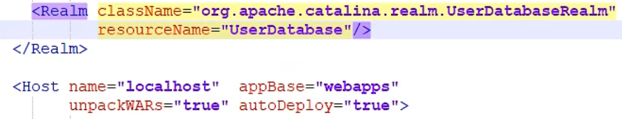

# Tomcat

## Tomcat文件目录

**（通过bin目录下的startup启动）**

## 项目目录结构

## Tomcat配置

通过修改conf目录下的server.xml文件，可以更改相关信息

- 更改端口

- 更改地址（需要更改本地域名才能使用，`C:\Windows\System32\drivers\etc\hosts`文件）

​		通过查询域名知道ip地址为`127.0.0.1`

**（注：默认端口：Tomcat：8080	mysql：3306	http：80	https：443	默认主机名称：localhost->127.0.0.1	默认网站应用存放位置	appBase="webapps"）**

## 网站是如何访问的

1. 输入一个域名，回车
2. 检查本机`C:\Windows\System32\drivers\etc\hosts`是否存在对应的地址。
   1. 有，则直接访问对应的ip地址，在这个地址中有我们需要的web程序，就可以直接访问
   2. 没有，去DNS服务器中找，找到就返回对应的ip地址，没有则返回没有找到网页

## Tomcat的示例文档

通过访问http://localhost:8080/examples/jsp/进入JSP示例模式

