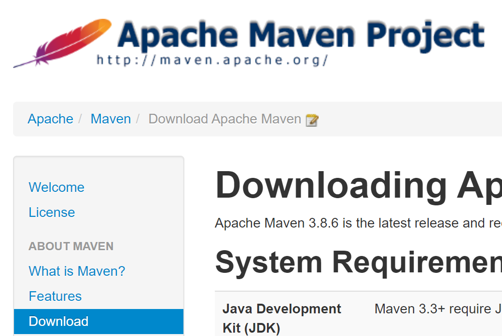
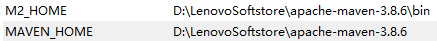
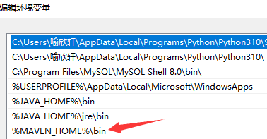

# Maven

## Maven作用

在Javaweb开发中，需要使用大量的jar包，我们手动去导入太麻烦了，如何能够让一个东西自动帮我导入和配置这个jar包？由此，Maven诞生了！

## Maven项目架构管理工具

我们目前用来方便导入jar包的

**Maven核心思想：约定大于配置**

- 有约束，不要去违反

- Maven会规定好你该如何去编写我们的Java代码，我们必须按照这个规范来

## Maven安装

按照IDEA的版本来下，这里**不推荐最新的**，结尾有如何下载历史版本的教程。官网：[Maven – Welcome to Apache Maven](https://maven.apache.org/)




下载解压缩到需要安装的目录：


## 配置环境变量

在系统变量中进行如下配置

- M2_HOME：maven下面的bin目录
- MAVEN_HOME：maven的目录



在系统的Path中配置`%MAVEN_HOME%\bin`



通过命令提示符`mvn -version`检验


## 配置阿里云镜像

- 镜像（mirrors）：加速下载，国内建议使用阿里云镜像

在对应目录下的conf目录-->`settings.xml`-->`<mirrors>`


加入的代码如下：

```xml
    <mirror>
          <id>alimaven</id>
          <name>aliyun maven</name>
          <url>http://maven.aliyun.com/nexus/content/groups/public/</url>
          <mirrorOf>central</mirrorOf>        
    </mirror>
```

> 腾讯镜像：
>
> ```xml
>     <mirror>
>           <id>tencent</id>
>           <name>tencent maven mirror</name>
>           <url>https://mirrors.tencent.com/nexus/repository/maven-public/</url>
>           <mirrorOf>*</mirrorOf>
>     </mirror>
> ```

## 配置Maven编译的JDK版本

- 让项目在编译的过程中默认使用1.8版本

在对应目录下的conf目录-->`settings.xml`-->`<profiles>`


加入的代码如下：

```xml
	<!--让Maven使用JDK1.8进行编译-->
	<profile>
		<id>jdk-1.8</id>
		<activation>
			<activeByDefault>true</activeByDefault>
			<jdk>1.8</jdk>
		</activation>
		<properties>
			<maven.compiler.source>1.8</maven.compiler.source>
            <maven.compiler.target>1.8</maven.compiler.target>
            <maven.compiler.compilerVersion>1.8</maven.compiler.compilerVersion>
		</properties>
    </profile>
```

## 建立本地仓库

本地仓库（localRepository）：不需要在网上下载

在安装目录下创建maven-repo文件夹：


打开conf目录下的-->`settings.xml`，将此文件夹地址`D:\LenovoSoftstore\apache-maven-3.8.6\maven-repo`放入

```xml
<localRepository>D:\LenovoSoftstore\apache-maven-3.8.6\maven-repo</localRepository>
```


***

## 关于Maven版本和IDEA兼容性问题


在官网下载历史版本


选择对应版本后


按照上述方式安装配置即可
