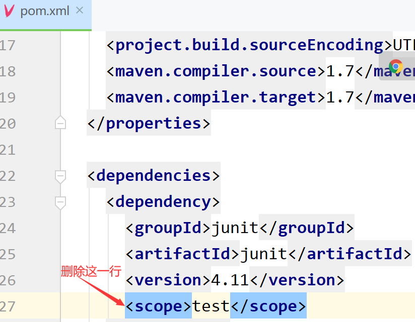

# IDEA里面使用Maven

## 创建一个MavenWeb项目


- 配置项目名：


- 配置Maven：


Maven home directtory：


- 项目保存位置：


- 初始化：（通过IDEA自动导入包）


点击install也可以


- 项目搭建成功：


观察Maven仓库：（有了对应的目录）


## IDEA设置中配置Maven

IDEA项目创建成功后看一下Maven的配置：


与导入相关的设置：


## IDEA自动生成的Maven项目的目录结构


如果使用自己的Maven会**缺失一些相关目录**，所以接下来就是配置完整的MavenWeb项目

## 配置完整的MavenWeb项目

对比自动生成的Maven，多了**Web应用下才有的目录**


- 在main下创建缺失的目录（暂时不用test）


- 因为这里还只是单纯的目录，需要**对目录进行标记**，java目录标记为**源代码目录Generated Sources Root**，resources标记为**资源目录Resources Root**


- 标记后就可以在java目录下创建class类了


也可以在项目结构里面配置


- 配置完毕：点进右下角`Event Log`看有没有报错


如果报错可以尝试



**如果还是无法解决是因为IDEA还没有支持到这个版本，只能去安装老版本的Maven**

## 配置Tomcat


## Maven结构


### pom.xml文件

pom.xml是Maven的核心配置文件，Maven有三种打包方式

- jar：默认的打包方式，打包成jar用作jar包使用。打包成jar用作jar包使用。
- war：将会打包成war，发布在服务器上，如网站或服务。一般是java web项目打包。
- pom：用在父级工程或聚合工程中，用来做jar包的版本控制，必须指明这个聚合工程的打包方式为pom。
- 补充一下，jdk9 后还可以打包 jmod（Java 模块化），厉害的是这个通过 jlink 命令，可以直接将 jmod 打包为对应环境的可执行的程序，告别了让用户安装 jdk 的步骤，现在也有对应的 maven 插件了。

版本和头文件：


需要修改的地方：


将图中1.7更改为1.8

**项目依赖配置**：可以通过更改项目的依赖配置导入其他仓库的包


Maven的高级之处在于——可以**自动导入这个jar包所依赖的其他jar包**


**项目构建配置**：


**Maven由于约定大于配置，以后可能遇到写的配置文件无法导出或者生效的问题**

解决方案：

```xml
	<!--在build中配置resources,来防止我们资源导出失败的问题-->
	<build>
        <resources>
            <resource>
                <directory>src/main/resources</directory>
                <includes>
                    <include>**/*.properties</include>
                    <include>**/*.xml</include>
                </includes>
                <filtering>true</filtering>
            </resource>
            <resource>
                <directory>src/main/java</directory>
                <includes>
                    <include>**/*.properties</include>
                    <include>**/*.xml</include>
                </includes>
                <filtering>true</filtering>
            </resource>
        </resources>
    </build>
```

## 目录树


