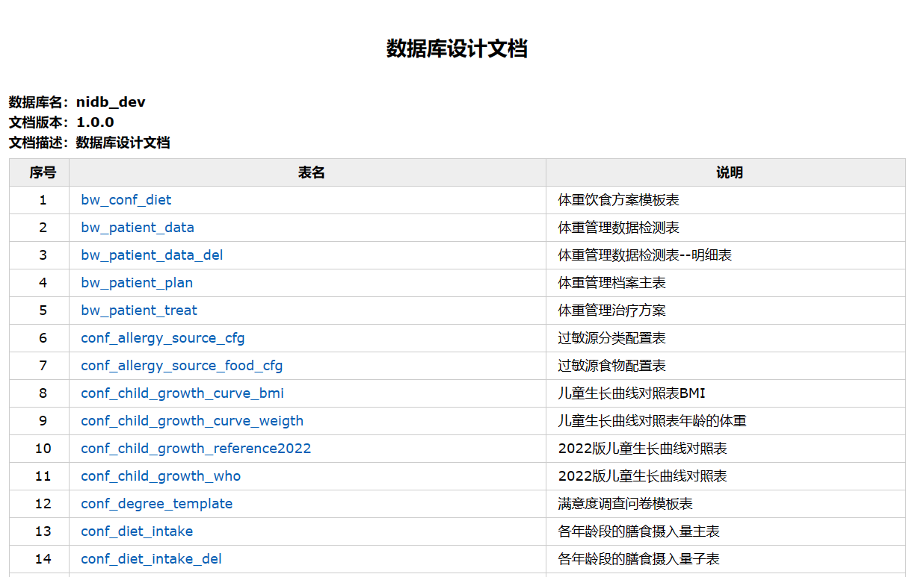
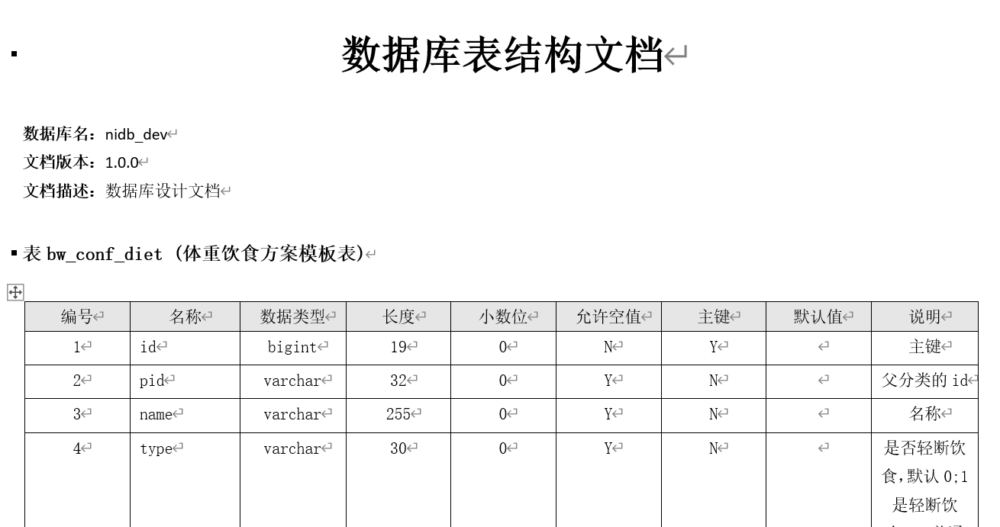
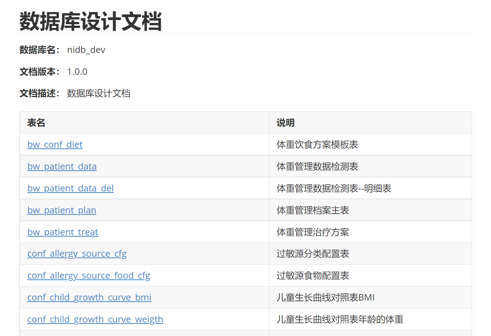
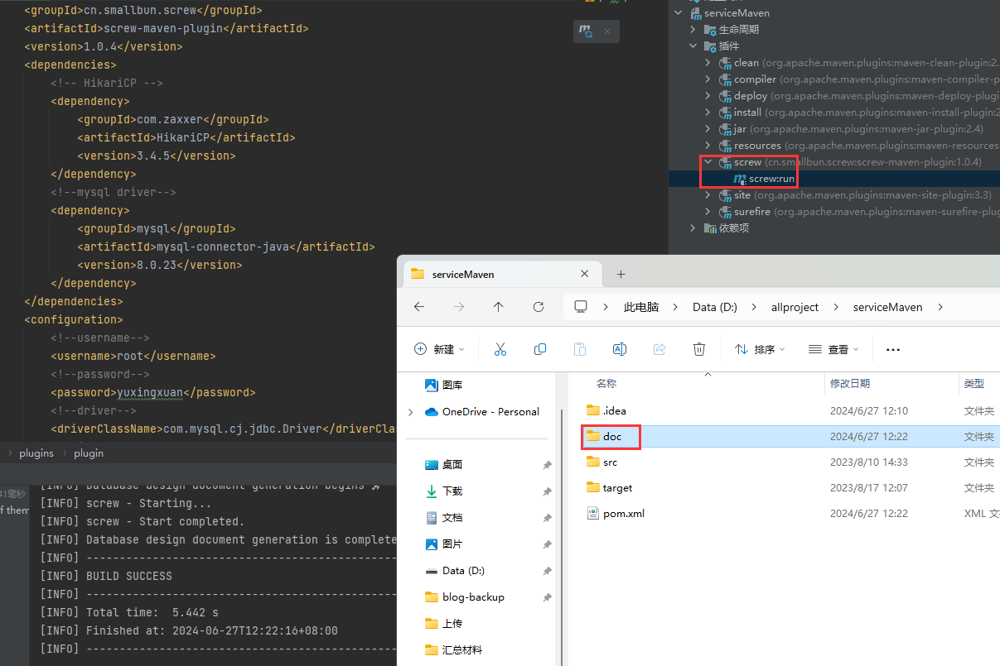

# screw数据库文档

## 代码生成

pom.xml

```xml
        <!-- screw核心 -->
        <dependency>
            <groupId>cn.smallbun.screw</groupId>
            <artifactId>screw-core</artifactId>
            <version>1.0.4</version>
        </dependency>

        <dependency>
            <groupId>org.freemarker</groupId>
            <artifactId>freemarker</artifactId>
            <version>2.3.30</version>
        </dependency>

        <!-- HikariCP -->
        <dependency>
            <groupId>com.zaxxer</groupId>
            <artifactId>HikariCP</artifactId>
            <version>3.4.5</version>
        </dependency>

        <dependency>
            <groupId>mysql</groupId>
            <artifactId>mysql-connector-java</artifactId>
            <version>8.0.23</version>
        </dependency>
```

pojoGeneration.java

```java
import cn.smallbun.screw.core.Configuration;
import cn.smallbun.screw.core.engine.EngineConfig;
import cn.smallbun.screw.core.engine.EngineFileType;
import cn.smallbun.screw.core.engine.EngineTemplateType;
import cn.smallbun.screw.core.execute.DocumentationExecute;
import cn.smallbun.screw.core.process.ProcessConfig;
import com.zaxxer.hikari.HikariConfig;
import com.zaxxer.hikari.HikariDataSource;

import javax.sql.DataSource;
import java.util.ArrayList;
import java.util.Arrays;
import java.util.List;

public class pojoGeneration {

    public static void main(String[] args) {
        // 数据源
        HikariConfig hikariConfig = new HikariConfig();
        hikariConfig.setDriverClassName("com.mysql.cj.jdbc.Driver");
        hikariConfig.setJdbcUrl("jdbc:mysql://127.0.0.1:3306/ry-vue");
        hikariConfig.setUsername("root");
        hikariConfig.setPassword("yuxingxuan");
        // 设置可以获取tables remarks信息
        hikariConfig.addDataSourceProperty("useInformationSchema", "true");
        // 最小空闲连接数
        hikariConfig.setMinimumIdle(2);
        // 最大连接数
        hikariConfig.setMaximumPoolSize(5);
        DataSource dataSource = new HikariDataSource(hikariConfig);

        EngineConfig engineConfig = EngineConfig.builder()
                // 导出文件地址
                .fileOutputDir("D:/img")
                // 是否打开文件夹
                .openOutputDir(true)
                // 文件类型:html、word、markdown
//                .fileType(EngineFileType.HTML)
                .fileType(EngineFileType.MD)
                // 模板引擎
                .produceType(EngineTemplateType.freemarker).build();

        ProcessConfig processConfig = ProcessConfig.builder()
                // 指定生成逻辑、当存在指定表、指定表前缀、指定表后缀时，将生成指定表，其余表不生成、并跳过忽略表配置
                // 根据名称指定表生成
                .designatedTableName(new ArrayList<>())
                // 根据表前缀生成
                .designatedTablePrefix(new ArrayList<>())
                // 根据表后缀生成
                .designatedTableSuffix(new ArrayList<>()).build();

        // 设置生成pojo相关配置
        Configuration config = Configuration.builder()
                .version("1.0.0")
                .description("数据库设计文档")
                .dataSource(dataSource)
                .engineConfig(engineConfig)
                .produceConfig(processConfig).build();
        // 执行生成文档
        new DocumentationExecute(config).execute();
    }

    /**
     * 配置想要生成的表+ 配置想要忽略的表
     *
     * @return 生成表配置
     */
    public static ProcessConfig getProcessConfig() {
        // 忽略表名
        List<String> ignoreTableName = Arrays.asList("a", "test_group");
        // 忽略表前缀，如忽略a开头的数据库表
        List<String> ignorePrefix = Arrays.asList("a", "t");
        // 忽略表后缀
        List<String> ignoreSuffix = Arrays.asList("_test", "czb_");
        return ProcessConfig.builder()
                // 根据名称指定表生成
                .designatedTableName(Arrays.asList("fire_user"))
                // 根据表前缀生成
                .designatedTablePrefix(new ArrayList<>())
                // 根据表后缀生成
                .designatedTableSuffix(new ArrayList<>())
                // 忽略表名
                .ignoreTableName(ignoreTableName)
                // 忽略表前缀
                .ignoreTablePrefix(ignorePrefix)
                // 忽略表后缀
                .ignoreTableSuffix(ignoreSuffix).build();
    }
}
```

> html格式
>
> 
>
> doc格式
>
> 
>
> md格式
>
> 

## 插件生成

```xml
    <!--方式二：Maven插件-->
    <build>
        <plugins>
            <plugin>
                <groupId>cn.smallbun.screw</groupId>
                <artifactId>screw-maven-plugin</artifactId>
                <version>1.0.4</version>
                <dependencies>
                    <!-- HikariCP -->
                    <dependency>
                        <groupId>com.zaxxer</groupId>
                        <artifactId>HikariCP</artifactId>
                        <version>3.4.5</version>
                    </dependency>
                    <!--mysql driver-->
                    <dependency>
                        <groupId>mysql</groupId>
                        <artifactId>mysql-connector-java</artifactId>
                        <version>8.0.23</version>
                    </dependency>
                </dependencies>
                <configuration>
                    <!--username-->
                    <username>root</username>
                    <!--password-->
                    <password>yuxingxuan</password>
                    <!--driver-->
                    <driverClassName>com.mysql.cj.jdbc.Driver</driverClassName>
                    <!--jdbc url-->
                    <jdbcUrl>jdbc:mysql://127.0.0.1:3306/ry-vue?serverTimezone=GMT%2B8</jdbcUrl>
                    <!--生成文件类型 HTML、MD、WORD-->
                    <fileType>WORD</fileType>
                    <!--打开文件输出目录-->
                    <openOutputDir>true</openOutputDir>
                    <!--生成模板-->
                    <produceType>freemarker</produceType>
                    <!--文档名称 为空时:将采用[数据库名称-描述-版本号]作为文档名称-->
                    <fileName></fileName>
                    <!--描述-->
                    <description>数据库文档生成</description>
                    <!--版本-->
                    <version>${project.version}</version>
                    <!--标题-->
                    <title>数据库文档</title>
                </configuration>
                <executions>
                    <execution>
                        <phase>compile</phase>
                        <goals>
                            <goal>run</goal>
                        </goals>
                    </execution>
                </executions>
            </plugin>
        </plugins>
    </build>
```

> 
