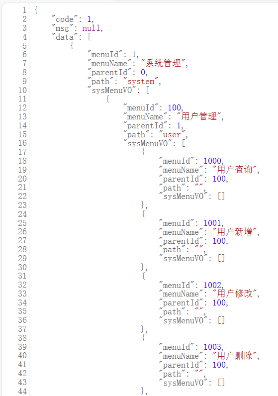
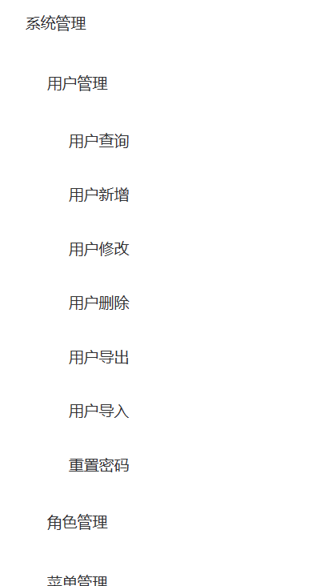

# 菜单树

## 后端

```java
    /**
     * 获取树形结构返回数据
     * @param menus
     * @return
     */
    public List<SysMenuVO> buildMenuTree(List<SysMenu> menus) {
        // 创建返回数组类型
        List<SysMenuVO> returnList = new ArrayList<>();

        // 处理为前端需要的信息
        /**
         * 相当于如下写法
         * List<SysMenuVO> sysMenuVOList = menus.stream().map(menu -> {
         *     SysMenuVO sysMenuVO = new SysMenuVO();
         *     BeanUtils.copyProperties(menu, sysMenuVO);
         *     return sysMenuVO;
         * }).collect(Collectors.toList());
         */
        List<SysMenuVO> sysMenuVOList = menus.stream().map(SysMenuVO::new).collect(Collectors.toList());

        // 将menuIdId划分成链表，用于判断是否为顶节点
        List<Long> menuIdList = menus.stream().map(SysMenu::getMenuId).collect(Collectors.toList());

        // 将parentId划分成链表，用于判断是否为底节点
        List<Long> parentIdList = menus.stream().map(SysMenu::getMenuId).collect(Collectors.toList());

        for (SysMenuVO next : sysMenuVOList) {
            // 判断是否为顶节点
            if (!menuIdList.contains(next.getParentId())) {
                // 修改此节点的连接链
                getChildList(sysMenuVOList, parentIdList, next);

                // 添加到返回链表中
                returnList.add(next);
            }
        }

        return returnList;
    }

    /**
     * 获取所有子节点
     * @param DTOList
     * @param parentIdList
     * @param menu
     */
    public void getChildList(List<SysMenuVO> DTOList, List<Long> parentIdList, SysMenuVO menu) {
        // 如果menuId不是任何节点的父节点代表递归终点
        if (!parentIdList.contains(menu.getMenuId())) {
            return;
        }

        // 根据ID获取所有子节点
        for (SysMenuVO next : DTOList) {
            // 判断此节点是否为想要寻找的子节点
            if (menu.getMenuId().longValue() == next.getParentId().longValue()) {
                // 是需要的子节点，添加至目标节点后面
                menu.getSysMenuVO().add(next);
                // 如果此节点还不是最后一层节点，则递归循环
                getChildList(DTOList, parentIdList, next);
            }
        }
    }
```

> 

## 前端

MenuItem.vue

```vue
<template>
  <div>
    <el-submenu v-if="hasChildren" :index="item.menuId.toString()">
      <template slot="title">{{ item.menuName }}</template>
      <menu-item
        v-for="child in item.sysMenuVO"
        :key="child.menuId"
        :item="child"
      ></menu-item>
    </el-submenu>
    <el-menu-item v-else :index="item.menuId.toString()">{{
      item.menuName
    }}</el-menu-item>
  </div>
</template>

<script>
export default {
  name: "menu-item", // 对于递归组件需要添加名称
  props: ["item"],
  computed: {
    hasChildren() {
      return this.item.sysMenuVO && this.item.sysMenuVO.length;
    },
  },
};
</script>
```

MenuTree.vue

```vue
<template>
  <el-menu>
    <menu-item
      v-for="item in menuData"
      :key="item.menuId"
      :item="item"
    ></menu-item>
  </el-menu>
</template>

<script>
import MenuItem from "./MenuItem";

export default {
  components: { MenuItem },
  props: ["menuData"],
};
</script>
```

App.vue

```vue
<template>
  <div>
    <menu-tree :menu-data="menuData"></menu-tree>
  </div>
</template>


<script>
import MenuTree from "@/views/element/MenuTree.vue";
import axios from "axios";
export default {
  components: { MenuTree },
  data() {
    return {
      menuData: [], // 数据
    };
  },
  created() {
    this.fetchData();
  },
  methods: {
    fetchData() {
      // 这里是获取数据的代码
      axios
        .get("http://localhost:8080/system/menu")
        .then((response) => {
          this.menuData = response.data.data;
        })
        .catch((error) => {
          console.error(error);
        });
    },
  },
};
</script>
```

> 
