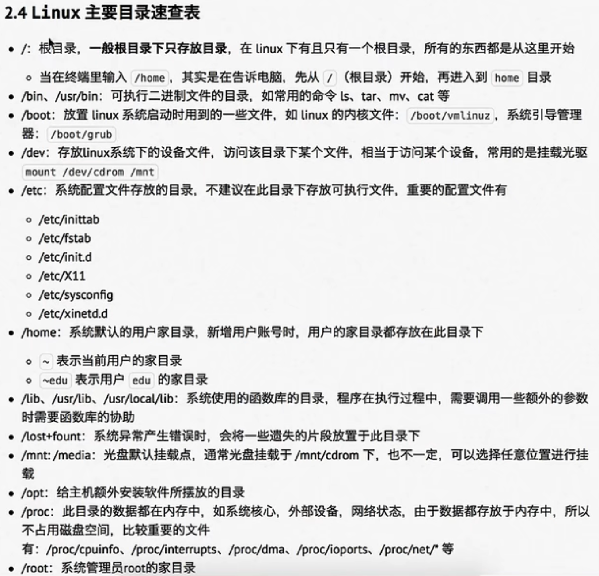
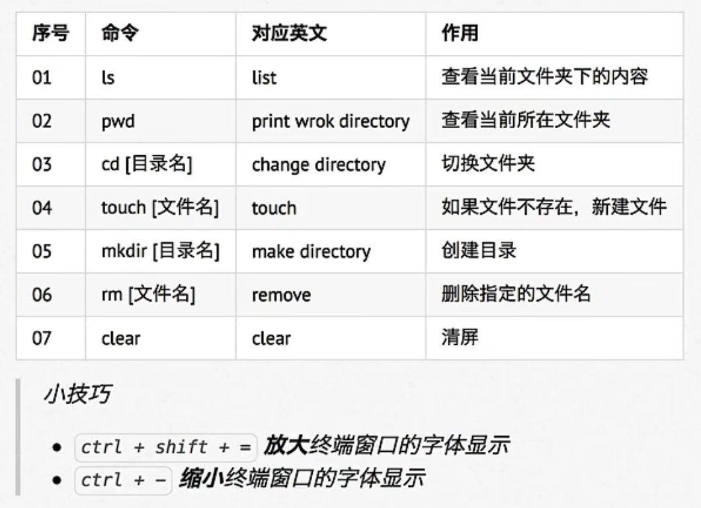
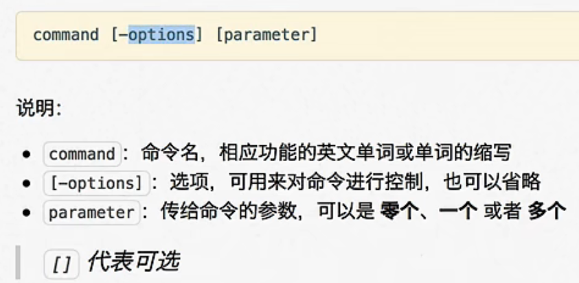
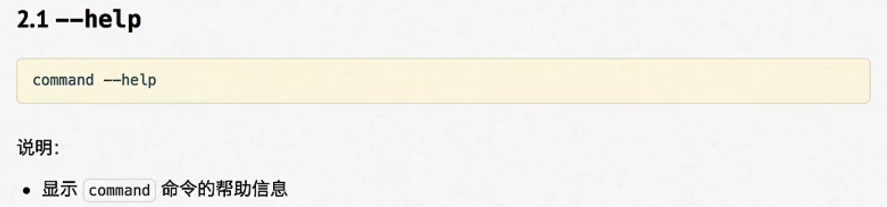
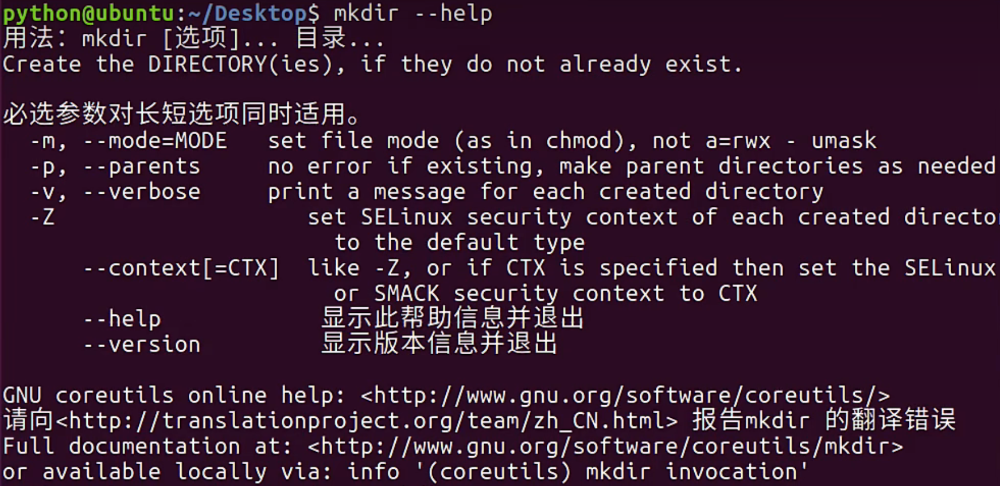
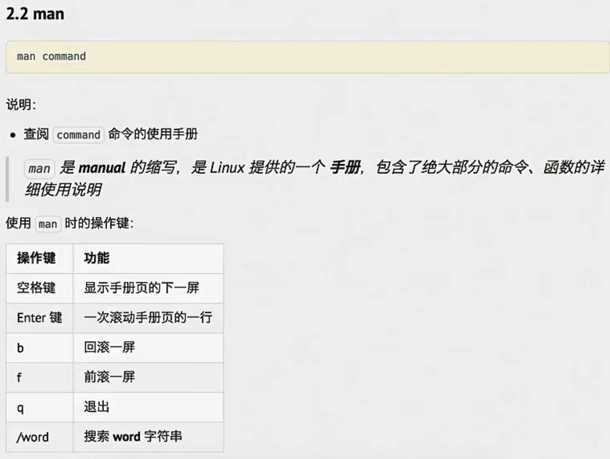
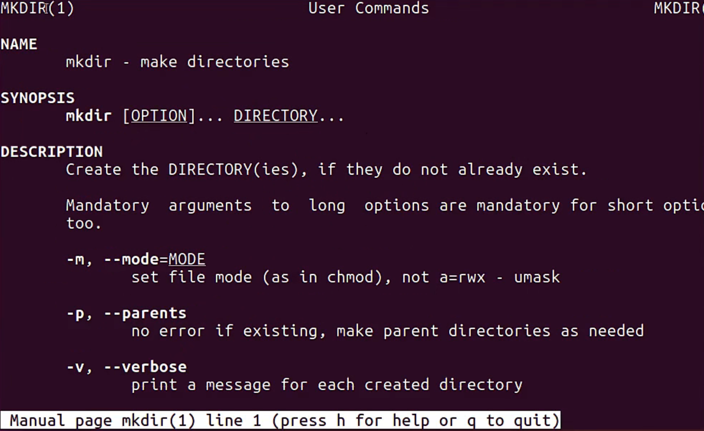

# Linux基础知识

## Linux的根目录

## Linux的终端命令

### Linux的常用终端命令

在敲出**文件/目录/命令**的前几个字母之后，按下Tab键，如果输入的没有歧义，系统会自动补全

**（注：rm无法直接删除目录，只能删除文件，但可以通过“rm -r 目录名称”的方式删除目录）**

### Linux的终端命令格式

### 查阅命令帮助信息

