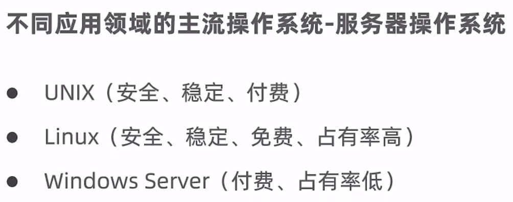
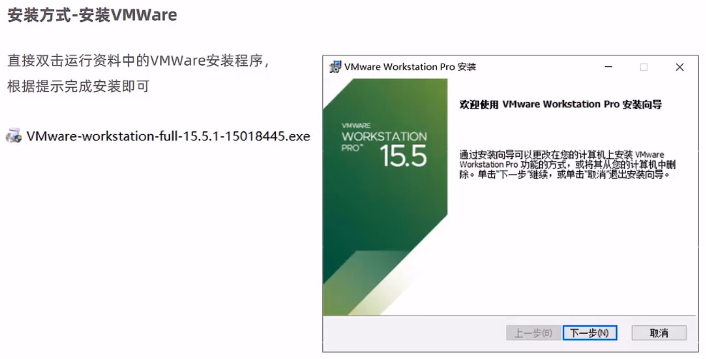

# Linux介绍和安装

## Linux介绍




### 目录结构


## 安装Linux

安装VMWare



安装CentOs


> VMware Workstation 15 Pro 永久激活密钥 YG5H2-ANZ0H-M8ERY-TXZZZ-YKRV8


下一步：


下一步：


下一步：


下一步：


下一步：


安装系统，回车选择第一个，等待安装完成即可：


选择语言：


等待检索完成，选择安装位置：


点击安装，等待安装完成的同时设置ROOT密码：


都设置为root：


重启后登录：


## 网卡设置


依次执行如下命令：

```
cd /
cd etc
cd sysconfig
cd network-scripts
vi ifcfg-ens33
```

编辑文本

```
i
移动到"no"下，修改为"yes"
按Esc退出,:wq保存退出
```

保存后重启服务器，再输入

```
ip addr
```

此时有了ip地址


## 安装SSH工具


安装：


此软件还需要先安装另外一个WinPcap才能实现安装，禁止自启：


## FinalShell连接Linux


连接：


连接成功：


> 破解软件适用于4.5版本以下，付费版功能介绍：[升级高级版/专业版/开通云端同步 - FinalShell官网 (hostbuf.com)](https://www.hostbuf.com/t/1081.html)
>
> ```python
> from hashlib import md5, sha3_384
> from Crypto.Hash import keccak
> 
> 
> def md5_hash(msg):
>  return md5(msg.encode()).hexdigest()
> 
> 
> def keccak384_hash(msg):
>  keccak_hash = keccak.new(digest_bits=384)
>  keccak_hash.update(msg.encode())
>  return keccak_hash.hexdigest()
> 
> 
> def main():
>  code = input("输入机器码: ")
> 
>  print("版本号 < 3.9.6 (旧版)")
>  try:
>      print("高级版: " + md5_hash("61305" + code + "8552")[8:24])
>      print("专业版: " + md5_hash("2356" + code + "13593")[8:24])
>  except Exception as e:
>      print(str(e))
> 
>  print("版本号 >= 3.9.6 (新版)")
>  try:
>      print("高级版: " + keccak384_hash(code + "hSf(78cvVlS5E")[12:28])
>      print("专业版: " + keccak384_hash(code + "FF3Go(*Xvbb5s2")[12:28])
>  except Exception as e:
>      print(str(e))
> 
> 
> if __name__ == "__main__":
>  main()
> 
> ```
>
> 用户名密码随便输入，这里都是`123`：
>
> 
>
> 生成破解码：
>
> ```
> 输入机器码: 123@acb33a2740a2f47f
> 版本号 < 3.9.6 (旧版)
> 高级版: f25170df8faf34b9
> 专业版: fa3432470ed55428
> 版本号 >= 3.9.6 (新版)
> 高级版: 4924db1c14e731a9
> 专业版: d82bb0ccea24843b
> ```
>
> 在线生成：
>
> - [FindShell - 授权码生成器 (404888.xyz)](https://cdn.404888.xyz/findshell.php)
> - [FinalShell 离线激活工具 (aristore.top)](https://www.aristore.top/posts/FinalShell/)