# Linux常用命令

## 初体验

### 常用命令

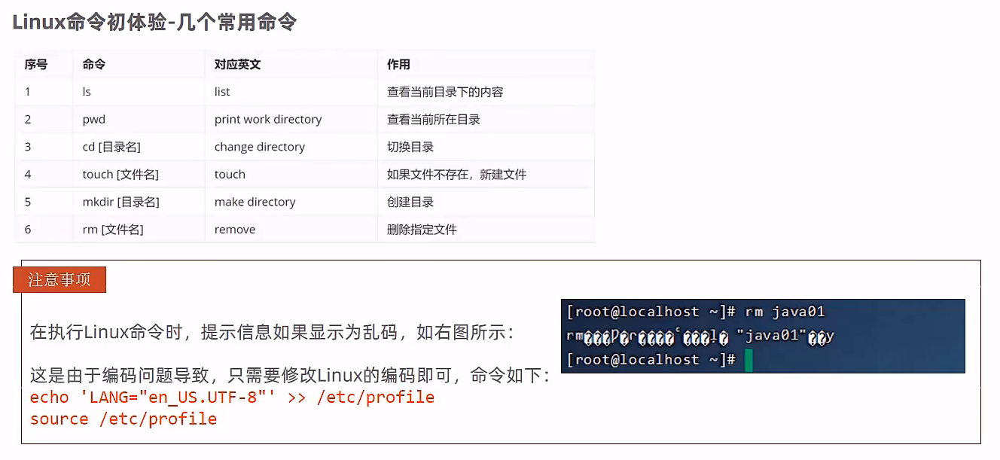

### 使用技巧

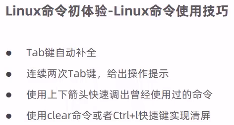

### 命令格式

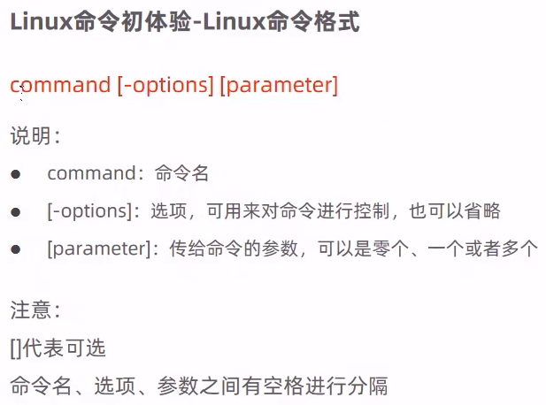

## 文件目录操作命令

### ls

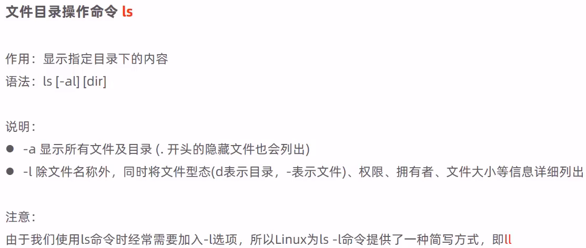

### cd

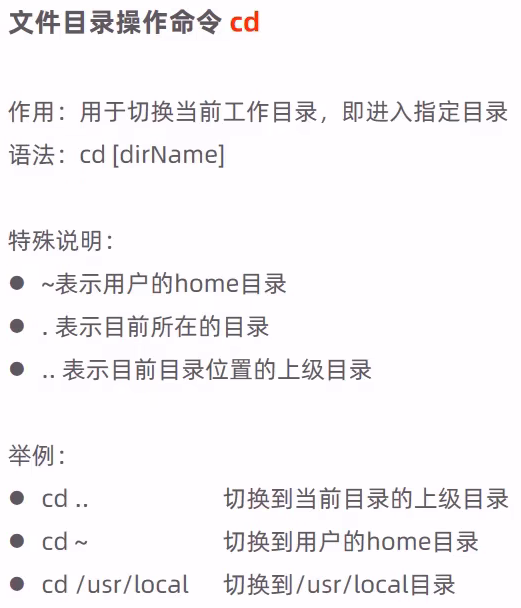

### cat

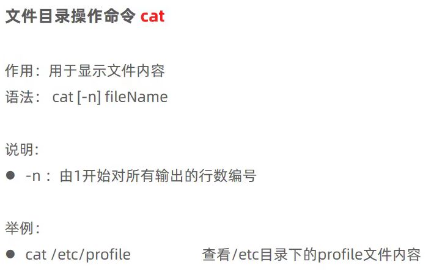

### more

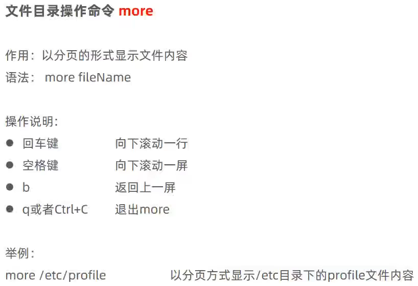

### tail

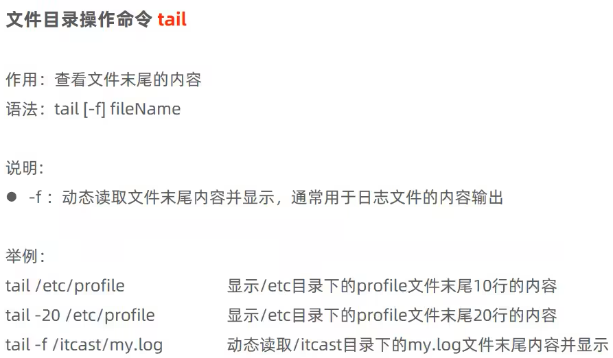

### mkdir

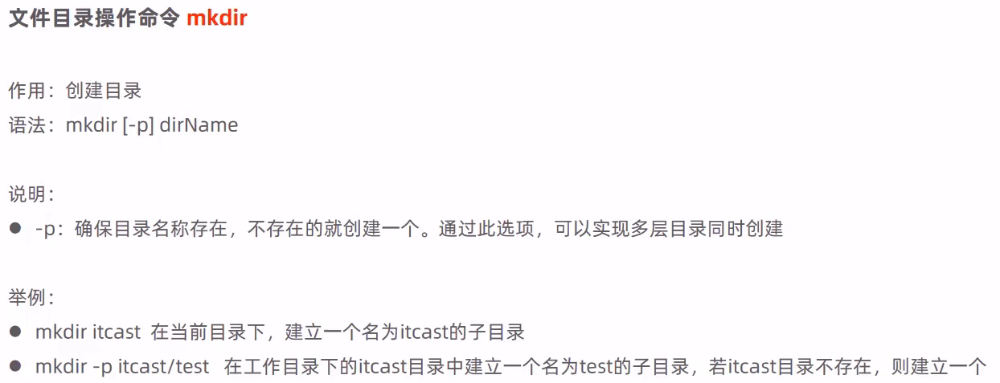

### rmdir

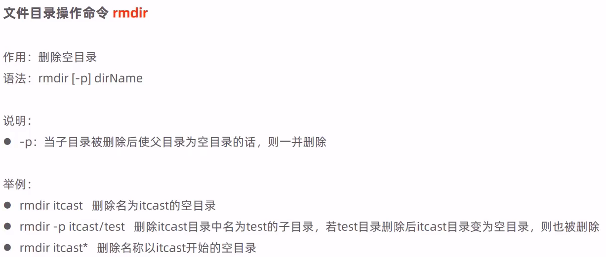

### rm

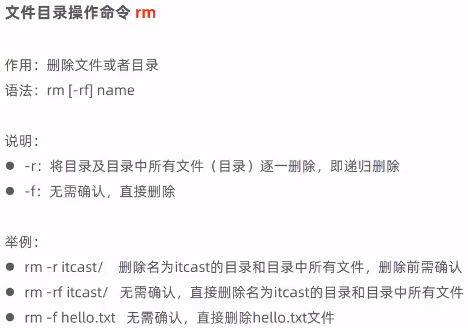

## 拷贝移动命令

### cp

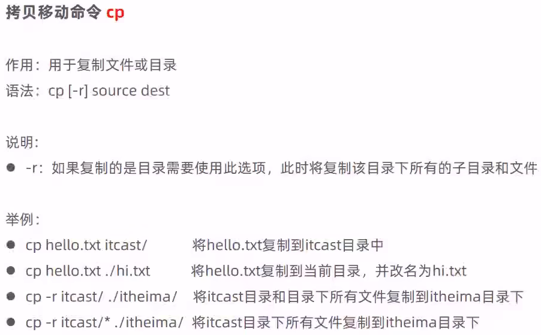

### mv


> 根据参数进行移动或改名或者移动并改名

## 打包压缩命令

### tar

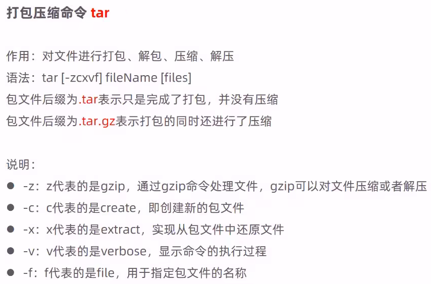

> 打包：
>
> ```
> tar -cvf xxx.tar xxx
> ```
>
> 打包并压缩：
>
> ```
> tar -zcvf xxx.tar.gz
> ```
>
> 解包：
>
> ```
> tar -xvf xxx.tar
> ```
>
> 解包并解压缩：
>
> ```
> tar -zxvf xxx.tar.gz
> ```
>
> 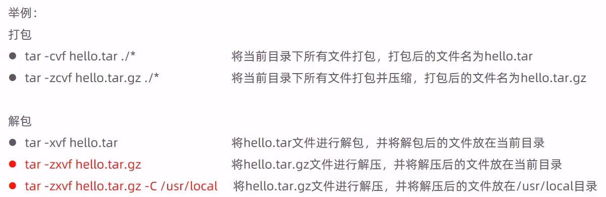

## 文本编辑命令

### vi/vim

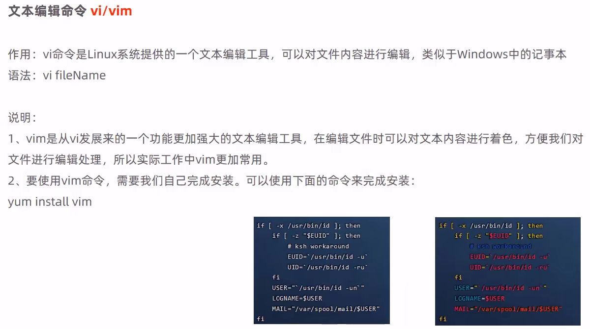

> 安装vim
>
> ```
> yum install vim
> ```
>
> 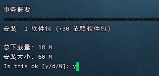
>
> 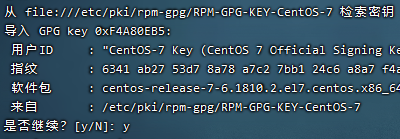
>
> 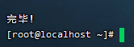

### vim


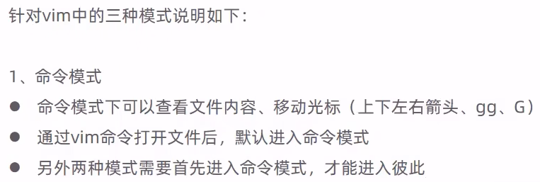

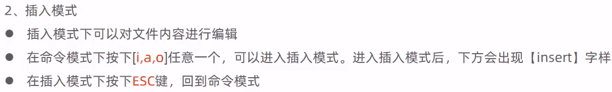

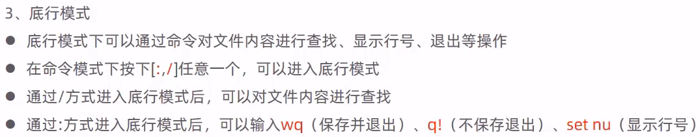

## 查找命令

### find

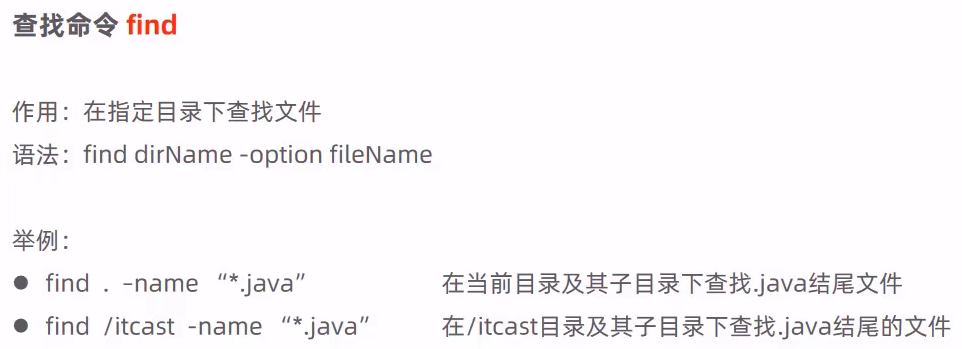

### grep

