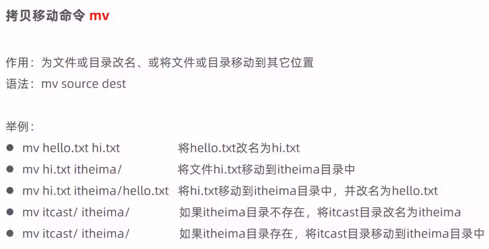

# Linux常用命令

## 初体验

### 常用命令


### 使用技巧


### 命令格式


## 文件目录操作命令

### ls


### cd


### cat


### more


### tail


### mkdir


### rmdir


### rm


## 文件时间操作命令

> 在Linux系统中，文件的三个时间戳分别为访问时间（Access Time, atime）、修改时间（Modification Time, mtime） 和状态改变时间（Change Time, ctime）
>
> - **atime（Access Time）**：文件内容最后一次被读取的时间
> - **mtime（Modify Time）**：文件内容最后一次被修改的时间
> - **ctime（Change Time）**：文件元数据（如权限、所有者、存储位置）最后一次被修改的时间
>
> | 英文名称 |   中文名称   | 触发操作示例                    | 关联系统调用/命令           |
> | :------: | :----------: | :------------------------------ | :-------------------------- |
> |  atime   | 最近访问时间 | `cat file`, `grep pattern file` | `stat.st_atime`             |
> |  mtime   | 最近修改时间 | `echo "data" > file`, `vim`     | `stat.st_mtime`             |
> |  ctime   | 最近改动时间 | `chmod 755 file`, `mv file new` | `stat.st_ctime`             |
> |  Birth   |   创建时间   | `touch file`, `dd`              | 需特定工具（如`e4getattr`） |

查看文件的详细信息：

```
[root@iZf8zaso97ymfxtjl94idqZ ~]# touch test.txt
[root@iZf8zaso97ymfxtjl94idqZ ~]# stat test.txt 
  文件："test.txt"
  大小：0               块：0          IO 块：4096   普通空文件
设备：fd01h/64769d      Inode：657212      硬链接：1
权限：(0644/-rw-r--r--)  Uid：(    0/    root)   Gid：(    0/    root)
最近访问：2025-06-03 15:58:40.013139275 +0800
最近更改：2025-06-03 15:58:40.013139275 +0800
最近改动：2025-06-03 15:58:40.013139275 +0800
创建时间：-
```

默认行为修改`atime`和`mtime`为当前时间：

```
touch 文件名
```

仅更新`atime`：

```
touch -a 文件名

# 使用-d参数（自然语言时间）
touch -a -d "2025-01-01 14:30:01.123456578" 文件名

# 使用-t参数（YYMMDDhhmm[.ss]格式）
touch -a -t 202501011430.12 文件名
```

仅更新`mtime`：

```
touch -m 文件名

# 使用-d参数（自然语言时间）
touch -m -d "2025-01-01 14:30:01.123456578" 文件名

# 使用-t参数（YYMMDDhhmm[.ss]格式）
touch -m -t 202501011430.12 文件名
```

复制文件时间戳：

```
touch -r 参考文件名 目标文件名
```

## 权限检验

> 通过执行一个无害命令（如true）来检测用户是否拥有无密码sudo权限。如果具备权限，则使用sudo执行目标命令；否则降级为普通用户执行

```sh
#!/bin/bash

# 检测是否可无密码执行sudo
if sudo -n true 2>/dev/null; then
    # 使用sudo执行命令
    sudo "$@"
else
    # 降级为普通用户执行
    "$@"
fi
```

## 拷贝移动命令

### cp


### mv



> 根据参数进行移动或改名或者移动并改名

## 打包压缩命令

### tar


> 打包：
>
> ```
> tar -cvf xxx.tar xxx
> ```
>
> 打包并压缩：
>
> ```
> tar -zcvf xxx.tar.gz
> ```
>
> 解包：
>
> ```
> tar -xvf xxx.tar
> ```
>
> 解包并解压缩：
>
> ```
> tar -zxvf xxx.tar.gz
> ```
>
> 

## 文本编辑命令

### vi/vim


> 安装vim
>
> ```
> yum install vim
> ```
>
> 
>
> 
>
> 

### vim


## 查找命令

### find


### grep

