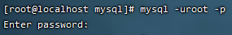

# 软件安装

## 软件安装方式


> rpm安装包网：[Rpmfind mirror](https://rpmfind.net/)

yum命令下载rpm包：

```
yumdownloader --resolve --destdir=/usr/local/docker-ce docker-ce
```

> - `--resolve`：同时下载所有必要的依赖项，以确保下载的包可以在没有网络连接的情况下安装
> - `--destdir=/usr/local/docker-ce`：这个选项指定了下载的 RPM 包和它们的依赖项应该被保存到的目录
> - `docker-ce`：这是想要下载的包的名称
>
> 如果怕依旧缺少依赖项，可以卸载此模块后再下载依赖项，但是这会把所有使用到此模块的模块都删除，如果涉及到比较核心的模块，就容易删除很多依赖的模块，检查依赖关系命令：
>
> ```
> yum deplist docker-ce
> ```

安装rpm包命令(强制)：

```
rpm -ivh *.rpm --force --nodeps
```

> - `--force`：这个选项用于强制安装，即使覆盖了其他包或者有依赖问题
> - `--nodeps`：这个选项告诉rpm不要检查或安装依赖项
>
> 正常安装命令(确保包被正确安装，同时检查依赖关系)：
>
> ```
> rpm -ivh *.rpm
> ```
>
> 如果RPM包有依赖关系，可以使用Yum来安装，会自动解决依赖关系：
>
> ```
> yum install *.rpm
> ```

## 安装jdk


切换目录：

```
cd /usr/local
```

上传文件：


解压缩：

```
tar -zxvf jdk-8u171-linux-x64.tar.gz
```

配置环境变量：

```
vim /etc/profile
```

> 通过"Shift" + "G"定位到文件末尾，再输入"I"进入编辑模式，在末尾添加
>
> ```
> JAVA_HOME=/usr/local/jdk1.8.0_171
> PATH=$JAVA_HOME/bin:$PATH
> ```
>
> 按下"ESC"输入":wq"保存并退出

重新加载profile文件：

```
source /etc/profile
```

检查是否安装成功：

```
java -version
```

> 

### 配置Maven

```
# Maven 环境变量配置
export MAVEN_HOME=/usr/local/apache-maven-3.6.1
export PATH=$MAVEN_HOME/bin:$PATH
```

> 如果mvn权限不够，需要配置权限：
>
> ```
> chmod 777 /usr/local/apache-maven-3.6.1/bin/mvn
> ```
>
> 检测结果：
>
> ```
> mvn -version
> ```
>
> 

## 安装Tomcat


 上传并解压：

```
tar -zxvf apache-tomcat-7.0.57.tar.gz
```

启动服务：

```
cd apache-tomcat-7.0.57/bin
```

执行脚本：

```
sh startup.sh
```


验证是否启动成功：


关闭服务：


```
sh shutdown.sh
```

## 防火墙设置


> 查看状态：
>
> ```
> systemctl status firewalld
> ```
>
> 
>
> 开放指定端口：
>
> ```
> firewall-cmd --zone=public --add-port=8080/tcp --permanent
> ```
>
> > 把数据库3306的端口也开放
>
> 加载生效：
>
> ```
> firewall-cmd --reload
> ```
>
> 查看生效的端口：
>
> ```
> firewall-cmd --zone=public --list-ports
> ```
>
> 访问Linux服务器对应的ip地址和端口，效果如下：
>
> 

## 安装MySQL

### 安装


检测安装情况：

```
rpm -qa
rpm -qa|grep mysql
rpm -qa|grep mariadb
```

> 

卸载mariadb：

```
rpm -e --nodeps mariadb-libs-5.5.60-1.el7_5.x86_64
```

 上传并解压（这里本来想将压缩包和解压文件放到`/usr/local/mysql`目录下，但是由于'cd'时加了'/'(根目录)，移动到了根目录下的/mysql）：

```
mkdir /mysql
mv mysql-5.7.25-1.el7.x86_64.rpm-bundle.tar.gz /mysql
cd /mysql
tar -zxvf mysql-5.7.25-1.el7.x86_64.rpm-bundle.tar.gz
```

> 

按照顺序安装rpm软件包：

```
rpm -ivh mysql-community-common-5.7.25-1.el7.x86_64.rpm
rpm -ivh mysql-community-libs-5.7.25-1.el7.x86_64.rpm
rpm -ivh mysql-community-devel-5.7.25-1.el7.x86_64.rpm
rpm -ivh mysql-community-libs-compat-5.7.25-1.el7.x86_64.rpm
rpm -ivh mysql-community-client-5.7.25-1.el7.x86_64.rpm

yum install net-tools
rpm -ivh mysql-community-server-5.7.25-1.el7.x86_64.rpm
```

> 按顺序执行，安装`yum install net-tools`之后再安装`rpm -ivh mysql-community-server-5.7.25-1.el7.x86_64.rpm`
>
> 

### 启动


启动服务：

```
systemctl start mysqld
```

> 设置开机自启动：
>
> ```
> systemctl enable mysqld
> ```

获取临时登录密码：

```
cat /var/log/mysqld.log
cat /var/log/mysqld.log|grep password
```


登录mysql：

```
mysql -uroot -p
r&vC+%&/i0Qq
```

> 

修改密码并开启访问权限：

```
set global validate_password_length=4;
set global validate_password_policy=LOW;
set password=password('root');
grant all on *.* to 'root'@'%' identified by 'root';
flush privileges;
```

退出并测试：

```
exit
```

```
mysql -uroot -p
```

```
show databases;
```


> 由于在前面开启了3306的端口，所以是可以使用Navicat连接到数据库的
>
> 

### 联网安装

**CentosOS使用yum安装**

安装镜像源：

```
wget https://dev.mysql.com/get/mysql80-community-release-el7-11.noarch.rpm

rpm -Uvh mysql80-community-release-el7-11.noarch.rpm

rm -rf mysql80-community-release-el7-11.noarch.rpm

```

安装mysql

```
yum list|grep mysql

yum install mysql-community-server

```

> 

启动mysql

```
systemctl start mysqld
```

查看日志文件，获取初始化密码

```
vim /var/log/mysqld.log
```

> 

设置密码

```
-- 设置一个复杂密码，防止密码强度不够
alter user 'root'@'localhost' identified by '13&Uasdf!ahjsf' password expire never;

flush privileges;

-- 降低密码强度
SET GLOBAL validate_password.policy=LOW;
SET GLOBAL validate_password.length=1;

-- 更改root用户的密码，并将其设置为永不过期
alter user 'root'@'localhost' identified by 'password' password expire never;

-- 更改root密码为'password'并明确指定使用mysql_native_password认证插件
alter user 'root'@'localhost' identified with mysql_native_password by 'password';

flush privileges;

use mysql

-- 将用户名为root且主机名为localhost的记录的host字段改为%,允许root用户从任何主机连接到MySQL服务器
update user set host='%' where user='root' and host='localhost';

flush privileges;

exit

```

**乌班图Ubuntu安装使用`apt-get`安装**

```
sudo apt-get update

sudo apt-get install mysql-server-8.0
```

> 对于安装提示界面，直接回车
>
> 
>
> 默认安装之后没有密码
>
> ```
> mysql -u root -p
> ```

设置密码

```
-- 更改root用户的密码，并将其设置为永不过期
alter user 'root'@'localhost' identified by 'password' password expire never;

-- 更改root密码并明确指定使用mysql_native_password认证插件
alter user 'root'@'localhost' identified with mysql_native_password by 'password';

flush privileges;

use mysql

-- 将用户名为root且主机名为localhost的记录的host字段改为%,允许root用户从任何主机连接到MySQL服务器
update user set host='%' where user='root' and host='localhost';

flush privileges;

exit

```

开启远程连接

```
vim /etc/mysql/mysql.conf.d/mysqld.cnf
```

修改bind-address为`0.0.0.0`


重启服务

```
systemctl restart mysql
```

## 安装lrzsz


搜索：

```
yum list lrzsz
```

安装：

```
yum install lrzsz.x86_64
```


通过命令跳出提示框来上传文件，不依赖SSH工具

```
rz
```

