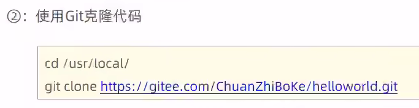
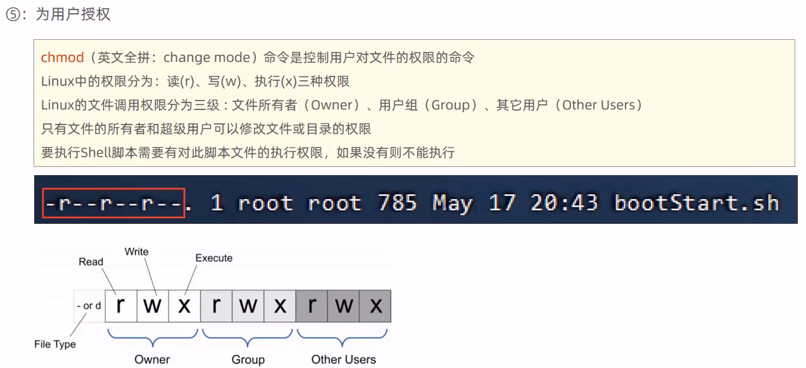

# 项目部署

## 手工项目部署


### 运行jar文件

创建文件目录：

```
mkdir /usr/local/app
rd /usr/local/app
```

上传文件：

```
rz
```

运行jar文件：

```
java -jar Hello-1.0-SNAPSHOT.jar
```

> 

### 优化运行方式

后台运行程序，并将日志文件输出到hello.log下：

```
nohup java -jar Hello-1.0-SNAPSHOT.jar &> hello.log &
```


### 停止程序

查找运行程序的进程id：

```
ps -ef|grep 'java -jar'
```

杀死进程：

```
kill -9 xxx
```


## 通过Shell脚本自动部署项目


### 安装Git




安装：

```
yum list git
yum install git
```

克隆代码：

```
cd /usr/local/
git clone https://gitee.com/yxx7318/hello.git # 这里是gitee地址，不是仓库url
```

> 对于私人仓库，需要输入账号密码：
>
> 
>
> 设置全局账号密码：
>
> ```
> git config --global user.name "yxx7318"
> 
> git config --global user.email "1303490776@qq.com"
> 
> # 在输入账号密码开始缓存，记录60秒
> git config --global credential.helper 'cache --timeout=60'
> 
> # 永久保存(可能需要先使用过一次缓存之后，再使用此命令才生效)
> git config --global credential.helper store
> 
> 
> # 去除密码缓存
> git config --global --unset credential.helper
> 
> # 查看用户名
> git config --global user.name
> 
> # 查看所有
> git config --list
> ```

## 安装Maven


上传文件：

```
rz
```

解压：

```
tar -zxvf apache-maven-3.5.4-bin.tar.gz
```

配置环境变量：

```
vim /etc/profile

export MAVEN_HOME=/usr/local/apache-maven-3.5.4
export PATH=$JAVA_HOME/bin:$MAVEN_HOME/bin:$PATH

source /etc/profile
```

检查是否生效：

```
mvn -version
```


### 配置仓库

创建在local目录下创建仓库：

```
mkdir repo
```

修改setting.xml：

```
vim /usr/local/apache-maven-3.5.4/conf/settings.xml

<localRepository>/usr/local/repo</localRepository>
```


### 配置阿里云镜像

修改setting.xml

```xml
    <mirror>
        <id>aliyun</id>
        <url>https://maven.aliyun.com/repository/public</url>
        <mirrorOf>*</mirrorOf>
    </mirror>
```


## 使用Shell脚本





### 修改脚本

脚本详细：


将其中的项目名称全部修改为自己的项目名称即可，如果目录没有错的话，因为这里创建的目录为hello，拉取项目的名称为hello(由hello.git决定)，所以最终的脚本为：

```
#!/bin/sh
echo =================================
echo  自动化部署脚本启动
echo =================================

echo 停止原来运行中的工程
APP_NAME=helloworld

tpid=`ps -ef|grep $APP_NAME|grep -v grep|grep -v kill|awk '{print $2}'`
if [ ${tpid} ]; then
    echo 'Stop Process...'
    kill -15 $tpid
fi
sleep 2
tpid=`ps -ef|grep $APP_NAME|grep -v grep|grep -v kill|awk '{print $2}'`
if [ ${tpid} ]; then
    echo 'Kill Process!'
    kill -9 $tpid
else
    echo 'Stop Success!'
fi

echo 准备从Git仓库拉取最新代码
cd /usr/local/hello

echo 开始从Git仓库拉取最新代码
git pull
echo 代码拉取完成

echo 开始打包
output=`mvn clean package -Dmaven.test.skip=true`

cd target

echo 启动项目
nohup java -jar helloworld-1.0-SNAPSHOT.jar &> helloworld.log &
echo 项目启动完成
```

> 由于如果使用windows的编辑器打开修改，会造成编码的错误，导致无法显示中文，所以需要在Linux目录下创建文件，并将代码复制过去并保存才能正常显示中文

### 为用户授权

查看权限：

```
mkdir sh
rz


ll bootStart.sh
```


修改权限：

```
chmod 777 bootStart.sh
```


## 运行脚本

```
./bootStart.sh
```


目录结构：


## 设置静态ip


打开文件：

```
cd /etc/sysconfig/network-scripts
vim ifcfg-ens33
```

> 可能后缀不一定是ens33

修改文件：

```
BOOTPROTO="static"


IPADDR="192.168.138.100"
NETMASK="255.255.255.0"
GATEWAY="192.168.138.2"
DNS1="192.168.138.2"
```

### 修改VM设置

在VM的"编辑"目录下的"虚拟网络编辑器"中：


### 重启网络服务

```
systemctl restart network
```

> 此时也需要对应的修改SSH工具的连接地址，否则连接不上

## 访问

```
192.168.138.100:8080/hello
```


