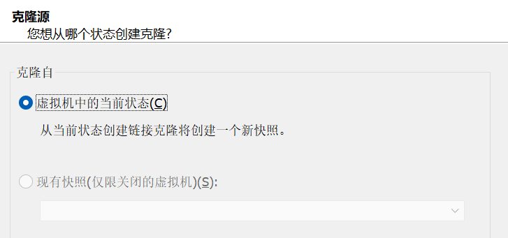
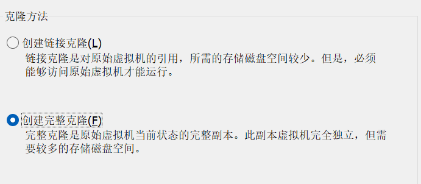
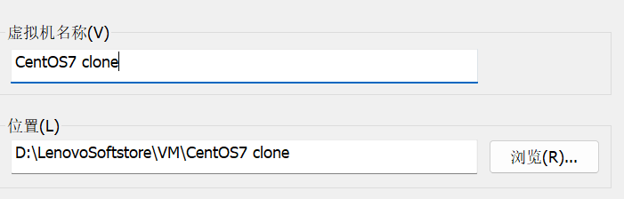
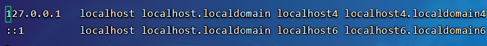
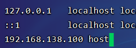
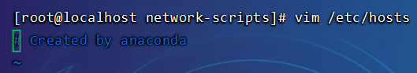
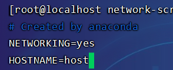
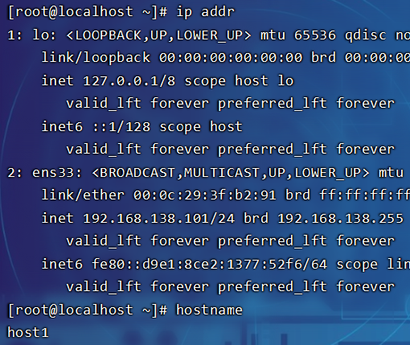

# Linux虚拟机复制

## 复制

通过VM自带的复制功能进行复制



下一步



选择位置



## 修改网卡配置

打开文件：

```
cd /etc/sysconfig/network-scripts
vim ifcfg-ens33
```

> 可能后缀不一定是ens33

修改文件：

```
BOOTPROTO=static


IPADDR="192.168.138.101"
NETMASK="255.255.255.0"
GATEWAY="192.168.138.2"
DNS1="192.168.138.2"


UUID=ce7c3e35-319f-4353-b438-9cecfa68964e
```

> IPADDR加一即可，通过uuidgen命令生成uuid，再修改uuid使两者不一致

## 修改主机名

```
vim /etc/hosts
```



添加

```
192.168.138.100 host
```

> 
>
> 另一台克隆的添加
>
> ```
> 192.168.138.101 host1
> ```

继续修改

```
vim /etc/sysconfig/network
```



添加

```
NETWORKING=yes
HOSTNAME=host
```

> 
>
> 另一台克隆的添加
>
> ```
> NETWORKING=yes
> HOSTNAME=host1
> ```

## 重启网络服务

```
systemctl restart network
```

查看克隆机效果

> ```
> ip addr
> hostname
> ```
>
> 
>
> 一般克隆完成后，虚拟机的网卡MAC地址会自动改变的，所以无需修改mac地址