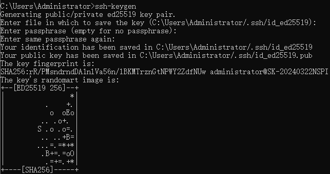
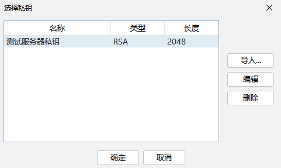

# SSH连接

## 手动生成密钥对

> 无需重启服务器

密钥生成命令：

```
ssh-keygen
```

> 生成更长的密钥，防止被暴力破解：
>
> ```
> ssh-keygen -t rsa -b 4096
> ```

不设置二级密码：



生成的密钥文件：


修改服务器的`.ssh/authorized_keys`文件，将公钥`id_ed25519.pub`的值追加到服务器内容后面：


直接连接：

```
ssh root@xxx.xxx.xxx.xxx
```

> 如果设置了二级密码，连接时就需要输入私钥密码确认：
>
> 

## 云服务商重置

> 需要重启服务器

创建密钥对：


> 

配置密钥对：


重启实例：


## FinalShell连接

新增私钥：


选择私钥：



更换认证方式：


> 手动生成的密钥可能finalshell不支持，转换密钥或者生成符合要求的密钥：
>
> ```
> 1.转换成PEM格式私钥
> ssh-keygen -p -m PEM -f 私钥路径
> 2.生成PEM格式的私钥
> 生成时增加 -m PEM参数
> ssh-keygen -m PEM -t rsa -C "注释"
> ```

## 命令行连接

```
ssh -i 测试服务器密钥对.pem root@8.134.145.242
```

> 
>
> 如果没有指定密钥文件，SSH客户端会自动使用当前目录中的`id_ed25519`文件

## 禁用密码连接


> 能够使用用户名和密码连接其实是开启了`/etc/ssh/sshd_config`中`PasswordAuthentication`为`yes`

编辑SSH配置文件`/etc/ssh/sshd_config`，找到以下行并按以下设置：

```
PasswordAuthentication no
ChallengeResponseAuthentication no
UsePAM no
```

> 确保这些参数没有被注释掉，并且设置为`no`

重启ssh服务：

```
sudo systemctl restart sshd
```

