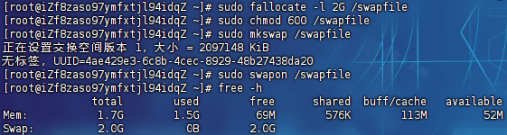
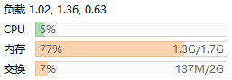

# 交换内存

> 交换分区（Swap Space）是操作系统中一种重要的虚拟内存管理机制，它的作用是扩展物理内存的容量，从而让系统能够运行更大的程序或同时运行更多的任务
>
> 交换分区是一个专门用于存储临时数据的磁盘区域，它充当了物理内存（RAM）的扩展。当系统的物理内存不足时，操作系统会将部分不常用的内存页（Page）从 RAM 中移到交换分区上，从而腾出更多的物理内存供当前活动的任务使用

## 创建新的交换文件

创建一个交换文件（例如 2GB）：

```
sudo fallocate -l 2G /swapfile
```

设置适当的权限：

```
sudo chmod 600 /swapfile
```

格式化为交换空间：

```
sudo mkswap /swapfile
```

启用交换文件：

```
sudo swapon /swapfile
```

检查是否成功启用：

```
free -h
```

> 
>
> 持久化配置：
>
> ```
> echo '/swapfile none swap sw 0 0' | sudo tee -a /etc/fstab
> ```

## 调整内核参数

> 内核参数`vm.swappiness`，越高系统越倾向于将不活跃的内存页换出到交换空间

查看当前值：

```
cat /proc/sys/vm/swappiness
```

临时配置：

```
sudo sysctl vm.swappiness=60
```

持久化设置，编辑`/etc/sysctl.conf`文件：

```
vim /etc/sysctl.conf
```

