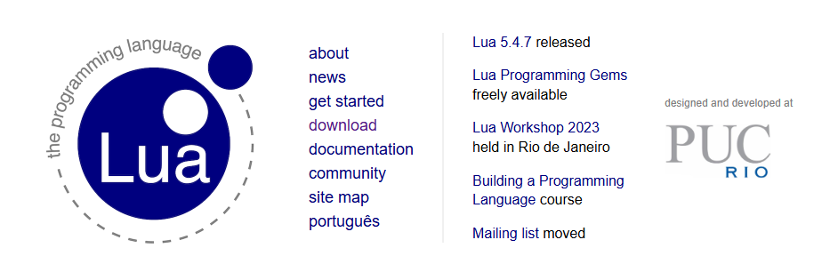
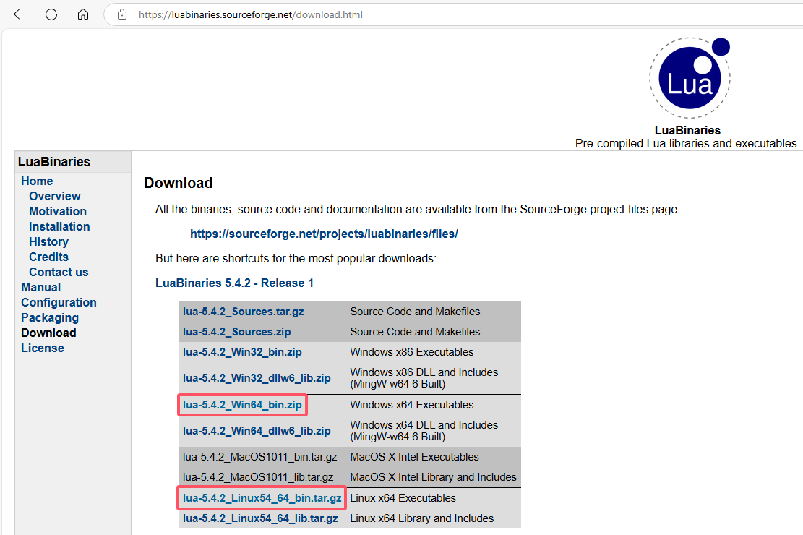
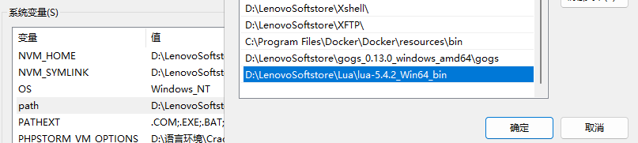
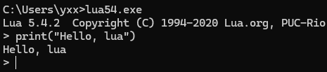
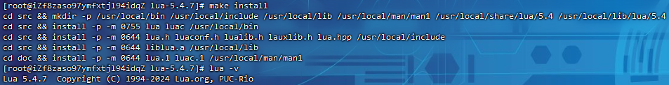

# Lua基础

> Lua是一种轻量、小巧的脚本语言，用标准C语言编写并以源代码形式开发。设计的目的是为了嵌入到其他应用程序中，从而为应用程序提供灵活的扩展和定制功能
>
> Lua在不同的系统中得到大量应用，场景的应用场景如下：游戏开发、独立应用脚本、web应用脚本、扩展和数据库插件、系统安全上

官网：[The Programming Language Lua](https://www.lua.org/)



## 特性

跟其他语言进行比较，Lua有其自身的特点

- 轻量级：Lua用标准C语言编写并以源代码形式开发，编译后仅仅一百余千字节，可以很方便的嵌入到其他程序中
- 可扩展：Lua提供非常丰富易于使用的扩展接口和机制，由宿主语言(通常是C或C++)提供功能，Lua可以使用它们，就像内置的功能一样
- 支持面向过程编程和函数式编程

## 安装

下载地址：[Lua Binaries Download (sourceforge.net)](https://luabinaries.sourceforge.net/download.html)



### Windows安装

下载二进制包，配置环境变量：



运行效果：



### Linux安装

编译安装：

```
curl -L -R -O https://www.lua.org/ftp/lua-5.4.7.tar.gz
tar zxf lua-5.4.7.tar.gz
cd lua-5.4.7
make all test

make install
```

> 