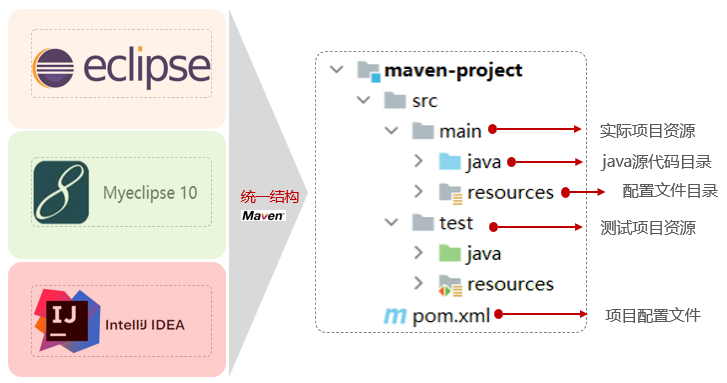
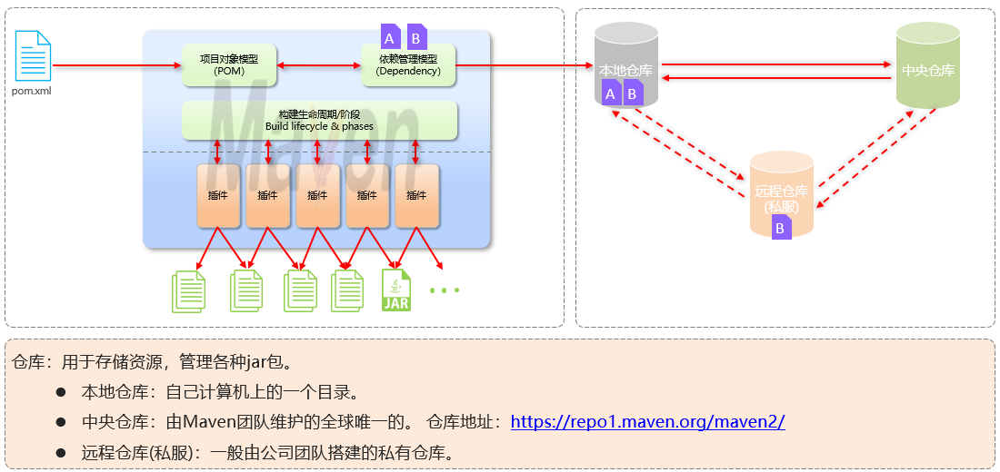
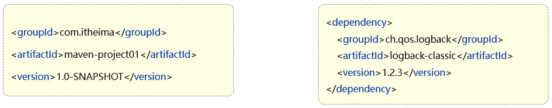
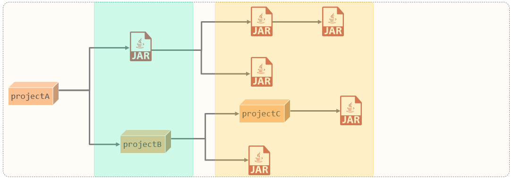
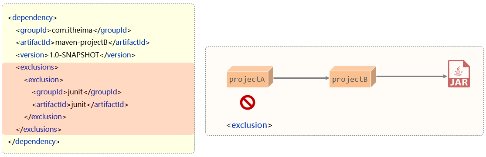
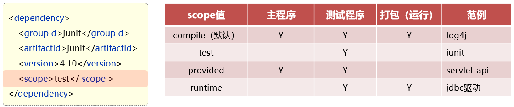
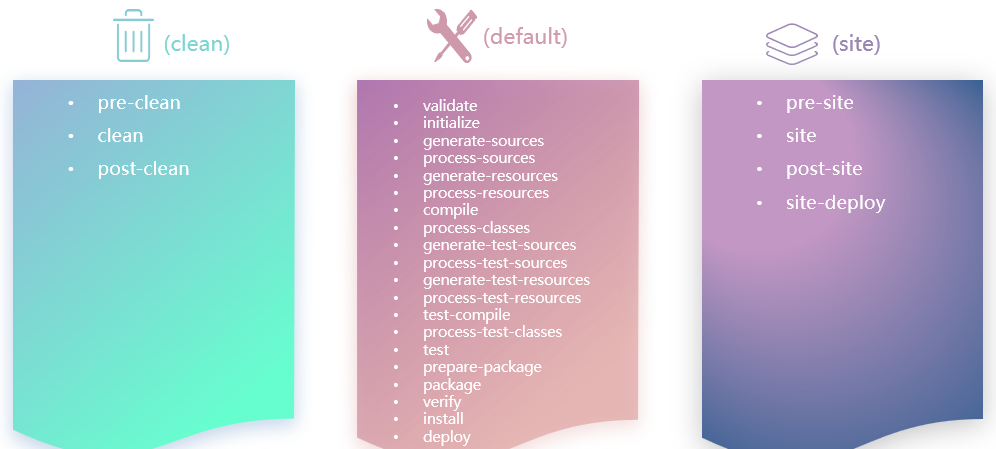
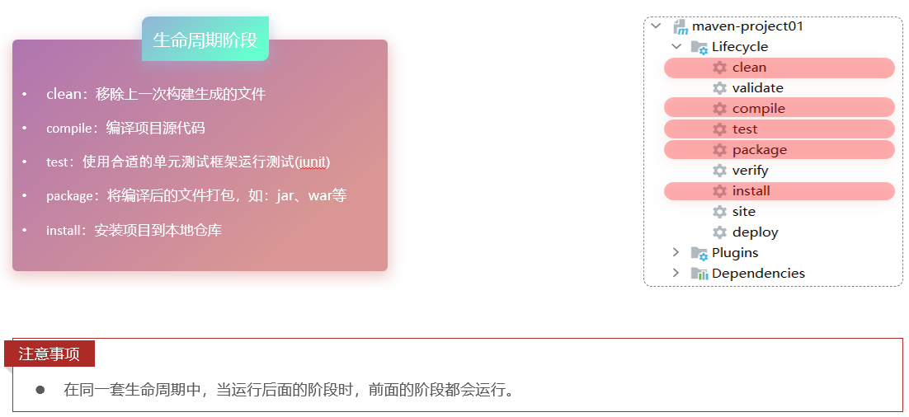
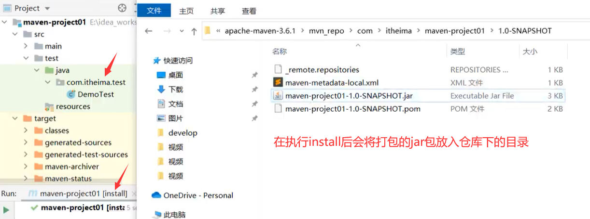
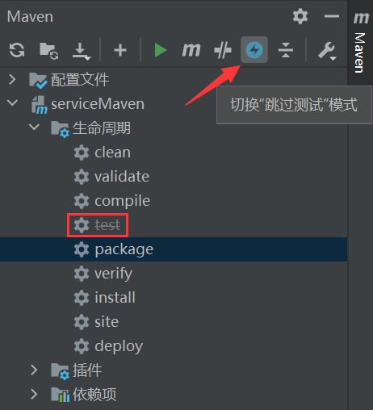

# Maven

Maven的作用

- 依赖管理：方便快捷的管理项目依赖的资源(jar包)，避免版本冲突问题
- 统一项目结构：提供标准、统一的项目结构
  - 
- 项目构建：标准跨平台(Linux、Windows、MacOS)的自动化项目构建方式

## 仓库



## Maven坐标

> Maven 中的坐标是资源的唯一标识，通过该坐标可以唯一定位资源位置，坐标来定义项目或引入项目中需要的依赖

主要组成：

- groupId：定义当前Maven项目隶属组织名称（通常是域名反写，例如：com.itheima）
- artifactId：定义当前Maven项目名称（通常是模块名称，例如 order-service、goods-service）
- version：定义当前项目版本号



## 镜像

```xml
	<mirror>
      <id>alimaven</id>
      <name>aliyun maven</name>
      <url>http://maven.aliyun.com/nexus/content/groups/public/</url>
      <mirrorOf>central</mirrorOf>        
	</mirror>
```

## 依赖管理

依赖具有传递性

- 直接依赖：在当前项目中通过依赖配置建立的依赖关系
- 间接依赖：被依赖的资源如果依赖其他资源，当前项目间接依赖其他资源



### 排除依赖

> 排除依赖指主动断开依赖的资源，被排除的资源无需指定版本



### 依赖范围

> 依赖的jar包，默认情况下，可以在任何地方使用(可以通过`<scope>…</scope> `设置其作用范围)

作用范围：

- 主程序范围有效（main文件夹范围内）
- 测试程序范围有效（test文件夹范围内）
- 是否参与打包运行（package指令范围内）



### 生命周期

> Maven的生命周期就是为了对所有的maven项目构建过程进行抽象和统一

Maven中有3套相互独立的生命周期：

- clean：清理工作
- default：核心工作，如：编译、测试、打包、安装、部署等
- site：生成报告、发布站点等

> 每套生命周期包含一些阶段（phase），阶段是有顺序的，后面的阶段依赖于前面的阶段
>
> 

生命周期阶段：



> install命令：
>
> 

## 跳过测试阶段

> 跳过测试阶段后，执行后面的阶段时，测试阶段将不会执行(同时也无法直接执行`test`)

