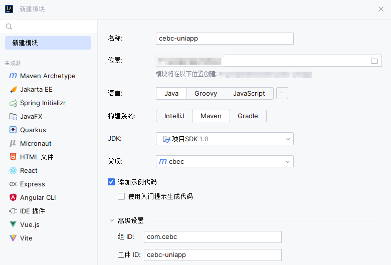
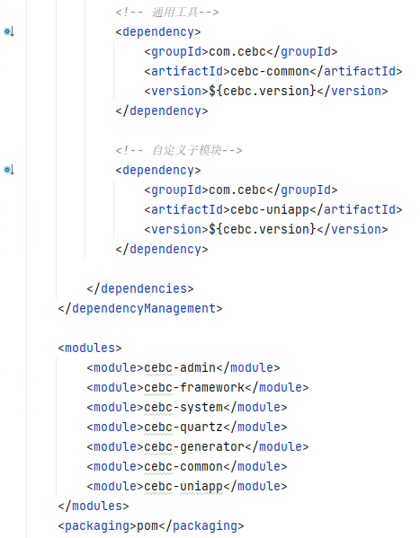
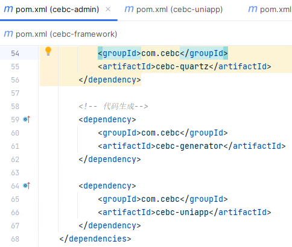
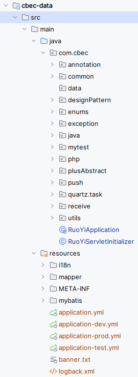
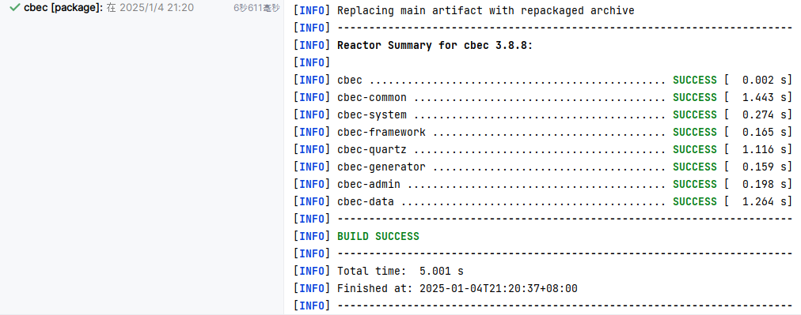
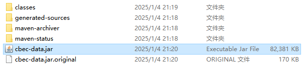
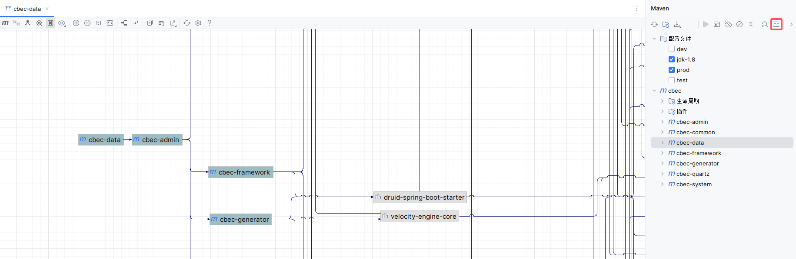

# Maven多模块

## 引入子模块

新建模块：



子`pom.xml`文件：

```xml
<?xml version="1.0" encoding="UTF-8"?>
<project xmlns="http://maven.apache.org/POM/4.0.0"
         xmlns:xsi="http://www.w3.org/2001/XMLSchema-instance"
         xsi:schemaLocation="http://maven.apache.org/POM/4.0.0 http://maven.apache.org/xsd/maven-4.0.0.xsd">
    <parent>
        <artifactId>cebc</artifactId>
        <groupId>com.cebc</groupId>
        <version>3.8.7</version>
    </parent>
    <modelVersion>4.0.0</modelVersion>

    <artifactId>cebc-uniapp</artifactId>

    <description>
        uniapp逻辑代码
    </description>

    <dependencies>

        <!-- 通用工具-->
        <dependency>
            <groupId>com.cebc</groupId>
            <artifactId>cebc-common</artifactId>
        </dependency>

    </dependencies>

</project>
```

> 无需在子模块中定义`<groupId>`，父模块中已定义

父`pom.xml`的`<dependencies>`标签下引入，这里只引入了版本控制，暂时没有引入依赖：




在真正的`<dependencies>`标签下引入依赖，若依是`admin`模块下汇总的，刷新maven依赖信息，清理残留的包，重新运行即可：



## 定义模块为入口模块

> 入口模块从`cbec-admin`修改为`cbec-data`

去除原先入口模块`cbec-admin`对`cbec-data`的依赖，在父`pom.xml`中定义`cbec-admin`依赖：

```xml
    <dependencyManagement>
        <dependencies>
            <!-- 若依依赖-->
            <dependency>
                <groupId>com.cbec</groupId>
                <artifactId>cbec-admin</artifactId>
                <version>${cbec.version}</version>
            </dependency>
        </dependencies>
    </dependencyManagement>

    <modules>
        <module>cbec-admin</module>
        <module>cbec-framework</module>
        <module>cbec-system</module>
        <module>cbec-quartz</module>
        <module>cbec-generator</module>
        <module>cbec-common</module>
        <module>cbec-data</module>
    </modules>
    <packaging>pom</packaging>
```

迁移`cbec-admin`模块中`<packaging>`标签的定义到`cbec-data`模块：

```xml
    <packaging>jar</packaging>
```

迁移`<build>`标签内容到`cbec-data`模块：

```xml
    <build>
        <plugins>
            <plugin>
                <groupId>org.springframework.boot</groupId>
                <artifactId>spring-boot-maven-plugin</artifactId>
                <version>2.5.15</version>
                <configuration>
                    <fork>true</fork> <!-- 如果没有该配置，devtools不会生效 -->
                </configuration>
                <executions>
                    <execution>
                        <goals>
                            <goal>repackage</goal>
                        </goals>
                    </execution>
                </executions>
            </plugin>
            <plugin>
                <groupId>org.apache.maven.plugins</groupId>
                <artifactId>maven-war-plugin</artifactId>
                <version>3.1.0</version>
                <configuration>
                    <failOnMissingWebXml>false</failOnMissingWebXml>
                    <warName>${project.artifactId}</warName>
                </configuration>
            </plugin>
        </plugins>
        <finalName>${project.artifactId}</finalName>
    </build>
```

迁移启动类文件`RuoYiApplication.java`和`RuoYiServletInitializer.java`，以及资源配置目录`resources`到`cbec-data`模块：



刷新maven依赖项，清理缓存，进行打包：





查看依赖关系：

