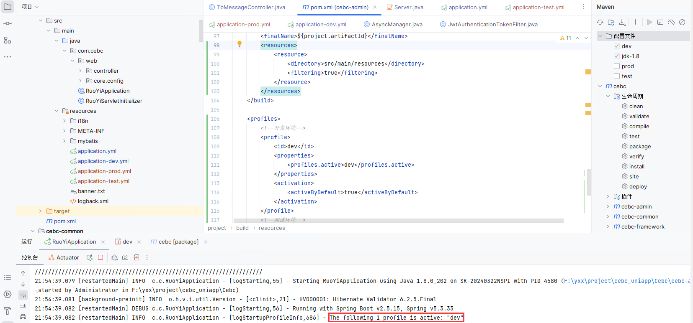
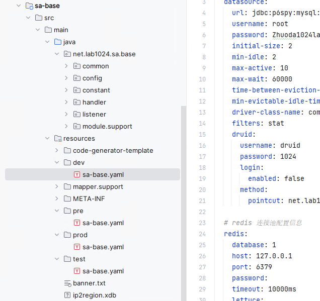
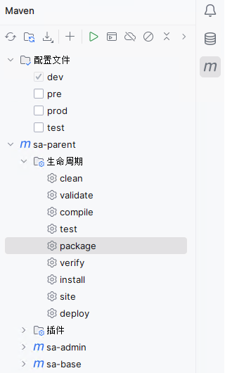
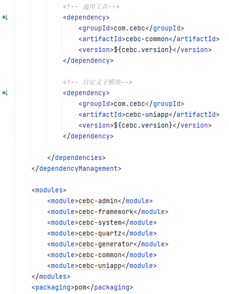
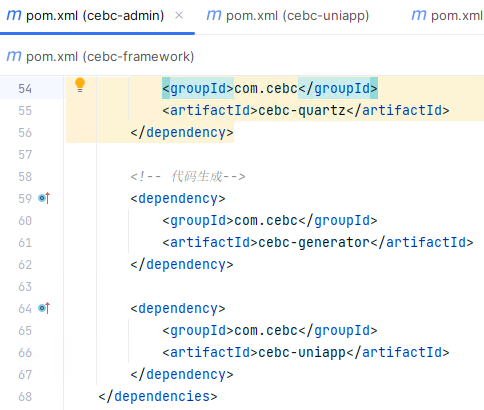

# Maven多环境

## 配置多环境文件

在父`pom.xml`或汇总的`pom.xml`中进行配置

```xml
    <profiles>
        <!--开发环境-->
        <profile>
            <id>dev</id>
            <properties>
                <profiles.active>dev</profiles.active>
            </properties>
            <activation>
                <activeByDefault>true</activeByDefault>
            </activation>
        </profile>
        <!--测试环境-->
        <profile>
            <id>test</id>
            <properties>
                <profiles.active>test</profiles.active>
            </properties>
        </profile>
        <!--预发布环境-->
        <profile>
            <id>pre</id>
            <properties>
                <profiles.active>pre</profiles.active>
            </properties>
        </profile>
        <!--生产环境-->
        <profile>
            <id>prod</id>
            <properties>
                <profiles.active>prod</profiles.active>
            </properties>
        </profile>
    </profiles>
```

并添加资源过滤，Maven才能替换资源文件中的占位符

```xml
    <build>
        <resources>
            <resource>
                <directory>src/main/resources</directory>
                <filtering>true</filtering>
            </resource>
        </resources>
    </build>
```

> 如果 `dev` profile被激活，Maven将寻找 `application-dev.yml` 文件



## 自定义加载

YamlProcessor.java

```java
import lombok.extern.slf4j.Slf4j;
import org.apache.commons.lang3.StringUtils;
import org.springframework.boot.SpringApplication;
import org.springframework.boot.env.EnvironmentPostProcessor;
import org.springframework.boot.env.YamlPropertySourceLoader;
import org.springframework.context.annotation.Configuration;
import org.springframework.core.annotation.Order;
import org.springframework.core.env.ConfigurableEnvironment;
import org.springframework.core.env.MutablePropertySources;
import org.springframework.core.env.PropertySource;
import org.springframework.core.io.Resource;
import org.springframework.core.io.support.PathMatchingResourcePatternResolver;

import java.io.IOException;
import java.util.List;

/**
 * yaml 读取配置
 *
 */
@Configuration
@Slf4j
@Order(value = 0)
public class YamlProcessor implements EnvironmentPostProcessor {

    private final YamlPropertySourceLoader loader = new YamlPropertySourceLoader();

    @Override
    public void postProcessEnvironment(ConfigurableEnvironment environment, SpringApplication application) {

        String filePath = environment.getProperty("project.log-path");
        if (StringUtils.isNotEmpty(filePath)) {
            System.setProperty("project.log-path", filePath);
        }

        MutablePropertySources propertySources = environment.getPropertySources();
        this.loadProperty(propertySources);
    }

    private void loadProperty(MutablePropertySources propertySources) {
        PathMatchingResourcePatternResolver resolver = new PathMatchingResourcePatternResolver();
        try {
            Resource[] resources = resolver.getResources("classpath*:sa-*.yaml");
            if (resources.length < 1) {
                return;
            }
            for (Resource resource : resources) {
                log.info("初始化系统配置：{}", resource.getFilename());
                List<PropertySource<?>> load = loader.load(resource.getFilename(), resource);
                load.forEach(propertySources::addLast);
            }
        } catch (IOException e) {
            throw new RuntimeException(e);
        }
    }


}
```

yaml文件位置


`spring.profiles.active` 属性用于指示 Spring Boot 使用哪个 profile 的配置

```yaml
spring:
  profiles:
    active: '@profiles.active@'
```

构建项目时，如果激活了 `dev` profile，Maven 会将 `@profiles.active@` 替换为 `dev`。因此，最终在 `application.yml` 文件中，这行配置会变成

```yaml
spring:
  profiles:
    active: dev
```

子模块下dev目录下的yaml文件也会被加载



打包命令

```
mvn clean package -Pdev  # 构建开发环境
mvn clean package -Ptest  # 构建测试环境
mvn clean package -Ppre  # 构建预发布环境
mvn clean package -Pprod  # 构建生产环境
```

## IDEA环境切换

选择对应的配置文件，启动项目或者打包项目即可



## 引入子模块

子`pom.xml`文件

```xml
<?xml version="1.0" encoding="UTF-8"?>
<project xmlns="http://maven.apache.org/POM/4.0.0"
         xmlns:xsi="http://www.w3.org/2001/XMLSchema-instance"
         xsi:schemaLocation="http://maven.apache.org/POM/4.0.0 http://maven.apache.org/xsd/maven-4.0.0.xsd">
    <parent>
        <artifactId>cebc</artifactId>
        <groupId>com.cebc</groupId>
        <version>3.8.7</version>
    </parent>
    <modelVersion>4.0.0</modelVersion>

    <artifactId>cebc-uniapp</artifactId>

    <description>
        uniapp逻辑代码
    </description>

    <dependencies>

        <!-- 通用工具-->
        <dependency>
            <groupId>com.cebc</groupId>
            <artifactId>cebc-common</artifactId>
        </dependency>

    </dependencies>

</project>
```

父`pom.xml`的`<dependencies>`标签下引入，这里只引入了版本控制，暂时没有引入依赖




在真正的`<dependencies>`标签下引入依赖，若依是`admin`模块下汇总的，刷新maven依赖信息，清理残留的包，重新运行即可：

