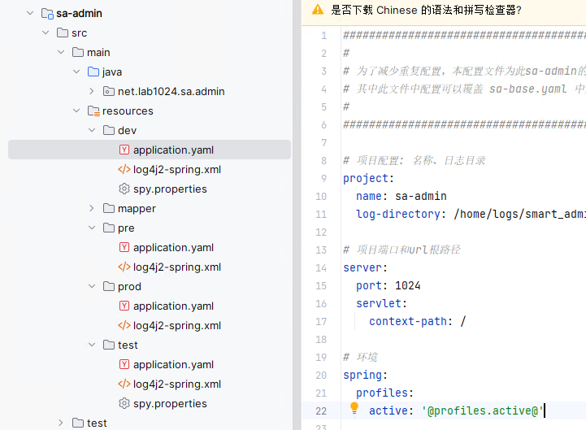

# Maven多环境

## 配置多环境文件

在父`pom.xml`(推荐)或汇总的`pom.xml`中进行配置：

```xml
    <profiles>
        <!--开发环境-->
        <profile>
            <id>dev</id>
            <properties>
                <profiles.active>dev</profiles.active>
            </properties>
            <activation>
                <activeByDefault>true</activeByDefault>
            </activation>
        </profile>
        <!--测试环境-->
        <profile>
            <id>test</id>
            <properties>
                <profiles.active>test</profiles.active>
            </properties>
        </profile>
        <!--预发布环境-->
        <profile>
            <id>pre</id>
            <properties>
                <profiles.active>pre</profiles.active>
            </properties>
        </profile>
        <!--生产环境-->
        <profile>
            <id>prod</id>
            <properties>
                <profiles.active>prod</profiles.active>
            </properties>
        </profile>
    </profiles>
```

并添加资源过滤，Maven才能替换资源文件中的占位符：

```xml
    <build>
        <resources>
            <resource>
                <directory>src/main/resources</directory>
                <filtering>true</filtering>
            </resource>
        </resources>
    </build>
```

> 如果`profile`属性值为`dev`，Maven将寻找`application-dev.yml`文件：


## 自定义加载

YamlProcessor.java

```java
import lombok.extern.slf4j.Slf4j;
import org.apache.commons.lang3.StringUtils;
import org.springframework.boot.SpringApplication;
import org.springframework.boot.env.EnvironmentPostProcessor;
import org.springframework.boot.env.YamlPropertySourceLoader;
import org.springframework.context.annotation.Configuration;
import org.springframework.core.annotation.Order;
import org.springframework.core.env.ConfigurableEnvironment;
import org.springframework.core.env.MutablePropertySources;
import org.springframework.core.env.PropertySource;
import org.springframework.core.io.Resource;
import org.springframework.core.io.support.PathMatchingResourcePatternResolver;

import java.io.IOException;
import java.util.List;

/**
 * yaml 读取配置
 *
 */
@Configuration
@Slf4j
@Order(value = 0)
public class YamlProcessor implements EnvironmentPostProcessor {

    private final YamlPropertySourceLoader loader = new YamlPropertySourceLoader();

    @Override
    public void postProcessEnvironment(ConfigurableEnvironment environment, SpringApplication application) {

        String filePath = environment.getProperty("project.log-path");
        if (StringUtils.isNotEmpty(filePath)) {
            System.setProperty("project.log-path", filePath);
        }

        MutablePropertySources propertySources = environment.getPropertySources();
        this.loadProperty(propertySources);
    }

    private void loadProperty(MutablePropertySources propertySources) {
        PathMatchingResourcePatternResolver resolver = new PathMatchingResourcePatternResolver();
        try {
            Resource[] resources = resolver.getResources("classpath*:sa-*.yaml");
            if (resources.length < 1) {
                return;
            }
            for (Resource resource : resources) {
                log.info("初始化系统配置：{}", resource.getFilename());
                List<PropertySource<?>> load = loader.load(resource.getFilename(), resource);
                load.forEach(propertySources::addLast);
            }
        } catch (IOException e) {
            throw new RuntimeException(e);
        }
    }


}
```

yaml文件位置：



`spring.profiles.active` 属性用于指示Spring Boot使用哪个profile的配置：

```yaml
spring:
  profiles:
    active: '@profiles.active@'
```

构建项目时，如果激活了`dev`profile，Maven会将`@profiles.active@`替换为`dev`。因此，最终在`application.yml`文件中，这行配置会变成：

```yaml
spring:
  profiles:
    active: dev
```

子模块下dev目录下的yaml文件也会被加载：


打包命令：

```
mvn clean package -Pdev  # 构建开发环境
mvn clean package -Ptest  # 构建测试环境
mvn clean package -Ppre  # 构建预发布环境
mvn clean package -Pprod  # 构建生产环境
```

## IDEA环境切换

选择对应的配置文件，启动项目或者打包项目即可：


