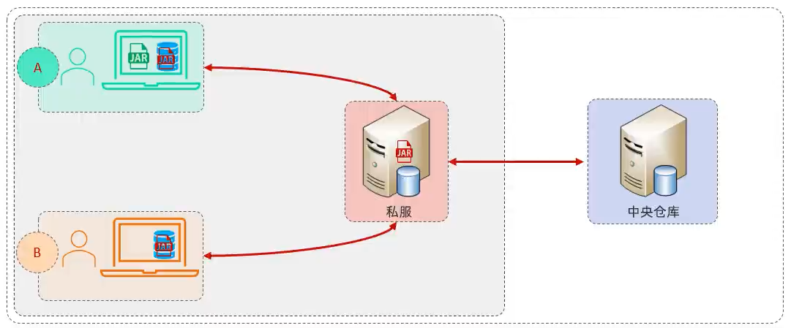
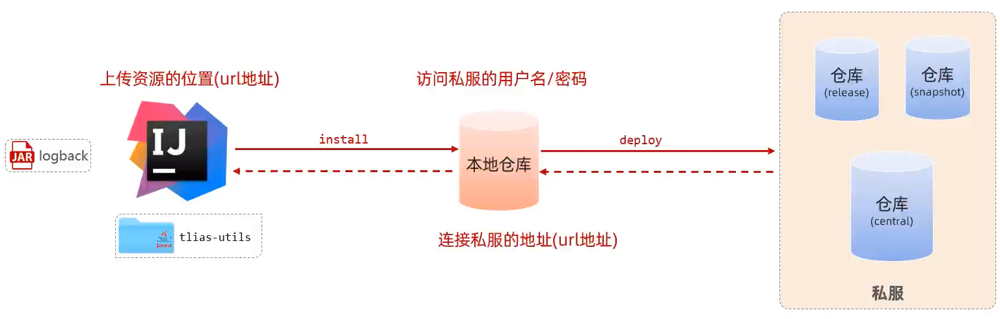
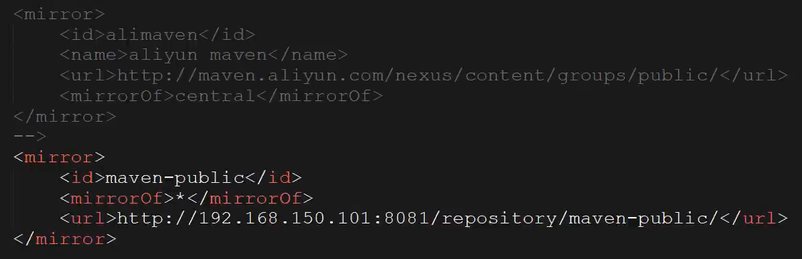
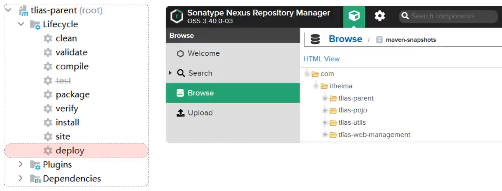

# Maven私服

> 私服是一种特殊的远程仓库，它是架设在局域网内的仓库服务，用来代理位于外部的中央仓库，用于解决团队内部的资源共享与资源同步问题



> 依赖查找顺序：
>
> - 本地仓库
> - 私服
> - 中央仓库

## 资源上传与下载



项目版本：

- RELEASE（发行版本）：功能趋于稳定、当前更新停止，可以用于发行的版本，存储在私服中的RELEASE仓库中
- SNAPSHOT（快照版本）：功能不稳定、尚处于开发中的版本，即快照版本，存储在私服中的SHAPSHOT仓库中

## 私服配置说明

示例：

- 访问私服：http://192.168.150.101:8081
- 访问密码：admin/admin

使用私服，需要在maven的settings.xml配置文件中，做如下配置：

1. 需要在 `<servers>` 标签中，配置访问私服的个人凭证(访问的用户名和密码)

   ```xml
   <server>
       <id>maven-releases</id>
       <username>admin</username>
       <password>admin</password>
   </server>
       
   <server>
       <id>maven-snapshots</id>
       <username>admin</username>
       <password>admin</password>
   </server>
   ```

2. 在 `<mirrors>` 中只配置自己私服的连接地址(如果之前配置过阿里云，需要直接替换掉)

   ```xml
   <mirror>
       <id>maven-public</id>
       <mirrorOf>*</mirrorOf>
       <url>http://192.168.150.101:8081/repository/maven-public/</url>
   </mirror>
   ```

   > 

3. 需要在 `profiles` 中，增加如下配置，来指定snapshot快照版本的依赖，依然允许使用

   ```xml
   <profile>
       <id>allow-snapshots</id>
           <activation>
           	<activeByDefault>true</activeByDefault>
           </activation>
       <repositories>
           <repository>
               <id>maven-public</id>
               <url>http://192.168.150.101:8081/repository/maven-public/</url>
               <releases>
               	<enabled>true</enabled>
               </releases>
               <snapshots>
               	<enabled>true</enabled>
               </snapshots>
           </repository>
       </repositories>
   </profile>
   ```

4. 如果需要上传自己的项目到私服上，需要在项目的pom.xml文件中(父工程)，增加如下配置，来配置项目发布的地址(也就是私服的地址)

   ```xml
   <distributionManagement>
       <!-- release版本的发布地址 -->
       <repository>
           <id>maven-releases</id>
           <url>http://192.168.150.101:8081/repository/maven-releases/</url>
       </repository>
       
       <!-- snapshot版本的发布地址 -->
       <snapshotRepository>
           <id>maven-snapshots</id>
           <url>http://192.168.150.101:8081/repository/maven-snapshots/</url>
       </snapshotRepository>
   </distributionManagement>
   ```

5. 发布项目，直接运行Maven的 deploy 生命周期即可 (发布时，建议跳过单元测试)



## 启动本地私服

1. 解压： apache-maven-nexus.zip

2. 进入目录： apache-maven-nexus\nexus-3.39.0-01\bin

3. 启动服务：双击 start.bat 
4. 访问服务：localhost:8081
5. 私服配置说明：将上述配置私服信息的 192.168.150.101 改为 localhost 