# Maven高级

分模块设计：

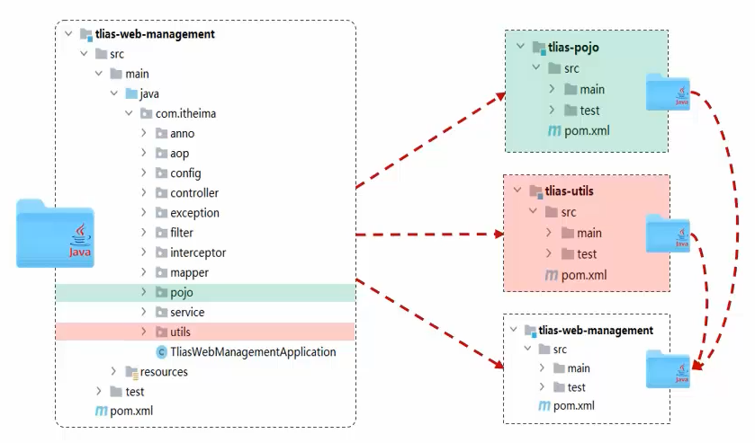

## 直接拆分

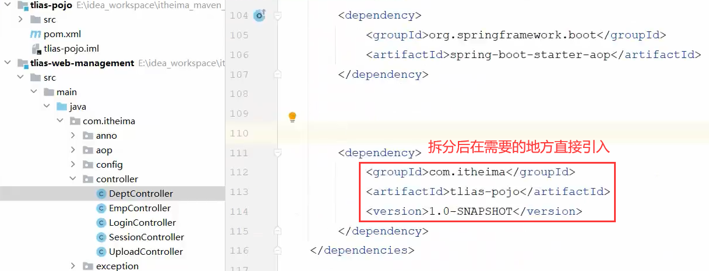

> 两个项目的依赖相互独立

## 继承

### 继承关系

> 继承描述的是两个工程间的关系，与Java中的继承类似，子工程可以继承父工程中的配置信息
>
> 通过`<parent>...</parent>`实现继承父工程

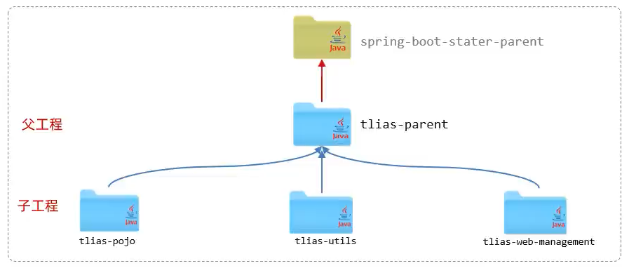

打包方式：

- `jar`：普通的模块打包，springboot项目基本都是jar包（内嵌tomcat运行）
- `war`：普通web程序打包，需要部署在外部的tomcat服务器中运行
- `pom`：父工程或聚合工程，该模块不写代码，仅进行依赖管理

具体步骤：

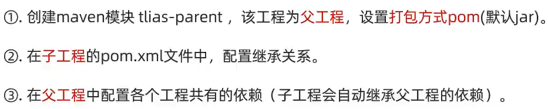

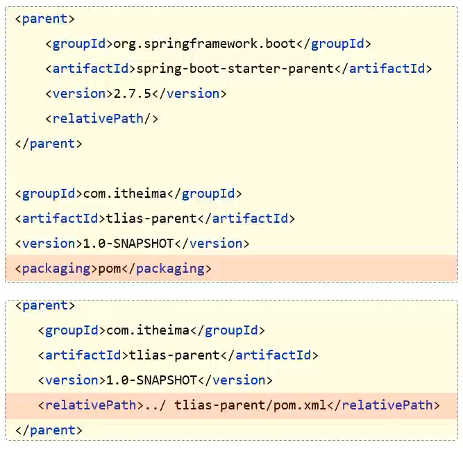

> `<relativePath>`指定父工程的pom文件的相对位置（如果不指定，将从目录`../pom.xml`、本地仓库、远程仓库的顺序查找父工程）
>
> 子工程的`<groupId>`可以省略：
>
> 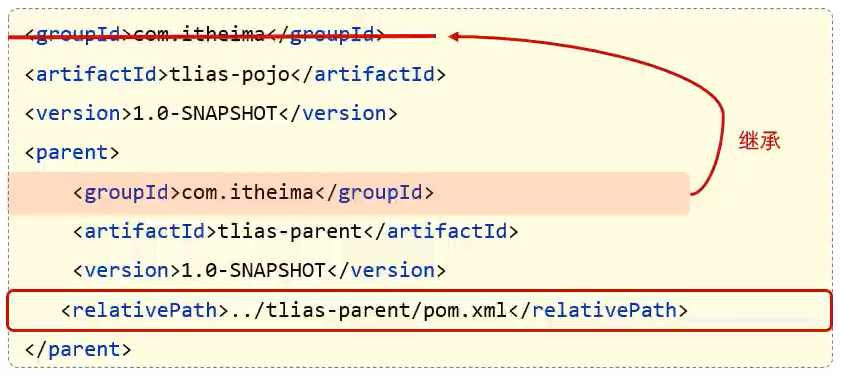
>
> 如果父子工程都配置了同一个依赖的不同版本，则以子工程为准

不同的父子工程结构（示例中使用的都是第一种）：

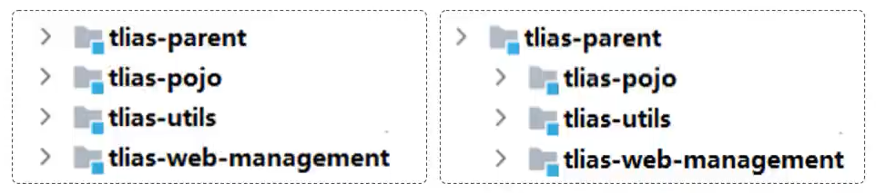

> 对于第二种父工程，因为父工程只管理子工程，没有代码和资源，所以在打包之后是没有自己的target目录的，最终汇总的jar包在最后一个显示"SUCCESS"的子工程的target目录下

### 版本锁定

> 如果需要修改子模块中某个依赖的版本，则需要一个个打开子模块的依赖去进行修改。此时就需要一个统一去管理子模块各个依赖的版本
>
> 通过`<dependencyManagement>`来统一管理依赖版本

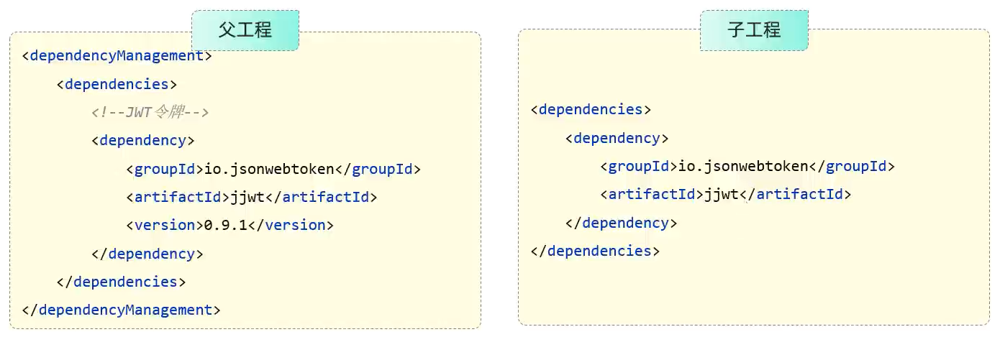

> 父工程并不会真正引入这个依赖，只是指定了子工程的依赖。此时子工程引入依赖时，无需指定`<version>`版本号，由父工程统一管理。如果需要变更版本，只需在父工程中变更即可

自定义属性/引用属性：

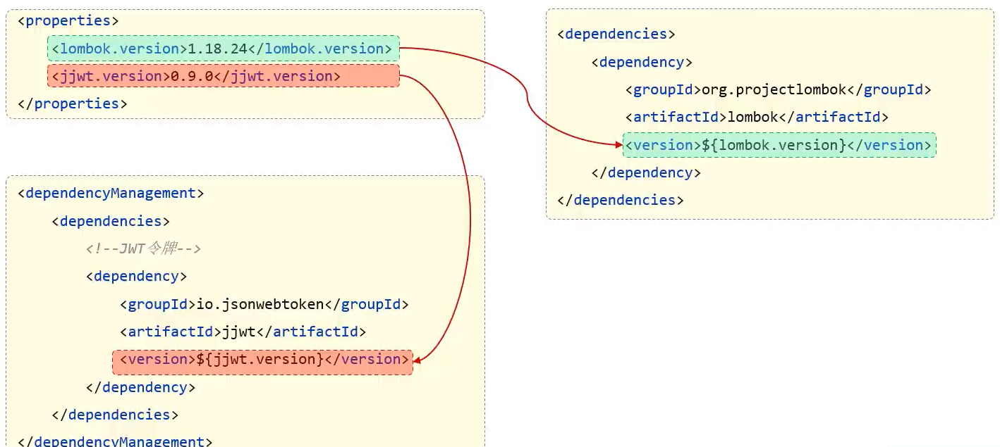

> 在`<properties>`标签中声明属性，属性名一般和模块名有关系，使用时直接引入属性值即可(子工程继承父工程的属性值)

### 继承和锁定区分

- 父工程需要被子工程继承的依赖定义在`<project>`下的`<dependencies>`下，代表全局引入
- 父工程需要对子工程版本锁定的依赖定义在`<project>`下的`<dependencyManagement>`下的`<dependencies>`下，不是全局引入依赖，子项目可以依据自己的情况引入，只是进行版本锁定

## 聚合

> 通过一个不具有业务功能的空工程（有且仅有一个pom文件），将多个模块组织成一个整体，同时进行项目的构建，可以快速构建项目（无需根据依赖关系手动构建，直接在聚合工程上构建即可）
>
> 通过`<modules>`设置当前聚合工程所包含的子模块名称

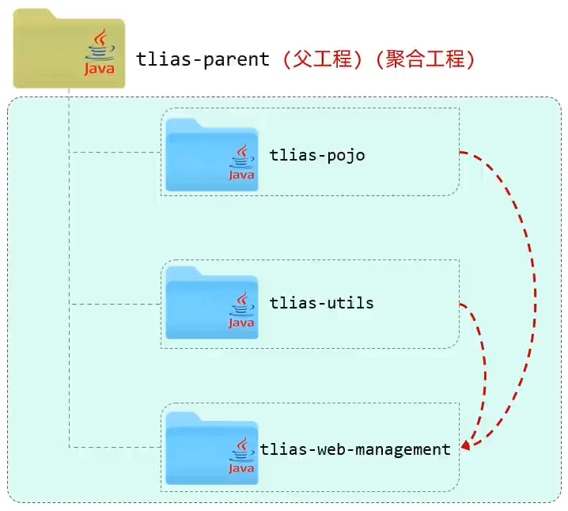

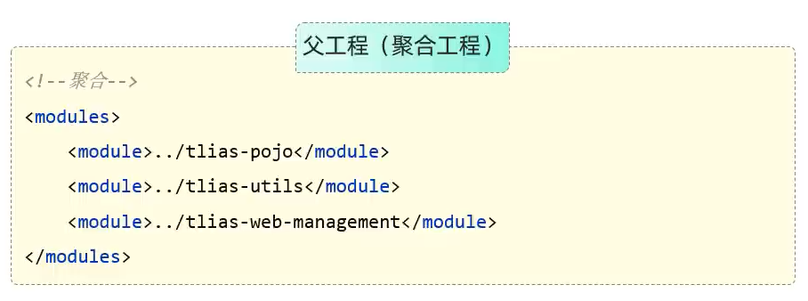

> 聚合工程中所包含的模块，在构建时，会自动根据模块间的依赖关系设置构建顺序，与聚合工程中模块的配置与书写位置无关

## 聚合和继承对比

作用：

- 聚合用于快速构建项目
- 继承用于简化依赖配置、统一管理依赖

相同点：

- 聚合与继承的pom.xml文件打包方式均属于pom，可以将两种关系制作到同一个pom文件中
- 聚合与继承均属于设计型模块，并无实际的模块内容

不同点：

- 聚合是在聚合工程中配置关系，聚合可以感知到参与聚合的模块有哪些
- 继承是在子模块中配置关系，父模块无法感知哪些子模块继承了自己
