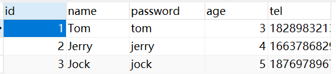
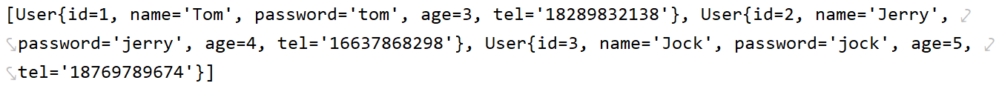

# MyBatisPlus入门

## 简介

MyBatisPlus（简称MP）是基于MyBatis框架基础上开发的增强型工具，旨在简化开发、提高效率

> 官网：
>
> - [MyBatis-Plus (baomidou.com)](https://baomidou.com/)
>
> 官方文档：
>
> - [简介 | MyBatis-Plus (baomidou.com)](https://baomidou.com/pages/24112f/)

开发方式

- 基于MyBatis使用MyBatisPlus
- 基于Spring使用MyBatisPlus
- **基于SpringBoot使用MyBatisPlus**

## 特性

- 无侵入：只做增强不做改变，引入它不会对现有工程产生影响，如丝般顺滑
- 损耗小：启动即会自动注入基本 CURD，性能基本无损耗，直接面向对象操作
- 强大的 CRUD 操作：内置通用 Mapper、通用 Service，仅仅通过少量配置即可实现单表大部分 CRUD 操作，更有强大的条件构造器，满足各类使用需求
- 支持 Lambda 形式调用：通过 Lambda 表达式，方便的编写各类查询条件，无需再担心字段写错
- 支持主键自动生成：支持多达 4 种主键策略（内含分布式唯一 ID 生成器 - Sequence），可自由配置，完美解决主键问题
- 支持 ActiveRecord 模式：支持 ActiveRecord 形式调用，实体类只需继承 Model 类即可进行强大的 CRUD 操作
- 支持自定义全局通用操作：支持全局通用方法注入（ Write once, use anywhere ）
- 内置代码生成器：采用代码或者 Maven 插件可快速生成 Mapper 、 Model 、 Service 、 Controller 层代码，支持模板引擎，更有超多自定义配置等您来使用
- 内置分页插件：基于 MyBatis 物理分页，开发者无需关心具体操作，配置好插件之后，写分页等同于普通 List 查询
- 分页插件支持多种数据库：支持 MySQL、MariaDB、Oracle、DB2、H2、HSQL、SQLite、Postgre、SQLServer 等多种数据库
- 内置性能分析插件：可输出 SQL 语句以及其执行时间，建议开发测试时启用该功能，能快速揪出慢查询
- 内置全局拦截插件：提供全表 delete 、 update 操作智能分析阻断，也可自定义拦截规则，预防误操作

## 入门案例

pom.xml

```xml
        <dependency>
            <groupId>mysql</groupId>
            <artifactId>mysql-connector-java</artifactId>
            <scope>runtime</scope>
        </dependency>

        <dependency>
            <groupId>com.baomidou</groupId>
            <artifactId>mybatis-plus-boot-starter</artifactId>
            <version>3.4.2</version>
        </dependency>

        <dependency>
            <groupId>com.alibaba</groupId>
            <artifactId>druid-spring-boot-starter</artifactId>
            <version>1.1.23</version>
        </dependency>
```

application.yml

```yaml
spring:
  datasource:
    type: com.alibaba.druid.pool.DruidDataSource
    driver-class-name: com.mysql.cj.jdbc.Driver
    url: jdbc:mysql://localhost:3306/mybatisplus_db?serverTimezone=UTC
    username: root
    password: yuxingxuan
```

User.java

```java
public class User implements Serializable {
    private Long id;
    private String name;
    private String password;
    private Integer age;
    private String tel;
}
// 省略get，set和toString方法
```

UserDao.java

```java
import com.baomidou.mybatisplus.core.mapper.BaseMapper;
import hello.domain.User;
import org.apache.ibatis.annotations.Mapper;

@Mapper
public interface UserDao extends BaseMapper<User> {
}
```

> UserService.java
>
> ```java
> import hello.domain.User;
> import com.baomidou.mybatisplus.extension.service.IService;
> 
> public interface UserService extends IService<User> {
> }
> ```
>
> UserServiceImpl.java
>
> ```java
> import hello.Mapper.UserMapper;
> import hello.Service.UserService;
> import hello.domain.User;
> import com.baomidou.mybatisplus.extension.service.impl.ServiceImpl;
> import org.springframework.stereotype.Service;
> 
> @Service
> public class UserServiceImpl extends ServiceImpl<UserMapper, User> implements UserService {
> }
> ```

MyBatisPlusTest.java

```java
@SpringBootTest(classes = MainApplication.class)
@RunWith(SpringRunner.class)
public class MyBatisPlusTest {
    @Resource
    private UserDao userDao;

    @Test
    public void testGetAll(){
        List<User> users = userDao.selectList(null);
        System.out.println(users);
    }
}
```

> 
>
> 
