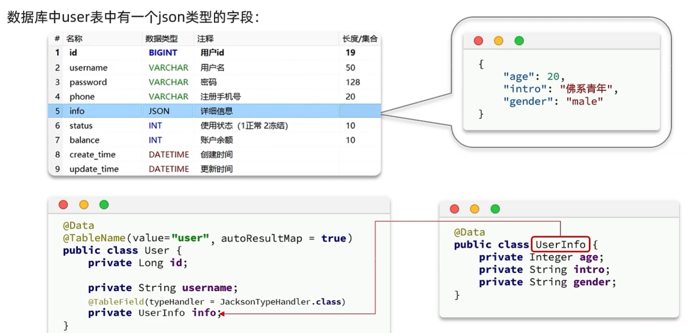
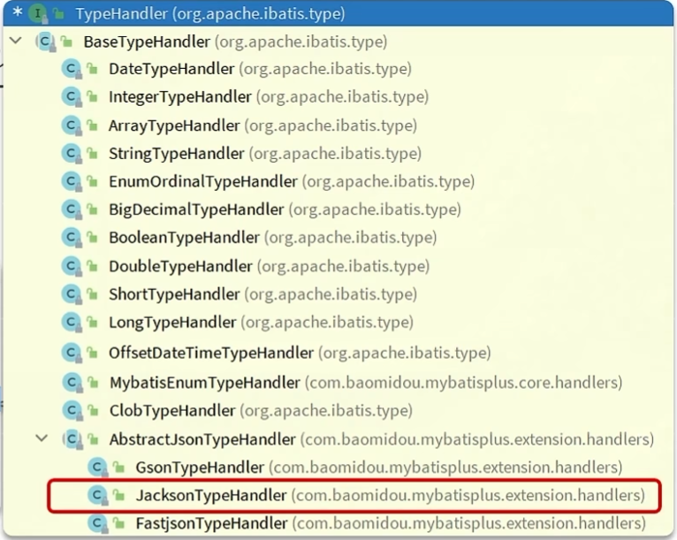

# JSON处理器

> 可以对直接存储在数据库中的JSON字符串进行映射处理



Mp增加了抽象JSON类型处理器：



## 示例使用

UserInfo.java

```java
@Data
@NoArgsConstructor
@AllArgsConstructor(staticName = "of") // 定义满参构造方法为静态的of方法(user.setInfo(UserInfo.of(20, "你好", "meal")))
// {"age":20,"intro":"佛系青年","gender":"male"}
public class UserInfo {
    private Integer age;
    private String intro;
    private String gender;
}
```

User.java

```java
@TableName(value = "tb_users", autoResultMap = true) // 设置映射的表名，开启自动创建结果映射
public class User implements Serializable {

    private static final long serialVersionUID = 1L;

    @TableId(type = IdType.ASSIGN_ID) //设置为主键且是自增的，确保在进行添加时不会出错
    // 指定MVC在序列化为JSON时将该字段转化为String类型
    @JsonFormat(shape = JsonFormat.Shape.STRING)
    private Long id;

    private String name;

    private String password;

    @TableField(typeHandler = JacksonTypeHandler.class)
    // 配置所使用的JSON处理器
    private UserInfo info;

    @TableField(fill = FieldFill.INSERT_UPDATE) //插入和更新时填充字段
    @DateTimeFormat(pattern = "yyyy-MM-dd HH:mm:ss")
    // 指定Java对象的属性在SpringMVC序列化为JSON时的处理方式
    @JsonFormat(pattern = "yyyy-MM-dd")
    private LocalDateTime updateTime;

    private UserStatus status;
}
```

> 返回给前端的结果
>
> ```json
> {
>     "code": 1,
>     "msg": null,
>     "data": [
>         {
>             "id": "1741080629858029569",
>             "name": null,
>             "password": null,
>             "info": {
>                 "age": 20,
>                 "intro": "佛系青年",
>                 "gender": "male"
>             },
>             "updateTime": "2023-12-12T12:12:12",
>             "status": "正常"
>         }
>     ],
>     "map": {}
> }
> ```

## 参考源码

JacksonTypeHandler.java

```java
package com.baomidou.mybatisplus.extension.handlers;

import com.baomidou.mybatisplus.core.toolkit.Assert;
import com.fasterxml.jackson.core.JsonProcessingException;
import com.fasterxml.jackson.databind.ObjectMapper;
import java.io.IOException;
import org.apache.ibatis.type.JdbcType;
import org.apache.ibatis.type.MappedJdbcTypes;
import org.apache.ibatis.type.MappedTypes;
import org.slf4j.Logger;
import org.slf4j.LoggerFactory;

@MappedTypes({Object.class})
@MappedJdbcTypes({JdbcType.VARCHAR})
public class JacksonTypeHandler extends AbstractJsonTypeHandler<Object> {
    private static final Logger log = LoggerFactory.getLogger(JacksonTypeHandler.class);
    private static ObjectMapper OBJECT_MAPPER;
    private final Class<?> type;

    public JacksonTypeHandler(Class<?> type) {
        if (log.isTraceEnabled()) {
            log.trace("JacksonTypeHandler(" + type + ")");
        }

        Assert.notNull(type, "Type argument cannot be null", new Object[0]);
        this.type = type;
    }

    protected Object parse(String json) {
        try {
            return getObjectMapper().readValue(json, this.type);
        } catch (IOException var3) {
            throw new RuntimeException(var3);
        }
    }

    protected String toJson(Object obj) {
        try {
            return getObjectMapper().writeValueAsString(obj);
        } catch (JsonProcessingException var3) {
            throw new RuntimeException(var3);
        }
    }

    public static ObjectMapper getObjectMapper() {
        if (null == OBJECT_MAPPER) {
            OBJECT_MAPPER = new ObjectMapper();
        }

        return OBJECT_MAPPER;
    }

    public static void setObjectMapper(ObjectMapper objectMapper) {
        Assert.notNull(objectMapper, "ObjectMapper should not be null", new Object[0]);
        OBJECT_MAPPER = objectMapper;
    }
}

```

FastjsonTypeHandler.java

```java
package com.baomidou.mybatisplus.extension.handlers;

import com.alibaba.fastjson.JSON;
import com.alibaba.fastjson.serializer.SerializerFeature;
import com.baomidou.mybatisplus.core.toolkit.Assert;
import org.apache.ibatis.type.JdbcType;
import org.apache.ibatis.type.MappedJdbcTypes;
import org.apache.ibatis.type.MappedTypes;
import org.slf4j.Logger;
import org.slf4j.LoggerFactory;

@MappedTypes({Object.class})
@MappedJdbcTypes({JdbcType.VARCHAR})
public class FastjsonTypeHandler extends AbstractJsonTypeHandler<Object> {
    private static final Logger log = LoggerFactory.getLogger(FastjsonTypeHandler.class);
    private final Class<?> type;

    public FastjsonTypeHandler(Class<?> type) {
        if (log.isTraceEnabled()) {
            log.trace("FastjsonTypeHandler(" + type + ")");
        }

        Assert.notNull(type, "Type argument cannot be null", new Object[0]);
        this.type = type;
    }

    protected Object parse(String json) {
        return JSON.parseObject(json, this.type);
    }

    protected String toJson(Object obj) {
        return JSON.toJSONString(obj, new SerializerFeature[]{SerializerFeature.WriteMapNullValue, SerializerFeature.WriteNullListAsEmpty, SerializerFeature.WriteNullStringAsEmpty});
    }
}

```

