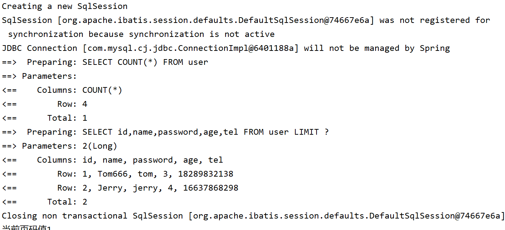

# 标准数据层开发


## CRUD 接口

### Service CRUD 接口

> 说明:
>
> - 通用 Service CRUD 封装[IService (opens new window)](https://gitee.com/baomidou/mybatis-plus/blob/3.0/mybatis-plus-extension/src/main/java/com/baomidou/mybatisplus/extension/service/IService.java)接口，进一步封装 CRUD 采用 `get 查询单行` `remove 删除` `list 查询集合` `page 分页` 前缀命名方式区分 `Mapper` 层避免混淆，
> - 泛型 `T` 为任意实体对象
> - 建议如果存在自定义通用 Service 方法的可能，请创建自己的 `IBaseService` 继承 `Mybatis-Plus` 提供的基类
> - 对象 `Wrapper` 为 [条件构造器](https://baomidou.com/pages/10c804/)

#### Save

```java
// 插入一条记录（选择字段，策略插入）
boolean save(T entity);
// 插入（批量）
boolean saveBatch(Collection<T> entityList);
// 插入（批量）
boolean saveBatch(Collection<T> entityList, int batchSize);
```

> #### 参数说明
>
> |     类型      |   参数名   |     描述     |
> | :-----------: | :--------: | :----------: |
> |       T       |   entity   |   实体对象   |
> | Collection<T> | entityList | 实体对象集合 |
> |      int      | batchSize  | 插入批次数量 |

#### SaveOrUpdate

```java
// TableId 注解存在更新记录，否插入一条记录
boolean saveOrUpdate(T entity);
// 根据updateWrapper尝试更新，否继续执行saveOrUpdate(T)方法
boolean saveOrUpdate(T entity, Wrapper<T> updateWrapper);
// 批量修改插入
boolean saveOrUpdateBatch(Collection<T> entityList);
// 批量修改插入
boolean saveOrUpdateBatch(Collection<T> entityList, int batchSize);
```

> #### 参数说明
>
> |     类型      |    参数名     |               描述               |
> | :-----------: | :-----------: | :------------------------------: |
> |       T       |    entity     |             实体对象             |
> |  Wrapper<T>   | updateWrapper | 实体对象封装操作类 UpdateWrapper |
> | Collection<T> |  entityList   |           实体对象集合           |
> |      int      |   batchSize   |           插入批次数量           |

#### Remove

```java
// 根据 queryWrapper 设置的条件，删除记录
boolean remove(Wrapper<T> queryWrapper);
// 根据 ID 删除
boolean removeById(Serializable id);
// 根据 columnMap 条件，删除记录
boolean removeByMap(Map<String, Object> columnMap);
// 删除（根据ID 批量删除）
boolean removeByIds(Collection<? extends Serializable> idList);
```

> #### 参数说明
>
> |                类型                |    参数名    |          描述           |
> | :--------------------------------: | :----------: | :---------------------: |
> |             Wrapper<T>             | queryWrapper | 实体包装类 QueryWrapper |
> |            Serializable            |      id      |         主键 ID         |
> |        Map<String, Object>         |  columnMap   |     表字段 map 对象     |
> | Collection<? extends Serializable> |    idList    |      主键 ID 列表       |

#### Update

```java
// 根据 UpdateWrapper 条件，更新记录 需要设置sqlset
boolean update(Wrapper<T> updateWrapper);
// 根据 whereWrapper 条件，更新记录
boolean update(T updateEntity, Wrapper<T> whereWrapper);
// 根据 ID 选择修改
boolean updateById(T entity);
// 根据ID 批量更新
boolean updateBatchById(Collection<T> entityList);
// 根据ID 批量更新
boolean updateBatchById(Collection<T> entityList, int batchSize);
```

> #### 参数说明
>
> |     类型      |    参数名     |               描述               |
> | :-----------: | :-----------: | :------------------------------: |
> |  Wrapper<T>   | updateWrapper | 实体对象封装操作类 UpdateWrapper |
> |       T       |    entity     |             实体对象             |
> | Collection<T> |  entityList   |           实体对象集合           |
> |      int      |   batchSize   |           更新批次数量           |

#### Get

```java
// 根据 ID 查询
T getById(Serializable id);
// 根据 Wrapper，查询一条记录。结果集，如果是多个会抛出异常，随机取一条加上限制条件 wrapper.last("LIMIT 1")
T getOne(Wrapper<T> queryWrapper);
// 根据 Wrapper，查询一条记录
T getOne(Wrapper<T> queryWrapper, boolean throwEx);
// 根据 Wrapper，查询一条记录
Map<String, Object> getMap(Wrapper<T> queryWrapper);
// 根据 Wrapper，查询一条记录
<V> V getObj(Wrapper<T> queryWrapper, Function<? super Object, V> mapper);
```

> #### 参数说明
>
> |            类型             |    参数名    |              描述               |
> | :-------------------------: | :----------: | :-----------------------------: |
> |        Serializable         |      id      |             主键 ID             |
> |         Wrapper<T>          | queryWrapper | 实体对象封装操作类 QueryWrapper |
> |           boolean           |   throwEx    |   有多个 result 是否抛出异常    |
> |              T              |    entity    |            实体对象             |
> | Function<? super Object, V> |    mapper    |            转换函数             |

#### List

```java
// 查询所有
List<T> list();
// 查询列表
List<T> list(Wrapper<T> queryWrapper);
// 查询（根据ID 批量查询）
Collection<T> listByIds(Collection<? extends Serializable> idList);
// 查询（根据 columnMap 条件）
Collection<T> listByMap(Map<String, Object> columnMap);
// 查询所有列表
List<Map<String, Object>> listMaps();
// 查询列表
List<Map<String, Object>> listMaps(Wrapper<T> queryWrapper);
// 查询全部记录
List<Object> listObjs();
// 查询全部记录
<V> List<V> listObjs(Function<? super Object, V> mapper);
// 根据 Wrapper 条件，查询全部记录
List<Object> listObjs(Wrapper<T> queryWrapper);
// 根据 Wrapper 条件，查询全部记录
<V> List<V> listObjs(Wrapper<T> queryWrapper, Function<? super Object, V> mapper);
```

> #### 参数说明
>
> |                类型                |    参数名    |              描述               |
> | :--------------------------------: | :----------: | :-----------------------------: |
> |             Wrapper<T>             | queryWrapper | 实体对象封装操作类 QueryWrapper |
> | Collection<? extends Serializable> |    idList    |          主键 ID 列表           |
> |        Map<String, Object>         |  columnMap   |         表字段 map 对象         |
> |    Function<? super Object, V>     |    mapper    |            转换函数             |

#### Page

```java
// 无条件分页查询
IPage<T> page(IPage<T> page);
// 条件分页查询
IPage<T> page(IPage<T> page, Wrapper<T> queryWrapper);
// 无条件分页查询
IPage<Map<String, Object>> pageMaps(IPage<T> page);
// 条件分页查询
IPage<Map<String, Object>> pageMaps(IPage<T> page, Wrapper<T> queryWrapper);
```

> #### 参数说明
>
> |    类型    |    参数名    |              描述               |
> | :--------: | :----------: | :-----------------------------: |
> |  IPage<T>  |     page     |            翻页对象             |
> | Wrapper<T> | queryWrapper | 实体对象封装操作类 QueryWrapper |

#### Count

```java
// 查询总记录数
int count();
// 根据 Wrapper 条件，查询总记录数
int count(Wrapper<T> queryWrapper);
```

> 如果sql语句中使用了`group by`，结果有多个组的话，使用`count`统计的就是每个组成员的个数。但是使用Mp的`count`方法会报错，因为方法底层使用的是`selectOne`方法，而返回的结果集有多个，就会报错
>
> 
>
> - `count(*)`：表示统计所有行数，包括字段为NULL的行。它会对每一行的所有字段进行计算，包括NULL值，这会增加计算的复杂度和消耗
> - `count(1)`：表示统计行数，忽略具体的字段值。它只需要判断每一行是否存在，而不需要对字段进行计算，这样可以减少计算的复杂度和消耗

#### Chain

> ```java
>         // 构造方法中指定实现BaseMapper的对象
>         LambdaUpdateChainWrapper<User> wrapper = new LambdaUpdateChainWrapper<>(userMapper);
> ```

query

```java
// 链式查询 普通
QueryChainWrapper<T> query();
// 链式查询 lambda 式。注意：不支持 Kotlin
LambdaQueryChainWrapper<T> lambdaQuery();

// 示例：
query().eq("column", value).one();
lambdaQuery().eq(Entity::getId, value).list();
```

update

```java
// 链式更改 普通
UpdateChainWrapper<T> update();
// 链式更改 lambda 式。注意：不支持 Kotlin
LambdaUpdateChainWrapper<T> lambdaUpdate();

// 示例：
update().eq("column", value).remove();
lambdaUpdate().eq(Entity::getId, value).update(entity);
```

### Mapper CRUD 接口

> 说明:
>
> - 通用 CRUD 封装[BaseMapper (opens new window)](https://gitee.com/baomidou/mybatis-plus/blob/3.0/mybatis-plus-core/src/main/java/com/baomidou/mybatisplus/core/mapper/BaseMapper.java)接口，为 `Mybatis-Plus` 启动时自动解析实体表关系映射转换为 `Mybatis` 内部对象注入容器
> - 泛型 `T` 为任意实体对象
> - 参数 `Serializable` 为任意类型主键 `Mybatis-Plus` 不推荐使用复合主键约定每一张表都有自己的唯一 `id` 主键
> - 对象 `Wrapper` 为 [条件构造器](https://baomidou.com/01.指南/02.核心功能/wrapper.html)

#### Insert

```java
// 插入一条记录
int insert(T entity);
```

#### Delete

```java
// 根据 entity 条件，删除记录
int delete(@Param(Constants.WRAPPER) Wrapper<T> wrapper);
// 删除（根据ID 批量删除）
int deleteBatchIds(@Param(Constants.COLLECTION) Collection<? extends Serializable> idList);
// 根据 ID 删除
int deleteById(Serializable id);
// 根据 columnMap 条件，删除记录
int deleteByMap(@Param(Constants.COLUMN_MAP) Map<String, Object> columnMap);
```

#### Update

```java
// 根据 whereWrapper 条件，更新记录
int update(@Param(Constants.ENTITY) T updateEntity, @Param(Constants.WRAPPER) Wrapper<T> whereWrapper);
// 根据 ID 修改
int updateById(@Param(Constants.ENTITY) T entity);
```

> 使用提示：在调用`updateById`方法前，需要在`T entity`（对应的实体类）中的主键属性上加上`@TableId`注解。

#### Select

```java
// 根据 ID 查询
T selectById(Serializable id);
// 根据 entity 条件，查询一条记录
T selectOne(@Param(Constants.WRAPPER) Wrapper<T> queryWrapper);

// 查询（根据ID 批量查询）
List<T> selectBatchIds(@Param(Constants.COLLECTION) Collection<? extends Serializable> idList);
// 根据 entity 条件，查询全部记录
List<T> selectList(@Param(Constants.WRAPPER) Wrapper<T> queryWrapper);
// 查询（根据 columnMap 条件）
List<T> selectByMap(@Param(Constants.COLUMN_MAP) Map<String, Object> columnMap);
// 根据 Wrapper 条件，查询全部记录
List<Map<String, Object>> selectMaps(@Param(Constants.WRAPPER) Wrapper<T> queryWrapper);
// 根据 Wrapper 条件，查询全部记录。注意： 只返回第一个字段的值
List<Object> selectObjs(@Param(Constants.WRAPPER) Wrapper<T> queryWrapper);

// 根据 entity 条件，查询全部记录（并翻页）
IPage<T> selectPage(IPage<T> page, @Param(Constants.WRAPPER) Wrapper<T> queryWrapper);
// 根据 Wrapper 条件，查询全部记录（并翻页）
IPage<Map<String, Object>> selectMapsPage(IPage<T> page, @Param(Constants.WRAPPER) Wrapper<T> queryWrapper);
// 根据 Wrapper 条件，查询总记录数
Integer selectCount(@Param(Constants.WRAPPER) Wrapper<T> queryWrapper);
```

## 标准数据层CRUD功能

MyBatisPlusTest.java

```java
@RunWith(SpringRunner.class)
@SpringBootTest(classes = MainApplication.class)
public class MyBatisPlusTest {
    @Resource
    private UserDao userDao;

    @Test
    public void testInsert(){
        User user = new User();
        // 对于未设置的主键，默认使用雪花算法生成ID
        user.setName("Hello");
        user.setPassword("World");
        user.setAge(12);
        user.setTel("15116003441");
        userDao.insert(user);
    }

    @Test
    public void testDelete(){
        userDao.deleteById(1679390769917546497L);
    }

    @Test
    public void testUpdate(){
        User user = new User();
        user.setId(1L);
        user.setName("Tom666");
        // 只修改提供的字段，对于未设置的值(null)，不会进行修改
        userDao.updateById(user);
    }

    @Test
    public void testGetById(){
        User user = userDao.selectById(2L);
        System.out.println(user);
    }

    @Test
    public void testGetAll(){
        List<User> users = userDao.selectList(null);
        System.out.println(users);
    }
}
```

**多数据操作**

```java
    @Test
    public void testDeleteMultiple(){
        List<Long> list = new ArrayList<>();
        list.add(1679767372400971778L);
        list.add(1679767372400971779L);
        list.add(1679769674381905921L);
        userDao.deleteBatchIds(list);
    }

    @Test
    public void testSelectMultiple(){
        List<Long> list = new ArrayList<>();
        list.add(1L);
        list.add(2L);
        list.add(3L);
        userDao.selectBatchIds(list);
    }
```

## 分页功能

> - Page对象：
>   - 当进行分页查询时，可以通过创建Page对象并设置需要的页码和每页记录数，然后将Page对象传递给Mapper的查询方法。Mybatis Plus会自动的将Page对象中设置的分页参数应用到SQL语句中，生成对应的分页查询SQL语句
>
> Page对象中还提供了一些其他的方法，如设置是否进行count查询、获取总记录数、获取总页数等
>
> Page对象的一个特性是它单独持有查询结果的记录集合，和总页数、总记录数等分页相关的信息。这些信息可以通过Page对象的方法直接获取
>
> 总的来说，Page对象是一个方便直接对结果集进行分页操作的工具
>
> - IPage对象：
>   - IPage对象则是一个接口，定义了一些分页相关的方法，Page对象实际上就是继承并实现了IPage接口。
>
> 相较于Page对象，IPage接口使用起来会更加灵活，可以实现自定义的分页逻辑，它只定义了标准的一些分页操作，具体实现可 以由使用者按需定制
>
> 使用IPage接口进行查询，查询结果会放在records属性中，为集合类型的属性
>
> 总结：Page对象与IPage接口的主要区别在于，Page对象是一个具体的分页工具类，提供了一些便利的方法用于进行分页处理。而IPage接口只定义了一些标准的分页操作，具体实现可以自定义

### 开启Mp拦截器

MpConfig.java

```java
import com.baomidou.mybatisplus.annotation.DbType;
import com.baomidou.mybatisplus.extension.plugins.MybatisPlusInterceptor;
import com.baomidou.mybatisplus.extension.plugins.inner.PaginationInnerInterceptor;
import org.springframework.context.annotation.Bean;
import org.springframework.context.annotation.Configuration;

@Configuration
public class MpConfig {
    @Bean
    public MybatisPlusInterceptor mpInterceptor(){
        // 1.定义Mp的拦截器
        MybatisPlusInterceptor mpInterceptor = new MybatisPlusInterceptor();
        PaginationInnerInterceptor paginationInnerInterceptor = new PaginationInnerInterceptor(DbType.MYSQL);
        paginationInnerInterceptor.setMaxLimit(1000L); // 设置分页上限
        // 2.添加分页拦截器
        mpInterceptor.addInnerInterceptor(new PaginationInnerInterceptor());
        return mpInterceptor;
    }
}
```

### 使用分页

MyBatisPlusTest.java

```java
    @Test
    public void testGetByPage(){
        // 查第1页，每页2条
        IPage page = new Page(1,2);
        userDao.selectPage(page,null); // 传入分页对象，查询条件为null
        System.out.println("当前页码值" + page.getCurrent());
        System.out.println("每页显示数" + page.getSize());
        System.out.println("一共多少页" + page.getPages());
        System.out.println("一共多少条数据" + page.getTotal());
        System.out.println("数据" + page.getRecords());
    }
```

> 

**如果是对于自己手动编写的sql，想要进行分页**，可以在方法的形参中传入`IPage page`参数，返回结果为`IPage`即可自动完成分页

Mapper.java

```java
    @Select("select * from tb_users")
    IPage<User> getPageList(IPage page);
```

```java
        IPage<User> pageList = userMapper.getPageList(new Page(2, 3));
```

```
==>  Preparing: SELECT COUNT(*) FROM tb_users
==> Parameters: 
<==    Columns: COUNT(*)
<==        Row: 16
<==      Total: 1
==>  Preparing: select * from tb_users LIMIT ?,?
==> Parameters: 3(Long), 3(Long)
<==    Columns: id, name, password, update_time, create_user
<==        Row: 4, y, "324", null, null
<==        Row: 5, testQuery, 123, null, null
<==        Row: 6, null, 123, null, null
<==      Total: 3
```

### 添加分页条件

> 可以在Query对象中添加分页条件，也可以在Page对象中添加条件(`new OrderItem()`对象)

```java
        // 定义排序条件
        OrderItem orderItem = new OrderItem("update_time", Boolean.TRUE);
        // 定义分页对象
        Page<User> page = new Page<>(1, 2);
        // 添加排序条件
        page.addOrder(orderItem);

        Page<User> result = lambdaQuery().page(page);
```

```
==>  Preparing: SELECT id, name, password, info, update_time, status FROM tb_users ORDER BY update_time ASC LIMIT ?
==> Parameters: 2(Long)
<==    Columns: id, name, password, info, update_time, status
<==        Row: 1, null, null, null, 2023-09-13 11:38:20, null
<==        Row: 1741080629858029569, null, null, {"age":20,"intro":"佛系青年","gender":"male"}, 2023-12-12 12:12:12, 1
<==      Total: 2
```

## 配置运行日志

application.yml

```yaml
mybatis-plus:
  configuration:
    # 开启Mp的日志，输出到控制台
    log-impl: org.apache.ibatis.logging.stdout.StdOutImpl
```

> 