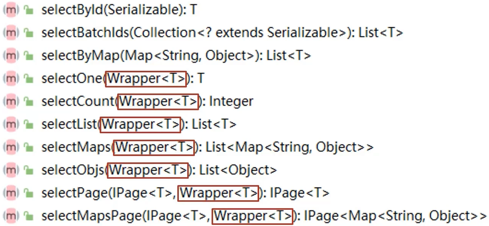

# 条件查询

MyBatisPlus将书写复杂的SQL查询条件进行了封装，使用编程的形式完成查询条件的组合



## 控制台打印信息优化

logback.xml

```xml
<?xml version="1.0" encoding="UTF-8"?>
<configuration>

</configuration>
```

配置application.yml，关闭banner

```yaml
spring:
  main:
    banner-mode: off

mybatis-plus:
  global-config:
    banner: false
```

## 条件查询的三种格式

MyBatisPlusTest.java

```java
    @Test
    public void testSelect(){
        // 方式一
//        QueryWrapper qw = new QueryWrapper();
//        // 小大对比，&lt("<")，&gt(">")
//        qw.lt("age", 4);
//        List<User> users = userDao.selectList(qw);
//        System.out.println(users);

        // 方式二
//        QueryWrapper<User> qw = new QueryWrapper();
//        // 小大对比，&lt("<")，&gt(">")
//        qw.lambda().lt(User::getAge, 4);
//        List<User> users = userDao.selectList(qw);
//        System.out.println(users);

        // 方式三
        LambdaQueryWrapper<User> lqw = new LambdaQueryWrapper<>();
        // 链式编程，通过or进行实现"或"查询
        lqw.lt(User::getAge, 2).or().gt(User::getAge, 4);
        List<User> users = userDao.selectList(lqw);
        System.out.println(users);
    }
```

## ChainWrapper

> 把查询条件和Mapper的操作合二为一，直接通过链式编程快速完成一整套逻辑

```java
        LambdaQueryChainWrapper<User> queryChainWrapper = new LambdaQueryChainWrapper<>(userMapper);
        User one = queryChainWrapper.eq(User::getId, "1").one();
```

> 在Impl层可以直接通过`lambdaQuery()`直接获取`LambdaQueryChainWrapper<User> queryChainWrapper = lambdaQuery()`

## QueryWrapper

> 继承自 AbstractWrapper ，自身的内部属性 `entity` 也用于生成 where 条件
> 及 LambdaQueryWrapper ，可以通过 `new QueryWrapper().lambda()` 方法获取

```java
select(String... sqlSelect)
select(Predicate<TableFieldInfo> predicate)
select(Class<T> entityClass, Predicate<TableFieldInfo> predicate)
```

> 第一类方法为：选择查询出想要的字段，例：`select("id", "name", "age")`
>
> 第二类方法为：过滤查询字段(主键除外)，入参不包含 class 的调用前需要`wrapper`内的`entity`属性有值！这两类方法重复调用以最后一次为准
>
> 例：`select(i -> i.getProperty().startsWith("test"))`
>
> ```java
>         LambdaQueryWrapper<User> lambdaQueryWrapper = new LambdaQueryWrapper<>();
>         // 传入字节码对象才能使用lambda表达式进行过滤，getProperty()获取属性名字，getColumn()获取字段名字
>         lambdaQueryWrapper.select(User.class, item -> item.getColumn().startsWith("pass"));
>         // 没有字节码文件，直接使用lambda表达式会报错
> //        lambdaQueryWrapper.select(item -> item.getProperty().startsWith("id"));
>         // 以最后一次调用为准，这里直接使用了字段名，类比于select(String... sqlSelect)
>         lambdaQueryWrapper.select(User::getId, User::getPassword);
> ```

## UpdateWrapper

> 继承自 `AbstractWrapper` ，自身的内部属性 `entity` 也用于生成 where 条件
> 及 `LambdaUpdateWrapper` ，可以通过 `new UpdateWrapper().lambda()` 方法获取

```java
set(String column, Object val)
set(boolean condition, String column, Object val)
```

> 例：`set("name", "老李头")`
>
> 例： `set("name", "")`--->数据库字段值变为**空字符串**
>
> 例:：`set("name", null)`--->数据库字段值变为`null`

### setSql

> 可以直接设置一段自定义的 SQL 代码

```java
setSql(String sql)
```

> 设置 SET 部分 SQL，会自动在语句前面加`,`分隔，例： `setSql("name = '老李头'")`

## QueryWrapper和UpdateWrapper

- `QueryWrapper`主要用于构建查询条件，以从数据库中获取满足特定条件的数据。
- `UpdateWrapper`主要用于构建更新操作的条件和**更新的字段值**，以更新数据库中满足特定条件的数据

```java
        // 条件的entity
        User userCondition = new User();
        userCondition.setId(2L);

        // 使用构造方法，将会依据user对象中属性值不为null的属性，构建where条件->id = 2
        LambdaUpdateWrapper<User> updateWrapper = new LambdaUpdateWrapper<>(userCondition);
        // 继续构建更新条件和更新内容，默认不会更新pojo中属性为null的字段，但可以手动设置为空值
        updateWrapper.set(User::getName, null);

        // 更新内容的entity
        User userUpdate = new User();
        userUpdate.setPassword("yuuuu");

        // 更新id为2的列，设置name为null，设置password为yuuuu
        // ==>  Preparing: UPDATE tb_users SET password=?, name=? WHERE id=?
        // ==> Parameters: yuuuu(String), null, 2(Long)
        // <==    Updates: 1
        userMapper.update(userUpdate, updateWrapper);
```

## null值处理

> 对于多条件查询，可能会存在其中一个或者多个为"null"的情况，但是在条件组合查询时，往往会将所有的条件都放进去，此时，一个个判断每一个属性的值是否为空再将决定是否输入到条件中，是很麻烦的一个过程

MyBatisPlusTest.java

```java
    @Test
    public void testSelectNull(){
        // 假设这是传过来的条件
        User user = new User();
        user.setAge(3);
        user.setName("Jock");

        LambdaQueryWrapper<User> lqw = new LambdaQueryWrapper();
        // 当满足条件时才会拼接对应的查询条件(User::getAge为sql字段age，user.getAge()为对比值)
        lqw.gt(null != user.getAge(), User::getAge, user.getAge());
        // 当名字为空时，才会要求名字相等
        lqw.eq(null == user.getName(), User::getName, user.getName());
        System.out.println(userDao.selectList(lqw));
    }
```

> 

## 查询投影


MyBatisPlusTest.java

```java
    @Test
    public void testSelectProjection(){
        QueryWrapper qw = new QueryWrapper();
        qw.select("name");
        System.out.println(userDao.selectList(qw));
        // SELECT count(*) as count, age FROM user GROUP BY age
        qw.select("count(*) as count, age");
        // 进行分组
        qw.groupBy("age");
        List<Map<String, Object>> list = userDao.selectMaps(qw);
        // [{count=1, age=3}, {count=2, age=5}, {count=1, age=18}]
        System.out.println(list);

        LambdaQueryWrapper<User> lqw = new LambdaQueryWrapper();
        // 查询投影：指定查询的字段，SELECT id,age FROM user
        lqw.select(User::getId, User::getAge);
        List<User> userList = userDao.selectList(lqw);
        System.out.println(userList);
    }
```

## 查询条件


> 所有条件：[条件构造器 | MyBatis-Plus (baomidou.com)](https://baomidou.com/pages/10c804/#abstractwrapper)

MyBatisPlusTest.java

```java
    @Test
    public void testConditionSelect(){
        // &lt("<")，&gt(">")，&le("<=")，&ge(">=")，eq("=")，between(column, value1, value2)
        LambdaQueryWrapper<User> lqw = new LambdaQueryWrapper();
        // SELECT id,name,password,age,tel FROM user WHERE (age BETWEEN ? AND ?)
        lqw.between(User::getAge, 4,6);
        List<User> userList = userDao.selectList(lqw);
        System.out.println(userList);

        LambdaQueryWrapper<User> lqw1 = new LambdaQueryWrapper();
        // like：%?%，likeLeft：%?，likeRight：?%
        lqw1.likeRight(User::getName, "t");
        System.out.println(userDao.selectList(lqw1));
    }
```

### eq(=)

```java
eq(R column, Object val)
eq(boolean condition, R column, Object val)
```

> 例： `eq("name", "老王")`--->`name = '老王'`

### ne(<>)

> 例： `ne("name", "老王")`--->`name <> '老王'`

### gt(>)

> 例： `gt("age", 18)`--->`age > 18`

### ge(\>=)

> 例： `ge("age", 18)`--->`age >= 18`

### lt(<)

> 例： `lt("age", 18)`--->`age < 18`

### le(<=)

> 例： `le("age", 18)`--->`age <= 18`

### likeLeft

```java
likeLeft(R column, Object val)
likeLeft(boolean condition, R column, Object val)
```

> 例： `likeLeft("name", "王")`--->`name like '%王'`

### isNotNull

```java
isNotNull(R column)
isNotNull(boolean condition, R column)
```

> 例： `isNotNull("name")`--->`name is not null`

### notIn

```java
notIn(R column, Collection<?> value)
notIn(boolean condition, R column, Collection<?> value)
```

> 例： `notIn("age",{1,2,3})`--->`age not in (1,2,3)`

### inSql

```java
inSql(R column, String inValue)
inSql(boolean condition, R column, String inValue)
```

> 例： `inSql("id", "select id from table where id < 3")`--->`id in (select id from table where id < 3)`

### groupBy

```java
groupBy(R... columns)
groupBy(boolean condition, R... columns)
```

> 例： `groupBy("id", "name")`--->`group by id,name`

### orderByDesc

```java
orderByDesc(R... columns)
orderByDesc(boolean condition, R... columns)
```

> 例： `orderByDesc("id", "name")`--->`order by id DESC,name DESC`

### orderBy

```java
orderBy(boolean condition, boolean isAsc, R... columns)
```

> 例： `orderBy(true, true, "id", "name")`--->`order by id ASC,name ASC`

### having

```java
having(String sqlHaving, Object... params)
having(boolean condition, String sqlHaving, Object... params)
```

> 例： `having("sum(age) > {0}", 11)`--->`having sum(age) > 11`

### func

```java
func(Consumer<Children> consumer)
func(boolean condition, Consumer<Children> consumer)
```

> func 方法(主要方便在出现if...else下调用不同方法能不断链)，例：`func(i -> if(true) {i.eq("id", 1)} else {i.ne("id", 1)})`

### or

```java
or()
or(boolean condition)
or(Consumer<Param> consumer)
or(boolean condition, Consumer<Param> consumer)
```

> 例： `or(i -> i.eq("name", "李白").ne("status", "活着"))`--->`or (name = '李白' and status <> '活着')`

### nested

```java
nested(Consumer<Param> consumer)
nested(boolean condition, Consumer<Param> consumer)
```

> 例： `nested(i -> i.eq("name", "李白").ne("status", "活着"))`--->`(name = '李白' and status <> '活着')`

### apply

```java
apply(String applySql, Object... params)
apply(boolean condition, String applySql, Object... params)
```

> 例：`apply("date_format(dateColumn,'%Y-%m-%d') = {0}", "2008-08-08")`--->`date_format(dateColumn,'%Y-%m-%d') = '2008-08-08'")`

### last

```java
last(String lastSql)
last(boolean condition, String lastSql)
```

> 只能调用一次,多次调用以最后一次为准
>
> 例：`last("limit 1")`
>
> ```java
>         LambdaQueryWrapper<User> queryWrapper = new LambdaQueryWrapper<>();
>         queryWrapper.in(User::getId, idList);
>         // in查询的结果按顺序排序，规避了结果顺序会乱的情况
>         queryWrapper.last("ORDER BY FIELD(id," + StringUtils.join(idList, ",") + ")");
> ```

### notExists

```java
notExists(String notExistsSql)
notExists(boolean condition, String notExistsSql)
```

> 例： `notExists("select id from table where age = 1")`--->`not exists (select id from table where age = 1)`

## 映射匹配兼容性

- 表字段与编码属性设计不同步


- 编码中添加了数据库中未定义的属性(**根据java的pojo类属性生成的sql时，由于数据库没有对应的字段，会报错**)


- 采用默认查询开放了更多字段的查看权限


- 表名和编码开发设计不同步


> 配置application.yml，设置表名策略
>
> ```yaml
> mybatis-plus:
>   global-config:
>     db-config:
>       # 设置所有表名前缀带"tb_"
>       table-prefix: tb_
> ```