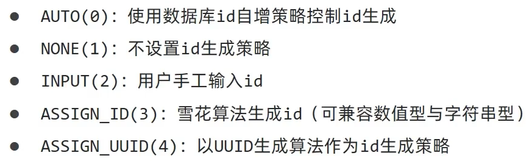

# id生成策略和公共字段填充

## id生成策略

不同表应用不同的id生成策略和公共字段填充


### 支持的策略



- 自增主键（AUTO）：使用**数据库的自增机制生成主键**，等同于默认插入id为null
- 不设置（NONE）：不设置id生成策略和公共字段填充，**插入数据时没有手动设置主键的值会使用默认的雪花算法**
- 用户自定义主键（INPUT）：手动指定主键的值，**插入数据时没有手动设置主键的值会使用默认的雪花算法**
- 雪花算法（ASSIGN_ID）：雪花算法生成id
- UUID算法（ASSIGN_UUID）：以UUID生成算法生成id

> 雪花算法组成：
>
> 
>
> 一切还是以手动设置主键为最优先，**如果手动设置了值，那么会优先使用设置的值**
>
> 已废弃的一些策略：
>
> - UUID(已废弃)：等同于ASSIGN_UUID
> - ID_WORKER(已废弃)：生成整数，等同于ASSIGN_ID
> - ID_WORKER_STR(已废弃)：生成字符串，等同于ASSIGN_ID

```java
    @TableId(type = IdType.ASSIGN_ID)
    private Long id;
```

> 在执行insert操作时，id无需设置，会自动使用雪花算法生成并插入，不依赖配置项

与前端的兼容性问题：

> Java的Long类型最大能表示9223372036854775807（即2的63次方-1），对于大于2的53次方的Long类型，JavaScript已经无法精确表示，会丢失精度
>
> 后端可以通过注解指定Spring默认的JSON工具包jackson的序列化方式来解决
>
> ```java
>        @TableId(type = IdType.ASSIGN_ID)
>        // 指定MVC在序列化为JSON时将该字段转化为String类型
>        @JsonFormat(shape = JsonFormat.Shape.STRING)
>        private Long id;
> ```

### 全局配置策略

application.yml

```yaml
mybatis-plus:
  global-config:
    db-config:
      # 定义主键自增策略(此时可以省略@TableId(type = IdType.ASSIGN_ID)，对于名称为id的属性就会自动填充)
      id-type: ASSIGN_ID
```

> 配置全局主键生成策略为ASSIGN_ID

## 公共字段填充

> 只对MyBatis-Plus提供的`insert`和`update`方法生效

对于在编辑时需要设置修改时间、修改人等公共字段，可以将其放在一个地方进行统一处理

```java
    @TableField(fill = FieldFill.INSERT) //插入时填充字段
    private LocalDateTime createTime;

    @TableField(fill = FieldFill.INSERT_UPDATE) //插入和更新时填充字段
    private LocalDateTime updateTime;

    @TableField(fill = FieldFill.INSERT) //插入时填充字段
    private Long createUser;

    @TableField(fill = FieldFill.INSERT_UPDATE) //插入和更新时填充字段
    private Long updateUser;
```

> 

BaseContext.java

```java
/**
 * 基于ThreadLocal封装工具类，用户保存和获取当前登录用户id
 */
public class BaseContext {
    private static ThreadLocal<Long> threadLocal = new ThreadLocal<>();

    /**
     * 设置值
     * @param id
     */
    public static void setCurrentId(Long id){
        threadLocal.set(id);
    }

    /**
     * 获取值
     * @return
     */
    public static Long getCurrentId(){
        return threadLocal.get();
    }

    /**
     * 移除值
     */
    public static void removeCurrentId(){
        threadLocal.remove();
    }
}
```

> 由于客户端发送一次http请求，对应的在服务端都会分配一个新的线程来处理，此时为了防止插入信息的出错，可以引入ThreadLocal
>
> ThreadLocal并不是一个Thread，而是Thread的局部变量，当使用ThreadLocal维护变量时，会为每个使用该变量的线程提供独立的变量副本，只有线程内才能修改和获取，具有隔离效果
>
> - `set(T value)`：设置当前线程的线程局部变量的值
> - `T get()`：返回当前线程所对应的线程局部变量的值
>
> 可以在获取到用户id后存入线性局部变量中，再到MyMetaObjecthandler中去调用进行插入即可

### 元数据处理器

MyMetaObjecthandler.java

```java
import com.baomidou.mybatisplus.core.handlers.MetaObjectHandler;
import lombok.extern.slf4j.Slf4j;
import org.apache.ibatis.reflection.MetaObject;
import org.springframework.stereotype.Component;
import java.time.LocalDateTime;

/**
 * 自定义元数据对象处理器
 */
@Component
@Slf4j
public class MyMetaObjectHandler implements MetaObjectHandler {
    /**
     * 插入操作，自动填充
     * @param metaObject
     */
    @Override
    public void insertFill(MetaObject metaObject) {
        log.info("公共字段自动填充[insert]...");
        log.info(metaObject.toString());
        metaObject.setValue("createTime",LocalDateTime.now());
        metaObject.setValue("updateTime",LocalDateTime.now());
        metaObject.setValue("createUser",BaseContext.getCurrentId());
        metaObject.setValue("updateUser",BaseContext.getCurrentId());
    }

    /**
     * 更新操作，自动填充
     * @param metaObject
     */
    @Override
    public void updateFill(MetaObject metaObject) {
        log.info("公共字段自动填充[update]...");
        log.info(metaObject.toString());

        long id = Thread.currentThread().getId();
        log.info("线程id为：{}",id);

        metaObject.setValue("updateTime",LocalDateTime.now());
        metaObject.setValue("updateUser",BaseContext.getCurrentId());
    }
}
```

LoginCheckFilter.java

```java
        //4、判断登录状态，如果已登录，则直接放行
        if(request.getSession().getAttribute("employee") != null){
            log.info("用户已登录，用户id为：{}",request.getSession().getAttribute("employee"));

            Long empId = (Long) request.getSession().getAttribute("employee");
            BaseContext.setCurrentId(empId);

            filterChain.doFilter(request,response);
            return;
        }
```

