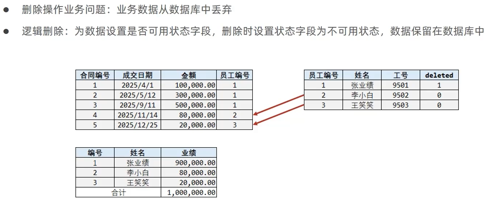
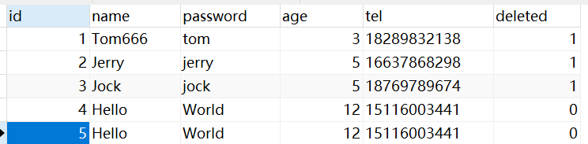

# 逻辑删除



## 使用示例

在User.java中添加属性

```java
    /**
     * 标识记录是否被删除的字段
     * 0 表示未删除，1 表示已删除
     */
    @TableLogic(value = "0", delval = "1")
    private Integer deleted;
```

MyBatisPlusTest.java

```java
    @Test
    public void testDeleted(){
        List<Long> list = new ArrayList<>();
        list.add(1L);
        list.add(2L);
        list.add(3L);
        // UPDATE tb_user SET deleted=1 WHERE id IN ( ? , ? , ? ) AND deleted=0
        userDao.deleteBatchIds(list);
    }
```

> 此时执行MyBatisPlus相关的删除语句，**都只会将需要被删除的属性按照要求更新为逻辑被删除**
>
> ```sql
> SELECT id,name,password,age,tel,deleted FROM tb_user WHERE id IN ( ? , ? , ? ) AND deleted=0
> ```
>
> 此时执行MyBatisPlus相关的**查询和更新方法**，都会**自动在结尾添加"deleted=0"**
>
> ```sql
> SELECT id,name,password,age,tel,deleted FROM tb_user WHERE id=? AND deleted=0
> 
> UPDATE tb_user SET name=? WHERE id=? AND deleted=0
> ```
>
> 

## 全局配置

application.yml

```yaml
mybatis-plus:
  global-config:
    db-config:
      # 定义属性为deleted的代表为逻辑删除
      logic-delete-field: deleted
      logic-delete-value: 1
      logic-not-delete-value: 0
```

