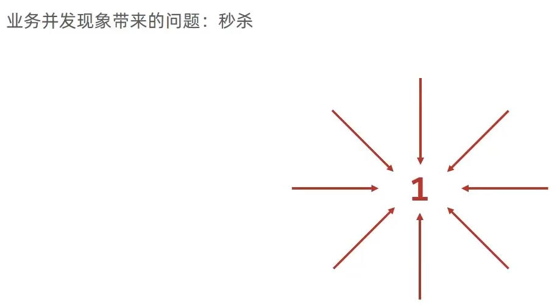

# 乐观锁

MyBatis-Plus 的乐观锁是一种并发控制机制，**用于解决多个线程同时对同一数据进行修改时可能引发的数据不一致问题**

> 乐观锁的原理是通过在数据表中添加一个版本号（或者称为乐观锁字段），在更新数据时比较版本号，如果版本号一致，则更新成功，否则更新失败
>
> 乐观锁的优点是不会对数据进行加锁，不会阻塞其他线程的读操作，只有在更新时才会进行版本号的比较和更新操作



MpConfig.java

```java
        // 3.添加乐观锁拦截器
        mpInterceptor.addInnerInterceptor(new OptimisticLockerInnerInterceptor());
```

在User.java中添加属性

```java
    @Version
    private Integer version;
```

在tb_user表中添加字段`version`

MyBatisPlusTest.java

```java
    @Test
    public void testLock(){
        User user = new User();
        user.setId(1L);
        user.setName("Tom666");
        // 必须设置version的值才能生效
        user.setVersion(userDao.selectById(1L).getVersion());
        // UPDATE tb_user SET name=?, version=? WHERE id=? AND version=? AND deleted=0
        // Tom666(String), 2(Integer), 1(Long), 1(Integer)
        userDao.updateById(user);
    }
```

> 