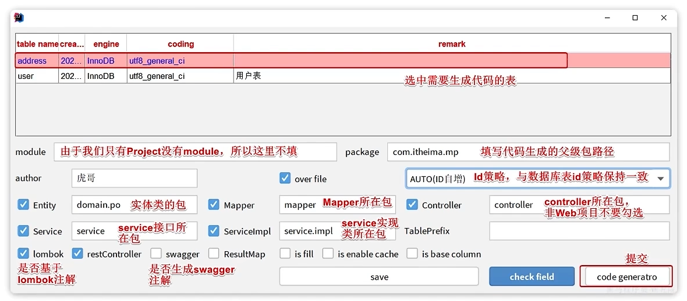
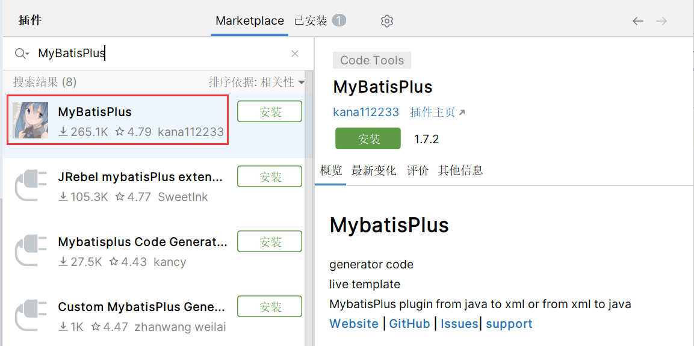
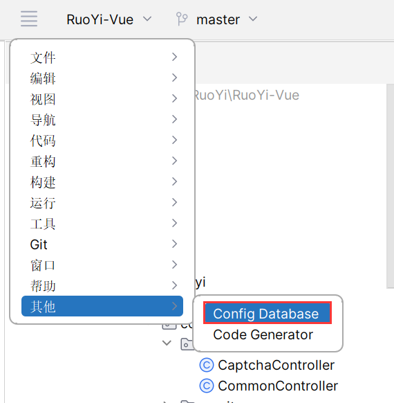
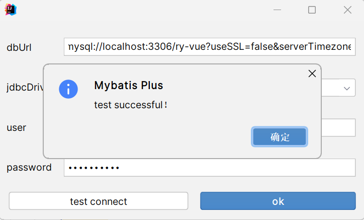
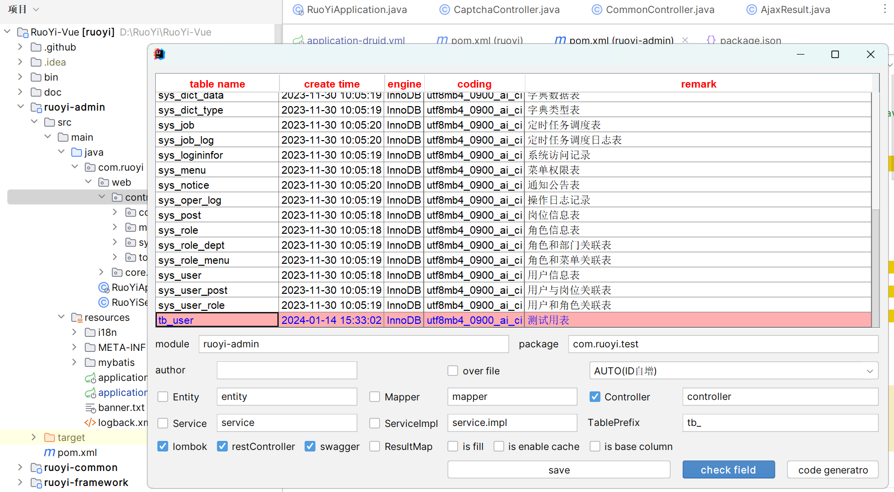
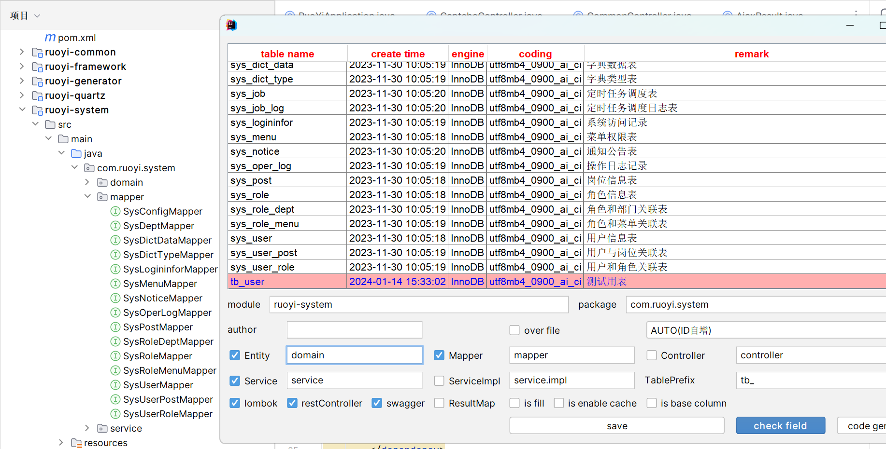

# 代码生成器

MyBatis-Plus 的代码生成器是一个用于根据数据库表结构生成对应 Java 实体类、Mapper 接口和 XML 配置文件的工具

## 代码生成

pom.xml

```xml
        <!-- 代码生成器 -->
        <dependency>
            <groupId>com.baomidou</groupId>
            <artifactId>mybatis-plus-generator</artifactId>
            <version>3.4.1</version>
        </dependency>
        <dependency>
            <groupId>org.apache.velocity</groupId>
            <artifactId>velocity-engine-core</artifactId>
            <version>2.3</version>
        </dependency>
```

Generator.java

```java
import com.baomidou.mybatisplus.annotation.IdType;
import com.baomidou.mybatisplus.generator.AutoGenerator;
import com.baomidou.mybatisplus.generator.config.DataSourceConfig;
import com.baomidou.mybatisplus.generator.config.GlobalConfig;
import com.baomidou.mybatisplus.generator.config.PackageConfig;
import com.baomidou.mybatisplus.generator.config.StrategyConfig;

public class Generator {
    public static void main(String[] args) {
        AutoGenerator autoGenerator = new AutoGenerator();
        // 配置数据源
        DataSourceConfig ds = new DataSourceConfig();
        ds.setDriverName("com.mysql.cj.jdbc.Driver");
        ds.setUrl("jdbc:mysql://localhost:3306/mybatisplus_db?serverTimezone=UTC");
        ds.setUsername("root");
        ds.setPassword("yuxingxuan");
        autoGenerator.setDataSource(ds);

        // 设置全局配置
        GlobalConfig globalConfig = new GlobalConfig();
        // 设置代码的输出目录(user.dir为项目目录，后面可以再指定包目录)
        globalConfig.setOutputDir(System.getProperty("user.dir") + "/src/main/java");
        globalConfig.setOpen(false); // 设置生成完毕后是否打开生成代码所在的目录
        globalConfig.setAuthor("yxx"); // 设置作者
        globalConfig.setFileOverride(true); // 设置是否覆盖原始生成的文件
        globalConfig.setMapperName("%sDao"); // 设置数据层接口名，%s为占位符，指代模块名称
        globalConfig.setIdType(IdType.ASSIGN_ID); // 设置Id生成策略
        autoGenerator.setGlobalConfig(globalConfig);

        // 设置包相关配置
        PackageConfig packageConfig = new PackageConfig();
        packageConfig.setParent("testOne"); // 设置生成的包名，与代码所在位置组合成完整路径
        packageConfig.setEntity("domain"); // 设置实体类包名
        packageConfig.setMapper("dao"); // 设置数据层包名
        autoGenerator.setPackageInfo(packageConfig);

        // 策略设置
        StrategyConfig strategyConfig = new StrategyConfig();
        strategyConfig.setInclude("tb_user"); // 设置当前参与生成的表名
        strategyConfig.setTablePrefix("tb_"); // 设置数据库表的前缀名称，例如：User = tb_user
        strategyConfig.setRestControllerStyle(true); // 设置是否启用Rest风格
        strategyConfig.setVersionFieldName("version"); // 设置逻辑删除字段名
        strategyConfig.setLogicDeleteFieldName("deleted"); // 设置乐观锁字段名
//        strategyConfig.setEntityLombokModel(true); // 设置是否启用lombok注解的方式配置pojo类
        autoGenerator.setStrategy(strategyConfig);

        // 执行生成
        autoGenerator.execute();
    }
}
```

> 

## 插件生成

使用说明：



下载插件：



配置数据库连接（可能随版本变化，会在tool工具目录下）：



测试连接：



使用插件生成代码：




