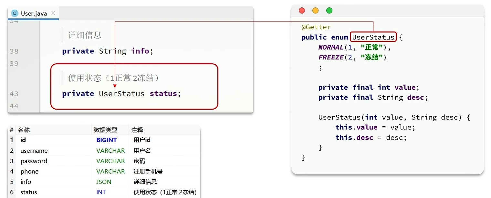
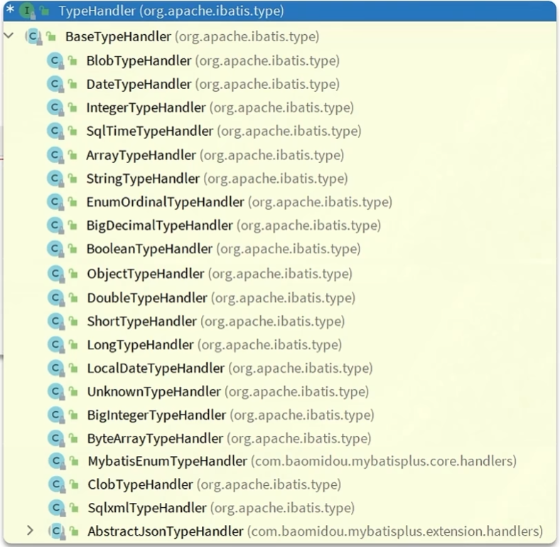

# 枚举处理器

> 可以对pojo中的类的属性值定义为枚举，再与数据库中的字段进行映射



Mp增强了枚举处理器：



## 示例使用

### 全局配置

配置全局枚举处理器`application.yml`：

```yaml
mybatis-plus:
  configuration:
    # 配置全局枚举处理器
    default-enum-type-handler: com.baomidou.mybatisplus.core.handlers.MybatisEnumTypeHandler
```

UserStatus.java

```java
import com.baomidou.mybatisplus.annotation.EnumValue;
import com.fasterxml.jackson.annotation.JsonValue;
import lombok.Getter;

@Getter
public enum UserStatus {
    NORMAL(1, "正常"),
    FREEZE(2, "冻结")
    ;

    @EnumValue
    // 配置Mp在与数据库关联时枚举所对应的属性值
    private final int value;
    @JsonValue
    // 配置SpringMvc在处理枚举时应该返回的属性值
    private final String desc;

    UserStatus(int value, String desc) {
        this.value = value;
        this.desc = desc;
    }
}
```

User.java

```java
@TableName(value = "tb_users", autoResultMap = true) // 设置映射的表名，开启自动创建结果映射
public class User implements Serializable {

    private static final long serialVersionUID = 1L;

    @TableId(type = IdType.ASSIGN_ID) //设置为主键且是自增的，确保在进行添加时不会出错
    // 指定MVC在序列化为JSON时将该字段转化为String类型
    @JsonFormat(shape = JsonFormat.Shape.STRING)
    private Long id;

    private String name;

    private String password;

    @TableField(fill = FieldFill.INSERT_UPDATE) //插入和更新时填充字段
    @DateTimeFormat(pattern = "yyyy-MM-dd HH:mm:ss")
    // 指定Java对象的属性在SpringMVC序列化为JSON时的处理方式
    @JsonFormat(pattern = "yyyy-MM-dd")
    private LocalDateTime updateTime;

    private UserStatus status;
}
```

> 返回给前端的结果：
>
> ```json
> {
>     "code": 1,
>     "msg": null,
>     "data": [
>         {
>             "id": "1741080629858029569",
>             "name": null,
>             "password": null,
>             "updateTime": "2023-12-12T12:12:12",
>             "status": "正常"
>         }
>     ],
>     "map": {}
> }
> ```

### 实现接口

> 默认支持通过实现`IEnum`接口来自定义枚举到数据库值的映射关系

```java
public enum StatusEnum implements IEnum<Integer> {
    ENABLE(1, "启用"),
    DISABLE(0, "禁用");

    private int value;
    private String desc;

    StatusEnum(int value, String desc) {
        this.value = value;
        this.desc = desc;
    }

    @Override
    public Integer getValue() {
        return this.value;
    }
}
```

> 定义了一个名为`StatusEnum`的枚举，它实现了`IEnum<Integer>` 接口，其中`Integer`表示数据库中的存储类型。`getValue()`方法返回该枚举项在数据库中的表示形式
