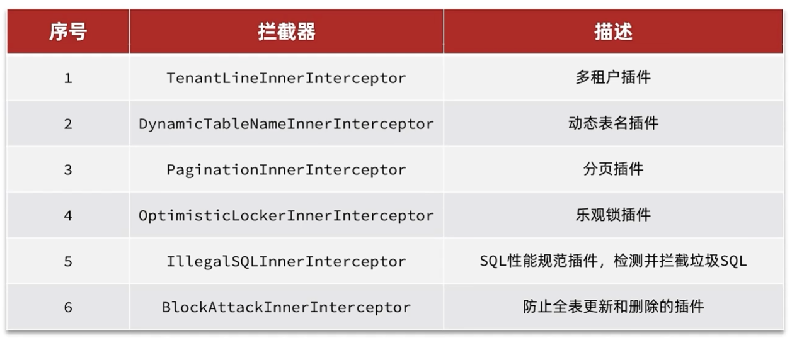

# MP相关配置

## 注解

```java
@TableName(value = "tb_users", autoResultMap = true) // 设置映射的表名，开启自动创建结果映射
@TableField(exist = false) // 告诉ORM框架在生成SQL语句时忽略这个字段
@TableField(value = "createdate", updateStrategy = FieldStrategy.IGNORED) // 执行更新操作时，无论如何修改createDate属性的值，都不会被更新到数据库中


    @TableId(type = IdType.ASSIGN_ID) // 在执行insert操作时，id无需设置，会自动使用雪花算法生成并插入，不依赖配置项
    // 指定MVC在序列化为JSON时将该字段转化为String类型
    @JsonFormat(shape = JsonFormat.Shape.STRING)
    private Long id;


    @TableField(fill = FieldFill.INSERT_UPDATE) //插入和更新时填充字段(设置value值用于指定实体类属性在数据库表中对应的字段名)
    // 指定了日期时间字符串的格式，告诉Spring MVC按照指定的格式来解析请求参数中的日期时间数据
    @DateTimeFormat(pattern = "yyyy-MM-dd HH:mm:ss")
    // 指定Java对象的属性在SpringMVC序列化为JSON时的处理方式
    @JsonFormat(pattern = "yyyy-MM-dd")
    private LocalDateTime updateTime;


    /**
     * 标识记录是否被删除的字段
     * 0 表示未删除，1 表示已删除
     */
    @TableLogic(value = "0", delval = "1")
    private Integer deleted;


    @Version
    private Integer version;


```

## 快速搭建

UserDao.java

```java
import com.baomidou.mybatisplus.core.mapper.BaseMapper;
import hello.domain.User;
import org.apache.ibatis.annotations.Mapper;

@Mapper
public interface UserDao extends BaseMapper<User> {
}
```

UserService.java

```java
import hello.domain.User;
import com.baomidou.mybatisplus.extension.service.IService;

public interface UserService extends IService<User> {
}
```

UserServiceImpl.java

```java
import hello.Mapper.UserMapper;
import hello.Service.UserService;
import hello.domain.User;
import com.baomidou.mybatisplus.extension.service.impl.ServiceImpl;
import org.springframework.stereotype.Service;

@Service
public class UserServiceImpl extends ServiceImpl<UserMapper, User> implements UserService {
}
```

> 可以通过`lambdaQuery()`快速调用自身的Query对象`LambdaQueryChainWrapper<User> queryChainWrapper = lambdaQuery()`

### 序列化

```java
public class User implements Serializable {
    // 在序列化和反序列化过程中保持版本的一致性
    private static final long serialVersionUID = 1L;
```

## 拦截器配置



MpConfig.java

```java
import com.baomidou.mybatisplus.annotation.DbType;
import com.baomidou.mybatisplus.extension.plugins.MybatisPlusInterceptor;
import com.baomidou.mybatisplus.extension.plugins.inner.PaginationInnerInterceptor;
import org.springframework.context.annotation.Bean;
import org.springframework.context.annotation.Configuration;

@Configuration
public class MpConfig {
    @Bean
    public MybatisPlusInterceptor mpInterceptor(){
        // 1.定义Mp的拦截器
        MybatisPlusInterceptor mpInterceptor = new MybatisPlusInterceptor();
        PaginationInnerInterceptor paginationInnerInterceptor = new PaginationInnerInterceptor(DbType.MYSQL);
        paginationInnerInterceptor.setMaxLimit(1000L); // 设置分页上限
        // 2.添加分页拦截器
        mpInterceptor.addInnerInterceptor(new PaginationInnerInterceptor());
        // 3.添加乐观锁拦截器
        mpInterceptor.addInnerInterceptor(new OptimisticLockerInnerInterceptor());
        return mpInterceptor;
    }
}
```

> 分页
>
> ```java
>        @Test
>        public void testGetByPage(){
>            // 查第1页，每页2条
>            IPage page = new Page(1,2);
>            userDao.selectPage(page,null); // 传入分页对象，查询条件为null
>            System.out.println("当前页码值" + page.getCurrent());
>            System.out.println("每页显示数" + page.getSize());
>            System.out.println("一共多少页" + page.getPages());
>            System.out.println("一共多少条数据" + page.getTotal());
>            System.out.println("数据" + page.getRecords());
>        }
> ```

## 通用分页实体

PageQuery.java

```java
import com.alipay.service.schema.util.StringUtil;
import com.baomidou.mybatisplus.annotation.TableField;
import com.baomidou.mybatisplus.core.metadata.OrderItem;
import com.baomidou.mybatisplus.extension.plugins.pagination.Page;
import lombok.Data;

@Data
public class PageQuery {

    @TableField(exist = false)
    private Integer pageNo = 1;

    @TableField(exist = false)
    private Integer pageSize = 10;

    @TableField(exist = false)
    private String sortBy;

    @TableField(exist = false)
    private Boolean isAsc;

    public <T> Page<T> toMpPage(OrderItem... items) {
        Page<T> page = new Page<>(pageNo, pageSize);

        // 如果排序字段值不为空
        if (!StringUtil.isEmpty(sortBy)) {
            page.addOrder(new OrderItem(sortBy, isAsc));
        } else if (items != null) {
            page.addOrder(items);
        }
        return page;
    }

    public <T> Page<T> toMapPage(String defaultSortBy, Boolean isAsc) {
        return toMpPage(new OrderItem(defaultSortBy, isAsc));
    }

    public <T> Page<T> toMpPageDefaultSortByCreateTime() {
        return toMpPage(new OrderItem("create_time", false));
    }

    public <T> Page<T> toMpPageDefaultSortByUpdateTime() {
        return toMpPage(new OrderItem("update_time", false));
    }
}
```

PageDTO.java

```java
import cn.hutool.core.bean.BeanUtil;
import com.baomidou.mybatisplus.extension.plugins.pagination.Page;
import lombok.Data;

import java.util.Collections;
import java.util.List;
import java.util.function.Function;
import java.util.stream.Collectors;

@Data
public class PageDTO<T> {

    private Long total;

    private Long pages;

    private List<T> list;

    public static <PO, VO> PageDTO<VO> of(Page<PO> p, Class<VO> voClass) {
        PageDTO<VO> dto = dealWith(p);

        List<PO> records = p.getRecords();
        // 如果记录结果为空
        if (records == null || records.isEmpty()) {
            dto.setList(Collections.emptyList());
            return dto;
        }

        // 拷贝VO
        dto.setList(BeanUtil.copyToList(records, voClass));
        return dto;
    }

    public static <PO, VO> PageDTO<VO> of(Page<PO> p, Function<PO, VO> convertor) {
        PageDTO<VO> dto = dealWith(p);

        List<PO> records = p.getRecords();
        // 如果记录结果为空
        if (records == null || records.isEmpty()) {
            dto.setList(Collections.emptyList());
            return dto;
        }

        // 拷贝VO
        dto.setList(records.stream().map(convertor).collect(Collectors.toList()));
        return dto;
    }

    private static <VO, PO> PageDTO<VO> dealWith(Page<PO> p) {
        PageDTO<VO> dto = new PageDTO<>();
        dto.setTotal(p.getTotal());
        dto.setPages(p.getPages());
        return dto;
    }
}
```

> 使用了hutool工具包
>
> ```xml
>         <!-- 引入hutool工具包 -->
>         <dependency>
>             <groupId>cn.hutool</groupId>
>             <artifactId>hutool-all</artifactId>
>             <version>5.8.0.M2</version>
>         </dependency>
> ```

使用示例

```java
        User user = new User();
        // 获取分页对象
        Page<User> page = user.toMapPage("update_time", Boolean.TRUE);

        // 获取分页结果
        Page<User> result = lambdaQuery().page(page);

        // 获取返回给前端的结果
        PageDTO<UserVo> of = PageDTO.of(result, item -> {
            UserVo userVo = new UserVo();
            BeanUtils.copyProperties(item, userVo);
            return userVo;
        });
```

## 公共字段填充

BaseContext.java

```java
/**
 * 基于ThreadLocal封装工具类，用户保存和获取当前登录用户id
 */
public class BaseContext {
    private static ThreadLocal<Long> threadLocal = new ThreadLocal<>();

    /**
     * 设置值
     * @param id
     */
    public static void setCurrentId(Long id){
        threadLocal.set(id);
    }

    /**
     * 获取值
     * @return
     */
    public static Long getCurrentId(){
        return threadLocal.get();
    }

    /**
     * 移除值
     */
    public static void removeCurrentId(){
        threadLocal.remove();
    }
}
```

> 因为Tomcat是通过线程池的方式去处理请求的，所以会存在线程复用的情况，也就可能会出现线程复用时数据共享到其它线程，所以最好在使用后清空数据。对于控制层方法使用，可以在拦截器的`afterCompletion(HttpServletRequest request, HttpServletResponse response, Object handler, Exception ex) throws Exception`方法(视图渲染完后)中去清除数据

### 元数据处理器

MyMetaObjecthandler.java

```java
import com.baomidou.mybatisplus.core.handlers.MetaObjectHandler;
import lombok.extern.slf4j.Slf4j;
import org.apache.ibatis.reflection.MetaObject;
import org.springframework.stereotype.Component;
import java.time.LocalDateTime;

/**
 * 自定义元数据对象处理器
 */
@Component
@Slf4j
public class MyMetaObjecthandler implements MetaObjectHandler {
    /**
     * 插入操作，自动填充
     * @param metaObject
     */
    @Override
    public void insertFill(MetaObject metaObject) {
        log.info("公共字段自动填充[insert]...");
        log.info(metaObject.toString());
        metaObject.setValue("createTime",LocalDateTime.now());
        metaObject.setValue("updateTime",LocalDateTime.now());
        metaObject.setValue("createUser",BaseContext.getCurrentId());
        metaObject.setValue("updateUser",BaseContext.getCurrentId());
    }

    /**
     * 更新操作，自动填充
     * @param metaObject
     */
    @Override
    public void updateFill(MetaObject metaObject) {
        log.info("公共字段自动填充[update]...");
        log.info(metaObject.toString());

        long id = Thread.currentThread().getId();
        log.info("线程id为：{}",id);

        metaObject.setValue("updateTime",LocalDateTime.now());
        metaObject.setValue("updateUser",BaseContext.getCurrentId());
    }
}
```

> 设置id后自动进行填充
>
> ```java
>         BaseContext.setCurrentId(empId);
>         userService.save(user);
> ```

## 全局配置

application.yml

```yaml
mybatis:
  # 将目标目录下的bean都设置别名，方便后面在xxxMapper.xml中使用
  type-aliases-package: hello.pojo
  # 开启驼峰命名规则自动转换
  configuration: # 也可以直接加载全局配置文件——classpath:mybatis-config.xml
    map-underscore-to-camel-case: true
mybatis-plus:
  global-config:
    db-config:
      # 设置数据库表的前缀，查询时会自动给bean添加此前缀
      table-prefix: tb_
      # 定义属性为deleted的代表为逻辑删除
      logic-delete-field: deleted
      logic-delete-value: 1
      logic-not-delete-value: 0
      # 定义主键自增策略(此时可以省略@TableId(type = IdType.ASSIGN_ID)，对于名称为id的属性就会自动填充)
      id-type: ASSIGN_ID
    # 关闭banner
    banner: false
  # 开启MP日志功能，打印信息到控制台
  configuration:
    log-impl: org.apache.ibatis.logging.stdout.StdOutImpl
    # 配置全局枚举处理器
    default-enum-type-handler: com.baomidou.mybatisplus.core.handlers.MybatisEnumTypeHandler
```

