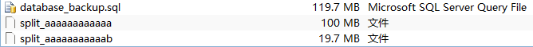
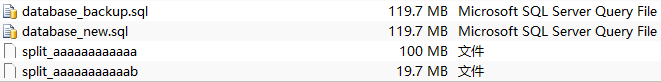
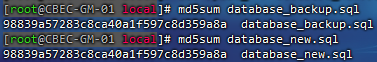
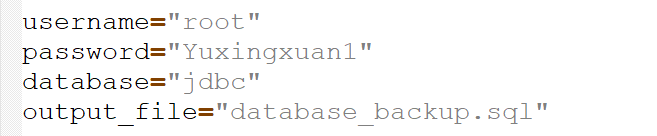
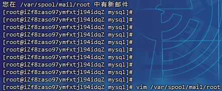
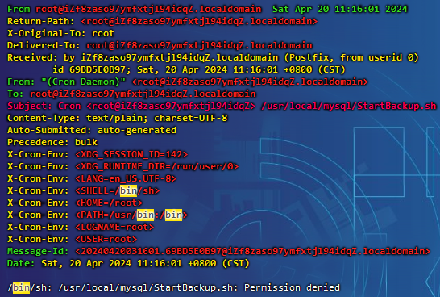
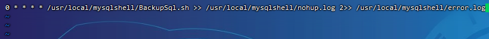
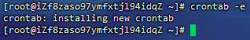
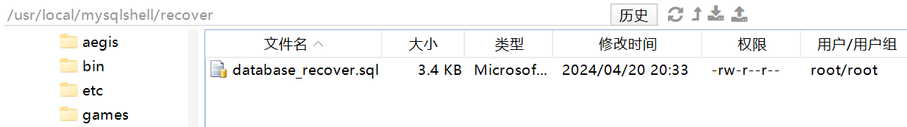
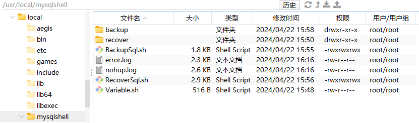

# Mysql自动化备份

## mysqldump备份

`mysqldump`是MySQL数据库的一个命令行工具，用于备份或导出数据库中的数据到一组SQL语句。`mysqldump`提供了许多选项，用于定制备份过程。

以下是常用的选项：

- `--single-transaction`：对于 InnoDB 表，这个选项会在开始备份之前启动一个事务，以确保备份是一致的。这对于避免备份过程中的数据更改非常有用
- `--quick`：这个选项告诉 `mysqldump` 从服务器一次获取一行数据，而不是将整个结果集缓存到内存中。这对于大型表非常有用，可以减少内存使用
- `--routines`：备份存储过程和函数
- `--events`：备份事件调度器的事件
- `--triggers`：备份表的触发器
- `--compress`：压缩备份文件
- `--master-data`：这个选项会在备份文件中包含二进制日志文件的位置和名称，这对于复制和灾难恢复非常有用

```
# 备份所有数据库，包括建表语句，系统关键表无需备份：mysql、sys、information_schema、performance_schema
mysqldump -u root -pyuxingxuan --default-character-set=utf --create-options --all-databases > specific_database_backup.sql

# 备份指定数据库，包含建库语句
mysqldump -u root -pyuxingxuan --default-character-set=utf8 --create-options --databases jdbc > specific_database_backup.sql
```

### 备份操作

大数据量备份从表：

```
mysqldump -h 127.0.0.1 \
 -u cebc-dev -p'password' --default-character-set=utf8 \
 --create-options --databases cebc \
 --lock-tables=True \
 --result-file=database_backup.sql 
```

切割文件，交给git管理：

```
split -b 100m -a 12 database_backup.sql split_
```

> 

合并文件

```
cat split_* > database_new.sql
```

> 

对比是否一致：

```
md5sum database_backup.sql

md5sum database_new.sql
```

> 

### 定时任务

修改数据库连接：

> 

给予脚本执行权限：

```
chmod +x /usr/local/mysqlshell/BackupSql.sh
```

> 如果脚本权限不够会报错，发送到邮箱：
>
> 
>
> 查看报错，原因为权限不够：
>
> 
>
> 

编辑crontab文件：

```
crontab -e
```

添加定时器任务，一小时执行一次，注释即可停止：

```
0 * * * * /usr/local/mysqlshell/BackupSql.sh >> /usr/local/mysqlshell/log.log 2>&1

0 * * * * /usr/local/mysqlshell/BackupSql.sh >> /usr/local/mysqlshell/nohup.log 2>> /usr/local/mysqlshell/error.log
```

> 
>
> 

还原状态：

```
sh RecoverSql.sh 2024-04-20 19
```

> 

整体目录结构：

> 

## mysqlbinlog备份

`mysqlbinlog` 是MySQL数据库的一个命令行工具，用于查看和解析MySQL二进制日志文件。二进制日志是MySQL服务器用来记录所有修改数据库操作的日志文件，这些操作包括DML (Data Manipulation Language) 语句（如`INSERT`、`UPDATE`、`DELETE`）、DDL (Data Definition Language) 语句（如`CREATE`、`ALTER`、`DROP`）以及事务操作

以下是常用的选项：

- `--start-position=<position>`：从指定的日志文件位置开始解析。
- `--stop-position=<position>`：解析到指定的日志文件位置结束。
- `--start-datetime=<datetime>`：从指定的日期和时间开始解析。
- `--stop-datetime=<datetime>`：解析到指定的日期和时间结束。
- `--no-defaults`：不使用默认配置文件。
- `--defaults-file=<file>`：使用指定的配置文件。
- `--read-from-remote-server`：从远程服务器读取日志文件。
- `--host=<hostname>`：连接到指定的服务器主机。
- `--user=<username>`：使用指定的用户名连接到服务器。
- `--password=<password>`：使用指定的密码连接到服务器。
- `--socket=<socket>`：使用指定的套接字文件连接到服务器。
- `--port=<port>`：使用指定的端口连接到服务器

记录备份时的时间戳或二进制日志的位置：

```
mysql -u root -pyuxingxuan -e "SHOW MASTER STATUS\G" > binlog_position.txt
```

使用`mysqlbinlog`工具备份从此次位置开始的变更：

```
mysqlbinlog --start-position=[备份的位置] /var/lib/mysql/binlog.000001 > /backup/mysql/diff_backup.sql
```

> 查看从位置`12345`开始的二进制日志内容
>
> ```
> mysqlbinlog --start-position=12345 mysql-bin.000001
> ```

使用`mysqlbinlog`解析的SQL语句来还原数据库，需要将这些语句应用到MySQL服务器上。这可以通过将`mysqlbinlog`的输出重定向到`mysql`命令来实现

```
mysqlbinlog --start-position=12345 mysql-bin.000001 | mysql -u root -pyuxingxuan test
```

## 二进制日志清理

> MySQL的二进制日志（binary log）默认不会自动删除，因此它们会一直保存直到管理员手动删除或配置了自动过期策略。二进制日志记录了所有对数据库进行的更改操作（如表结构和表数据的变更），用于数据库恢复、主从复制等场景
>
> 为了管理磁盘空间和维护日志文件的数量，通常建议设置二进制日志的过期时间。可以通过设置`expire_logs_days`系统变量来指定二进制日志文件保留的最大天数

### 过期时间

例如，如果希望二进制日志只保留7天，可以在MySQL配置文件（通常是`my.cnf`或`my.ini`）中的`[mysqld]`段落添加或修改如下行：

```
expire_logs_days = 7
```

也可以通过执行SQL命令动态地设置这个参数：

```
SET GLOBAL expire_logs_days = 7;
```

> 一旦设置了`expire_logs_days`，MySQL服务器会定期检查并删除超过指定天数的二进制日志文件
>
> 需要注意的是，该设置只影响将来创建的日志文件，并不会立即删除现有的旧日志文件，而会在下次检查时根据日志清理策略被清理

### 手动清理

如果需要立即清理过期的日志，可以使用`PURGE BINARY LOGS`语句手动清除不再需要的日志文件。例如，要删除所有早于某个特定日期的日志，可以执行：

```
PURGE BINARY LOGS BEFORE '2024-12-01 00:00:00';
```

或者，根据日志序列号来清除：

```
PURGE BINARY LOGS TO 'binlog.000005';
```

> 删除所有编号小于`binlog.000005`的日志文件

### 日志查看

列出当前服务器上所有的二进制日志文件及其大小：

```
SHOW BINARY LOGS;
-- 或者
SHOW MASTER LOGS;
```

