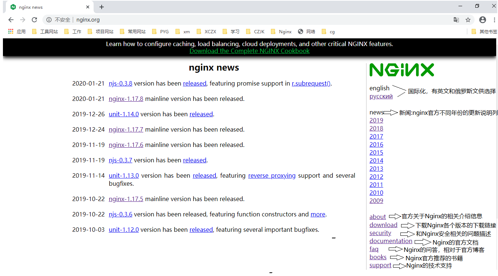

# Nginx基础

## 介绍


## 特点 

Nginx（“engine x”）一个具有高性能的【HTTP】和【反向代理】的【WEB服务器】，同时也是一个【POP3/SMTP/IMAP代理服务器】，是由伊戈尔·赛索耶夫(俄罗斯人)使用C语言编写的，Nginx的第一个版本是2004年10月4号发布的0.1.0版本。另外值得一提的是伊戈尔·赛索耶夫将Nginx的源码进行了开源，这也为Nginx的发展提供了良好的保障

> - WEB服务器：WEB服务器也叫网页服务器，英文名叫Web Server，主要功能是为用户提供网上信息浏览服务
> - HTTP：HTTP是超文本传输协议的缩写，是用于从WEB服务器传输超文本到本地浏览器的传输协议，也是互联网上应用最为广泛的一种网络协议。HTTP是一个客户端和服务器端请求和应答的标准，客户端是终端用户，服务端是网站，通过使用Web浏览器、网络爬虫或者其他工具，客户端发起一个到服务器上指定端口的HTTP请求
> - POP3/SMTP/IMAP：
>   - POP3(Post Offic Protocol 3)邮局协议的第三个版本
>   - SMTP(Simple Mail Transfer Protocol)简单邮件传输协议
>   - IMAP(Internet Mail Access Protocol)交互式邮件存取协议
>
> Nginx也可以作为电子邮件代理服务器

正向代理


反向代理


## Web服务器对比

- IIS：全称(Internet Information Services)即互联网信息服务，是由微软公司提供的基于windows系统的互联网基本服务。windows作为服务器在稳定性与其他一些性能上都不如类UNIX操作系统，因此在需要高性能Web服务器的场合下，IIS可能就会被"冷落"
- Tomcat：Tomcat是一个运行Servlet和JSP的Web应用软件，Tomcat技术先进、性能稳定而且开放源代码，因此深受Java爱好者的喜爱并得到了部分软件开发商的认可，成为目前比较流行的Web应用服务器。但是Tomcat天生是一个**重量级的Web服务器**，对静态文件和高并发的处理比较弱
- Apache：Apache的发展时期很长，同时也有过一段辉煌的业绩。在2014年以前都是市场份额第一的服务器。Apache有很多优点，如稳定、开源、跨平台等。但是它出现的时间太久了，在它兴起的年代，互联网的产业规模远远不如今天，所以它被设计成一个**重量级的**、**不支持高并发**的Web服务器。在Apache服务器上，如果有数以万计的并发HTTP请求同时访问，就会导致服务器上消耗大量能存，操作系统内核对成百上千的Apache进程**做进程间切换**也会消耗大量的CUP资源，并导致HTTP请求的平均响应速度降低，这些都决定了Apache不可能成为高性能的Web服务器。这也促使了Lighttpd和Nginx的出现
- Lighttpd：Lighttpd是德国的一个开源的Web服务器软件，它和Nginx一样，都是轻量级、高性能的Web服务器，欧美的业界开发者比较钟爱Lighttpd，而国内的公司更多的青睐Nginx，同时网上**Nginx的资源要更丰富些**
- 其他的服务器：Google Servers，Weblogic, Webshpere(IBM)...

Nginx以性能为王

## Nginx的优点

- 速度更快、并发更高：单次请求或者高并发请求的环境下，Nginx都会比其他Web服务器响应的速度更快。一方面在正常情况下，单次请求会得到更快的响应，另一方面，在高峰期(如有数以万计的并发请求)，Nginx比其他Web服务器更快的响应请求。Nginx之所以有这么高的并发处理能力和这么好的性能原因在于Nginx采用了多进程和**I/O多路复用(epoll)**的底层实现
- 配置简单，扩展性强：Nginx的设计极具扩展性，它本身就是由很多模块组成，这些模块的使用可以通过配置文件的配置来添加。这些模块有官方提供的也有第三方提供的模块，如果需要完全可以开发服务自己业务特性的定制模块
- 高可靠性：Nginx采用的是多进程模式运行，其中有一个master主进程和N多个worker进程，worker进程的数量我们可以手动设置，每个worker进程之间都是相互独立提供服务，并且master主进程可以在某一个worker进程出错时，快速去"拉起"新的worker进程提供服务
- 热部署：现在互联网项目都要求以7*24小时进行服务的提供，针对于这一要求，Nginx也提供了热部署功能，即可以在Nginx不停止的情况下，对Nginx进行文件升级、更新配置和更换日志文件等功能
- 成本低、BSD许可证：BSD是一个开源的许可证，世界上的开源许可证有很多，现在比较流行的有六种分别是GPL、BSD、MIT、Mozilla、Apache、LGPL。这六种的区别是什么，可以通过下面一张图来解释下：
  - 

## Nginx的功能特性及常用功能

Nginx提供的基本功能服务从大体上归纳为"**基本HTTP服务**"、“高级HTTP服务”和"**邮件服务**"等三大类

### 基本HTTP服务

Nginx可以提供基本HTTP服务，可以作为HTTP代理服务器和反向代理服务器，支持通过缓存加速访问，可以完成简单的负载均衡和容错，支持包过滤功能，支持SSL等

- 处理静态文件、处理索引文件以及支持自动索引
- 提供反向代理服务器，并可以使用缓存加上反向代理，同时完成负载均衡和容错
- 提供对FastCGI、memcached等服务的缓存机制，同时完成负载均衡和容错
- 使用Nginx的模块化特性提供过滤器功能。Nginx基本过滤器包括gzip压缩、ranges支持、chunked响应、XSLT、SSI以及图像缩放等。其中针对包含多个SSI的页面，经由FastCGI或反向代理，SSI过滤器可以并行处理
- 支持HTTP下的安全套接层安全协议SSL
- 支持基于加权和依赖的优先权的HTTP/2

### 高级HTTP服务

- 支持基于名字和IP的虚拟主机设置
- 支持HTTP/1.0中的KEEP-Alive模式和管线(PipeLined)模型连接
- 自定义访问日志格式、带缓存的日志写操作以及快速日志轮转
- 提供3xx~5xx错误代码重定向功能
- 支持重写（Rewrite）模块扩展
- 支持重新加载配置以及在线升级时无需中断正在处理的请求
- 支持网络监控
- 支持FLV和MP4流媒体传输

### 邮件服务

Nginx提供邮件代理服务也是其基本开发需求之一，主要包含以下特性：

- 支持IMPA/POP3代理服务功能
- 支持内部SMTP代理服务功能

### 常用功能

```
静态资源部署
Rewrite地址重写
	正则表达式
反向代理
负载均衡
	轮询、加权轮询、ip_hash、url_hash、fair
Web缓存
环境部署
	高可用的环境
用户认证模块...
```

Nginx的核心组成

```
nginx二进制可执行文件
nginx.conf配置文件
error.log错误的日志记录
access.log访问日志记录
```

## 下载和安装




下载


> rpm包下载地址
>
> ```
> http://nginx.org/packages
> ```
>
> centos7对应地址
>
> ```
> http://nginx.org/packages/centos/7/
> ```

安装


```
yum -y install gcc pcre-devel zlib-devel openssl openssl-devel

yum install wget
wget https://nginx.org/download/nginx-1.16.1.tar.gz # 默认下载到root目录下

tar -zxvf nginx-1.16.1.tar.gz

cd nginx-1.16.1

mkdir -p /usr/local/nginx
./configure --prefix=/usr/local/nginx # prefix代表安装的指定目录

make && make install # 编译并安装
```

> GCC编译器：Nginx是使用C语言编写的程序，因此想要运行Nginx就需要安装一个编译工具。GCC就是一个开源的编译器集合，用于处理各种各样的语言，其中就包含了C语言
>
> - 使用命令`yum install -y gcc`来安装
>- 安装成功后，可以通过`gcc --version`来查看gcc是否安装成功
> 
>PCRE：Nginx在编译过程中需要使用到PCRE库（perl Compatible Regular Expressoin 兼容正则表达式库)，因为在Nginx的Rewrite模块和http核心模块都会使用到PCRE正则表达式语法
> 
>- 可以使用命令`yum install -y pcre pcre-devel`来进行安装
> - 安装成功后，可以通过`rpm -qa pcre pcre-devel`来查看是否安装成功
>
> zlib：zlib库提供了开发人员的压缩算法，在Nginx的各个模块中需要使用gzip压缩，所以我们也需要提前安装其库及源代码zlib和zlib-devel
>
> - 可以使用命令`yum install -y zlib zlib-devel`来进行安装
>- 安装成功后，可以通过`rpm -qa zlib zlib-devel`来查看是否安装成功
> 
>OpenSSL：OpenSSL是一个开放源代码的软件库包，应用程序可以使用这个包进行安全通信，并且避免被窃听。SSL：Secure Sockets Layer安全套接协议的缩写，可以在Internet上提供秘密性传输，其目标是保证两个应用间通信的保密性和可靠性。在Nginx中，如果服务器需要提供安全网页时就需要用到OpenSSL库，所以我们需要对OpenSSL的库文件及它的开发安装包进行一个安装
> 
>- 可以使用命令`yum install -y openssl openssl-devel`来进行安装
> - 安装成功后，可以通过`rpm -qa openssl openssl-devel`来查看是否安装成功

## 目录结构


```
	conf：配置文件目录
        fastcgi.conf：fastcgi相关配置文件
        fastcgi.conf.default：fastcgi.conf的备份文件
        fastcgi_params：fastcgi的参数文件
        fastcgi_params.default：fastcgi的参数备份文件
        scgi_params：scgi的参数文件
        scgi_params.default：scgi的参数备份文件
        uwsgi_params：uwsgi的参数文件
        uwsgi_params.default：uwsgi的参数备份文件
        mime.types：记录的是HTTP协议中的Content-Type的值和文件后缀名的对应关系
        mime.types.default：mime.types的备份文件
        nginx.conf：Nginx的核心配置文件
        nginx.conf.default：nginx.conf的备份文件
		koi-utf、koi-win、win-utf这三个文件都是与编码转换映射相关的配置文件，用来将一种编码转换成另一种编码
	html：存放nginx自带的两个静态的html页面
        50x.html：访问失败后的失败页面
        index.html：成功访问的默认首页
	logs：记录入门的文件，当nginx服务器启动后，这里面会有access.log、error.log和nginx.pid三个文件出现
	sbin：是存放执行程序文件nginx
        nginx是用来控制Nginx的启动和停止等相关的命令
```

```
cd /usr/local/nginx

yum install tree
tree
```

> 

## 命令

### 查看版本


### 检查配置文件正确性


### 启动和停止


```
cd /usr/local/nginx/sbin

./nginx

./nginx -s stop

ps -ef|grep nginx
```

> 
>
> 开启端口
>
> ```
> firewall-cmd --zone=public --add-port=80/tcp --permanent
> 
> firewall-cmd --reload
> ```
>
> 浏览器访问
>
> ```
> 192.168.138.100:80
> ```
>
> 

### 重新加载配置文件


```
vim /etc/profile # 配置到环境变量，方便任何目录执行重新加载命令

/usr/local/nginx/sbin:

source /etc/profile
```

> 修改前：
>
> 
>
> 修改后：
>
> 

```
/usr/local/nginx/sbin/nginx -s reload # 原本使用方式

nginx -s reload # 加入配置文件后可以简化使用，包括启动和停止命令都无需再切换目录
```

