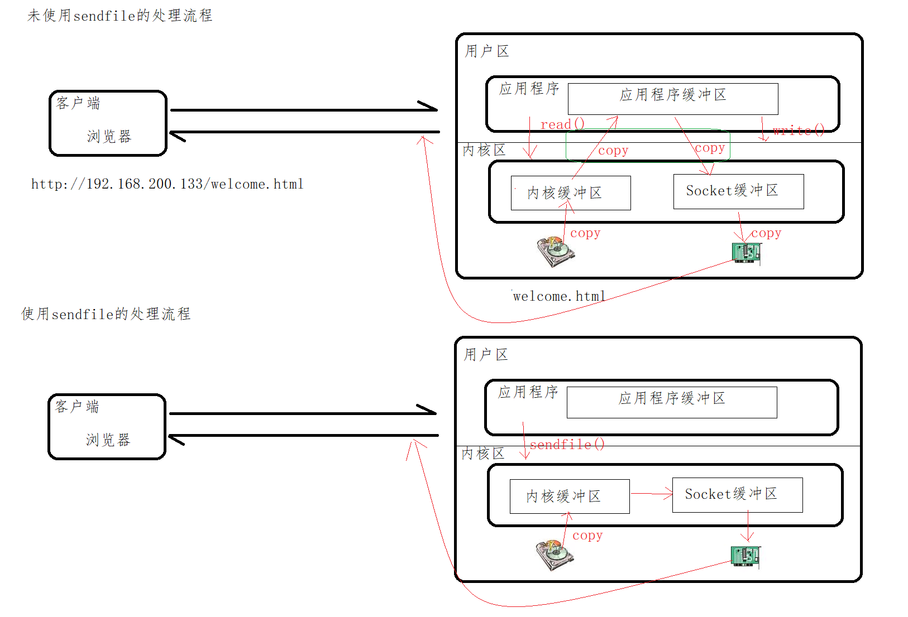
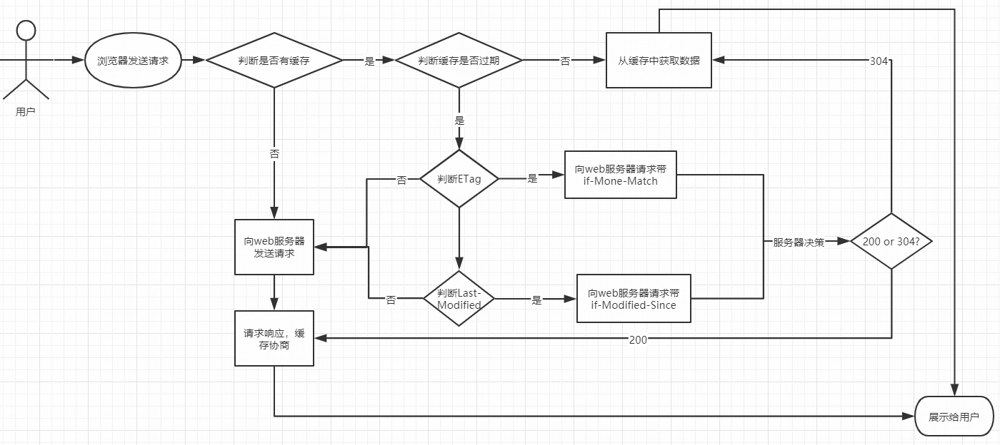

# Nginx静态资源配置

## Nginx静态资源配置指令

### listen指令

> 用来配置监听端口

| 语法   | listen address[:port] [default_server]...;<br/>listen port [default_server]...; |
| ------ | ------------------------------------------------------------ |
| 默认值 | listen *:80 \| *:8000                                        |
| 位置   | server                                                       |

listen的设置比较灵活：

```
listen 127.0.0.1:8000; // listen localhost:8000 监听指定的IP和端口
listen 127.0.0.1;	// 监听80端口（对于HTTP请求）或者443端口（对于HTTPS请求），这取决于Nginx配置中是否启用了SSL
listen 8000;	// 监听指定端口上的连接
listen *:8000;	// 监听指定端口上的连接
```

### default_server指令

> 将此虚拟主机设置成默认主机。所谓的默认主机指的是如果没有匹配到对应的address:port，则会默认执行的（如果不指定默认使用的是第一个server）

```nginx
    server{
        listen 8080 default_server;
        server_name localhost;
        default_type text/plain;
        return 444 'This is a error request';
    }
```

### server_name指令

> 用来设置虚拟主机服务名称

| 语法   | server_name  name ...;<br/>name可以提供多个中间用空格分隔 |
| ------ | --------------------------------------------------------- |
| 默认值 | server_name  "";                                          |
| 位置   | server                                                    |

server_name的配置方式有三种，分别是：

- **精确匹配**：按照访问域名直接进行匹配

  - ```nginx
        server {
            listen 80;
            server_name www.itcast.cn www.itheima.cn;
            ...
        }
    ```

- **通配符匹配**：需要注意的是通配符不能出现在域名的中间，只能出现在首段或尾段

  - ```nginx
        server {
            listen 80;
            server_name  *.itcast.cn	www.itheima.*;
            # www.itcast.cn abc.itcast.cn www.itheima.cn www.itheima.com
            ...
        }
    ```

  - 下面的配置就会报错

  - ```nginx
        server {
            listen 80;
            server_name  www.*.cn www.itheima.c*
            ...
        }
    ```

- **正则表达式匹配**：可以使用正则表达式，并且使用`~`作为正则表达式字符串的开始标记

  - ```nginx
        server{
            listen 80;
            # 注意：~后面不能加空格，括号可以取值，'(\w+)'的值对应变量'$1'，访问'www.mytest.com，返回'====>access mytest'
            server_name ~^www\.(\w+)\.com$;
            default_type text/plain;
            return 200 '====>access $1';
        }
    ```

正则表达式表：

| 代码  | 说明                                                       |
| ----- | ---------------------------------------------------------- |
| ^     | 匹配搜索字符串开始位置(匹配URI的开始部分)                  |
| $     | 匹配搜索字符串结束位置(确保URI正好以某个模式结束)          |
| .     | 匹配除换行符\n之外的任何单个字符                           |
| \     | 转义字符，将下一个字符标记为特殊字符                       |
| [xyz] | 字符集，与任意一个指定字符匹配                             |
| [a-z] | 字符范围，匹配指定范围内的任何字符                         |
| \w    | 与以下任意字符匹配 A-Z a-z 0-9 和下划线,等效于[A-Za-z0-9_] |
| \d    | 数字字符匹配，等效于[0-9]                                  |
| {n}   | 正好匹配n次                                                |
| {n,}  | 至少匹配n次                                                |
| {n,m} | 匹配至少n次至多m次                                         |
| *     | 对于前一个字符零次或多次，等效于{0,}                       |
| +     | 对于前一个字符一次或多次，等效于{1,}                       |
| ?     | 对于前一个字符零次或一次，等效于{0,1}                      |

> hosts是一个没有扩展名的系统文件，可以用记事本等工具打开，其作用就是将一些常用的网址域名与其对应的IP地址建立一个关联“数据库”，当用户在浏览器中输入一个需要登录的网址时，系统会首先自动从hosts文件中寻找对应的IP地址，一旦找到，系统会立即打开对应网页，如果没有找到，则系统会再将网址提交DNS域名解析服务器进行IP地址的解析
>
> - `windows`：`C:\Windows\System32\drivers\etc`
> - `centos`：`/etc/hosts`

匹配优先级顺序，从上到下：

- 准确匹配server_name
- 通配符在开始时匹配server_name成功
- 通配符在结束时匹配server_name成功
- 正则表达式匹配server_name成功
- 被默认的default_server处理，如果没有指定默认找第一个server

### location指令

> 用来设置请求的URI

| 语法   | location [  =  \| ~ \| ~* \| ^~ \| @ ] uri{...} |
| ------ | ----------------------------------------------- |
| 默认值 | —                                               |
| 位置   | server、location                                |

> URI变量是待匹配的请求字符串，可以不包含正则表达式，也可以包含正则表达式
>
> Nginx服务器在搜索匹配location的时候，精确匹配`=`优先级最高，通用匹配`/`优先级最低
>
> - 先使用不包含正则表达式进行匹配，找到一个匹配度最高的一个
> - 然后再通过包含正则表达式的进行匹配，如果能匹配到直接访问
> - 匹配不到，就使用刚才匹配度最高的那个location来处理请求

属性介绍：

- 不带符号`/`：要求必须以指定模式开始

  - ```nginx
        server {
            listen 80;
            server_name 127.0.0.1;
            location /abc {
                default_type text/plain;
                return 200 "access success";
            }
        }
        # 可以匹配到
        # http://localhost/abc
        # http://localhost/abc?p1=TOM
        # http://localhost/abc/
        # http://localhost/abcdef
    ```

- 精确匹配`=`：用于不包含正则表达式的uri前，必须与指定的模式精确匹配

  - ```nginx
        server {
            listen 80;
            server_name 127.0.0.1;
            location =/abc {
                default_type text/plain;
                return 200 "access success";
            }
        }
        # 可以匹配到
        # http://localhost/abc
        # http://localhost/abc?p1=TOM
        # 匹配不到
        # http://localhost/abc/
        # http://localhost/abcdef
    ```

- 正则表达式`~`或`~*`：表示用于表示当前uri中包含了正则表达式，区分大小写或不区分大小写

  - ```nginx
        server {
            listen 80;
            server_name 127.0.0.1;
            location ~^/abc\w$ {
                default_type text/plain;
                return 200 "access success";
            }
        }
        # 可以匹配到
        # http://localhost/abc_
        # http://localhost/abct
        # 匹配不到
        # http://localhost/abc
        # http://localhost/abc_t
    
        server {
            listen 80;
            server_name 127.0.0.1;
            location ~*^/abc\w$ {
                default_type text/plain;
                return 200 "access success";
            }
        }
        # 可以匹配到
        # http://localhost/ABc_
        # http://localhost/aBCT
        # 匹配不到
        # http://localhost/ABC
        # http://localhost/ABC_t
    ```

- 前缀匹配`^~`：用于不包含正则表达式的uri前，功能和不带符号`/`的一致，唯一不同的是，如果此模式匹配，**那么就停止搜索其他模式了**

  - ```nginx
        server {
            listen 80;
            server_name 127.0.0.1;
            location ^~/abc {
                default_type text/plain;
                return 200 "access success";
            }
        }
        # 可以匹配到
        # http://localhost/abc
        # http://localhost/abcuioyuiuio
        # http://localhost/abc/gsgdhjnk
        # http://localhost/abc/gsgdhjnk/aaa
        # 如果有'^~/abc/''，则对于'/abc/**'的匹配优先级更高
    ```

### root指令

> 设置请求的根目录

| 语法   | root path;             |
| ------ | ---------------------- |
| 默认值 | root html;             |
| 位置   | http、server、location |

> path为Nginx服务器接收到请求以后查找资源的根目录路径：
>
> ```nginx
>     location /images {
>         root /usr/local/nginx/html;
>     }
> ```
>
> 访问图片：`http://localhost/images/mv.png`
>
> `root`的处理结果是：`root路径+location路径`=>`/usr/local/nginx/html/images/mv.png`

### alias指令

> 用来更改location的URI

| 语法   | alias path; |
| ------ | ----------- |
| 默认值 | —           |
| 位置   | location    |

> path为修改后的根路径：
>
> ```nginx
>     location /images {
>         alias /usr/local/nginx/html;
>     }
> ```
>
> 访问图片：`http://localhost/images/mv.png`
>
> `alias`的处理结果是：`使用alias路径替换location路径`=>`/usr/local/nginx/html/mv.png`
>
> 需要修改`alias`值为`/usr/local/nginx/html/images`
>
> 注意：
>
> - 不能配置为：
>
>   - ```nginx
>         location /images/ {
>             # 会访问到'/usr/local/nginx/html/imagesmv.jpg'
>             alias /usr/local/nginx/html;
>         }
>     ```
>
> - 要么同时有，要么同时没有(`root`没有要求)：
>
>   - ```nginx
>         location /images/ {
>             alias /usr/local/nginx/html/;
>         }
>     ```
>
> - 对于正则匹配，如果不使用变量的话，也就是配置为：
>
>   - ```nginx
>         location ~ /images/.*\.(jpg|gif|png)$ {
>             alias /usr/local/nginx/html/;
>         }
>     ```
>
>   - 请求`/images/test.gif`时会重定向到`/images/test.gif/`，最后由于没有`/usr/local/nginx/html/images/test.gif/index.html`文件而报错
>
> - 应该使用**捕获组来获取变量定位到文件**：
>
>   - ```nginx
>         location ~ /images/(.*\.(jpg|gif|png)$) {
>             alias /usr/local/nginx/html/$1;
>         }
>     ```
>
>   - 就请求到了`/images/test.gif`

### index指令

> 设置网站的默认首页

| 语法   | index file ...;        |
| ------ | ---------------------- |
| 默认值 | index index.html;      |
| 位置   | http、server、location |

> 后面可以跟多个设置，如果访问的时候没有指定具体访问的资源，则会依次进行查找，找到第一个为止

### error_page指令

> 设置网站的错误页面

| 语法   | error_page code ... [=[response]] uri; |
| ------ | -------------------------------------- |
| 默认值 | —                                      |
| 位置   | http、server、location......           |

> 当出现对应的响应code后，如何来处理

## Nginx静态资源优化配置语法

> 三个属性配置进行优化：
>
> ```nginx
> http {
>     sendfile on;
>     tcp_nopush on;
>     tcp_nodeplay on;
> }
> ```

### sendfile指令

> 用来开启高效的文件传输模式

| 语法   | sendfile on \| off;         |
| ------ | ------------------------- |
| 默认值 | sendfile off;               |
| 位置   | http、server、location... |

> 请求静态资源的过程：客户端通过网络接口向服务端发送请求，操作系统将这些客户端的请求传递给服务器端应用程序，服务器端应用程序会处理这些请求，请求处理完成以后，操作系统还需要将处理得到的结果通过网络适配器传递回去
>
> 
>
> 

### tcp_nopush指令

> 必须在sendfile打开的状态下才会生效，主要是用来提升网络包的传输'效率'

| 语法   | tcp_nopush on \| off;  |
| ------ | ---------------------- |
| 默认值 | tcp_nopush off;         |
| 位置   | http、server、location |

### tcp_nodelay指令

> 必须在keep-alive连接开启的情况下才生效，来提高网络包传输的'实时性'

| 语法   | tcp_nodelay on\|off;   |
| ------ | ---------------------- |
| 默认值 | tcp_nodelay on;        |
| 位置   | http、server、location |

> 
>
> `tcp_nopush`和`tcp_nodelay`看起来是"互斥的"，但是在Linux2.5.9以后的版本中**两者是可以兼容的**
>
> - 三个指令都开启的好处是，`sendfile`可以开启高效的文件传输模式
> - `tcp_nopush`开启可以确保在发送到客户端之前数据包已经充分"填满"， 这大大减少了网络开销，并加快了文件发送的速度
> - 当它到达最后一个可能因为没有“填满”而暂停的数据包时，Nginx会忽略`tcp_nopush`参数， 此时`tcp_nodelay`会强制套接字发送数据。由此可知，`TCP_NOPUSH`可以与`TCP_NODELAY`一起设置，它比单独配置`TCP_NODELAY`具有更强的性能

## Nginx静态资源压缩

> 在Nginx的配置文件中可以通过配置gzip来对静态资源进行压缩，相关的指令可以配置在http块、server块和location块中，Nginx可以通过

```
ngx_http_gzip_module模块
ngx_http_gzip_static_module模块
ngx_http_gunzip_module模块
```

### Gzip模块配置指令

> 来自`ngx_http_gzip_module`模块，该模块会在nginx安装的时候内置到nginx的安装环境中

#### gzip指令

> 该指令用于开启或者关闭gzip功能

| 语法   | gzip on\|off;             |
| ------ | ------------------------- |
| 默认值 | gzip off;                 |
| 位置   | http、server、location... |

> 只有该指令为打开状态，下面的指令才有效果
>
> ```nginx
> http{
>    gzip on;
> }
> ```

#### gzip_types指令

> 该指令可以根据响应页的MIME类型选择性地开启Gzip压缩功能

| 语法   | gzip_types mime-type ...; |
| ------ | ------------------------- |
| 默认值 | gzip_types text/html;     |
| 位置   | http、server、location    |

> 所选择的值可以从mime.types文件中进行查找，也可以使用"*"代表所有
>
> ```nginx
> http{
> 	gzip_types application/javascript;
> }
> ```

#### gzip_comp_level指令

> 该指令用于设置Gzip压缩程度，级别从1-9,1表示要是程度最低，要是效率最高，9刚好相反，压缩程度最高，但是效率最低最费时间

| 语法   | gzip_comp_level level; |
| ------ | ---------------------- |
| 默认值 | gzip_comp_level 1;     |
| 位置   | http、server、location |

> 压缩级别一般在5和6之间，太高会有边际效应
>
> ```nginx
> http{
> 	gzip_comp_level 6;
> }
> ```

#### gzip_vary指令

> 该指令用于设置使用Gzip进行压缩发送是否携带`Vary:Accept-Encoding`头域的响应头部。主要是告诉接收方，所发送的数据经过了Gzip压缩处理

| 语法   | gzip_vary on\|off;     |
| ------ | ---------------------- |
| 默认值 | gzip_vary off;         |
| 位置   | http、server、location |

> 

#### gzip_buffers指令

> 该指令用于处理请求压缩的缓冲区数量和大小

| 语法   | gzip_buffers number size;  |
| ------ | -------------------------- |
| 默认值 | gzip_buffers 32 4k\|16 8k; |
| 位置   | http、server、location     |

> number：指定Nginx服务器向系统申请缓存空间个数，size指的是每个缓存空间的大小。主要实现的是申请number个每个大小为size的内存空间。这个值的设定一般会和服务器的操作系统有关，所以建议此项不设置，使用默认值即可
>
> ```nginx
> gzip_buffers 4 16K;	  #缓存空间大小
> ```

#### gzip_disable指令

> 针对不同种类客户端发起的请求，可以选择性地开启和关闭Gzip功能

| 语法   | gzip_disable regex ...; |
| ------ | ----------------------- |
| 默认值 | —                       |
| 位置   | http、server、location  |

> regex：根据客户端的浏览器标志(user-agent)来设置，支持使用正则表达式。指定的浏览器标志不使用Gzip.该指令一般是用来排除一些明显不支持Gzip的浏览器
>
> ```nginx
> gzip_disable "MSIE [1-6]\.";
> ```

#### gzip_http_version指令

> 针对不同的HTTP协议版本，可以选择性地开启和关闭Gzip功能

| 语法   | gzip_http_version 1.0\|1.1; |
| ------ | --------------------------- |
| 默认值 | gzip_http_version 1.1;      |
| 位置   | http、server、location      |

> 该指令是指定使用Gzip的HTTP最低版本，该指令一般采用默认值即可
>
> ```nginx
> gzip_http_version 1.1;
> ```

#### gzip_proxied指令

> 该指令设置是否对服务端返回的结果进行Gzip压缩

| 语法   | gzip_proxied  off\|expired\|no-cache\|<br/>no-store\|private\|no_last_modified\|no_etag\|auth\|any; |
| ------ | ------------------------------------------------------------ |
| 默认值 | gzip_proxied off;                                            |
| 位置   | http、server、location                                       |

> - `off`：关闭所有的代理结果数据压缩
> - `expired`：如果header中包含`Expires`头信息，启用压缩
> - `no-cache`：如果header中包含`Cache-Control:no-cache`头信息，启用压缩
> - `no-store`：如果header中包含`Cache-Control:no-store`头信息，启用压缩
> - `private`：如果header中包含`Cache-Control:private`头信息，启用压缩
> - `no_last_modified`：启用压缩，如果header中包含`Last_Modified`头信息，启用压缩
> - `no_etag`：启用压缩，如果header中包含`ETag`头信息，启用压缩
> - `auth`：启用压缩，如果header中包含`Authorization`头信息，启用压缩
> - `any`：无条件压缩所有结果数据

### Gzip和sendfile共存问题

> 开启`sendfile`以后，在读取磁盘上的静态资源文件的时候，可以减少拷贝的次数，可以不经过用户进程将静态文件通过网络设备发送出去，但是Gzip要想对资源压缩，是需要经过用户进程进行操作的。所以需要解决两个设置的共存问题，可以使用`ngx_http_gzip_static_module`模块的`gzip_static`指令来解决

#### gzip_static指令

> 检查与访问资源同名的`.gz`文件时，`response`中以`gzip`相关的`header`返回`.gz`文件的内容

| 语法   | **gzip_static** on \| off \| always; |
| ------ | ------------------------------------ |
| 默认值 | gzip_static off;                     |
| 位置   | http、server、location               |

> `always`：无论客户端是否支持`gzip`，都会发送文件`.gz`文件，生成`.gz`文件
>
> ```
> gzip jquery.min.js
> ```
>
> 
>
> 第一个为开启`gzip_static on;`，第二个为`gzip on;`

## Nginx静态资源缓存

> 缓存（cache），原始意义是指访问速度比一般随机存取存储器（RAM）快的一种高速存储器，通常它不像系统主存那样使用DRAM技术，而使用昂贵但较快速的SRAM技术。缓存的设置是所有现代计算机系统发挥高性能的重要因素之一

### Web缓存

> Web缓存是指一个Web资源（如html页面，图片，js，数据等）存在于Web服务器和客户端（浏览器）之间的副本。缓存会根据进来的请求保存输出内容的副本

**Web缓存的种类**

```
客户端缓存
	浏览器缓存
服务端缓存
	Nginx / Redis / Memcached等
```

**浏览器缓存**

> 当下一个请求来到的时候，如果是相同的URL，缓存会根据缓存机制决定是直接使用副本响应访问请求，还是向源服务器再次发送请求
>
> 比较常见的就是浏览器会缓存访问过网站的网页，当再次访问这个URL地址的时候，如果网页没有更新，就不会再次下载网页，而是直接使用本地缓存的网页。只有当网站明确标识资源已经更新，浏览器才会再次下载网页

浏览器缓存的好处：

- 成本最低的一种缓存实现
- 减少网络带宽消耗
- 降低服务器压力
- 减少网络延迟，加快页面打开速度

### 浏览器缓存的执行流程

> HTTP协议中和页面缓存相关的字段

| header        | 说明                                        |
| ------------- | ------------------------------------------- |
| Expires       | 缓存过期的日期和时间                        |
| Cache-Control | 设置和缓存相关的配置信息                    |
| Last-Modified | 请求资源最后修改时间                        |
| ETag          | 请求变量的实体标签的当前值，比如文件的MD5值 |



1. 用户首次通过浏览器发送请求到服务端获取数据，客户端是没有对应的缓存，所以需要发送request请求来获取数据
2. 服务端接收到请求后，获取服务端的数据及服务端缓存的允许后，返回200的成功状态码并且在响应头上附上对应资源以及缓存信息
3. 当用户再次访问相同资源的时候，客户端会在浏览器的缓存目录中查找是否存在响应的缓存文件
4. 如果没有找到对应的缓存文件，则走(2)步
5. 如果有缓存文件，接下来对缓存文件是否过期进行判断，过期的判断标准是(Expires)
6. 如果没有过期，则直接从本地缓存中返回数据进行展示
7. 如果**Expires**过期，接下来需要判断缓存文件是否发生过变化
8. 判断的标准有两个，一个是**ETag(Entity Tag)**，一个是**Last-Modified**
9. 判断结果是未发生变化，则服务端返回304，直接从缓存文件中获取数据
10. 如果判断是发生了变化，重新从服务端获取数据，并根据缓存协商(服务端所设置的是否需要进行缓存数据的设置)来进行数据缓存

> 缓存分为强缓存和弱缓存，强缓存直接从缓存中读取数据，弱缓存通过返回的状态码304决定来启用缓存

#### 弱缓存

第一次请求，状态码200：


直接刷新，第二次请求，状态码304：


#### 强缓存

在第一次请求的基础上，新开一个窗口，因为浏览器会先判断缓存是否过期(浏览器有默认的强缓存时间)再决定是否发送请求，在时间范围内，直接走从磁盘读取：


### 浏览器缓存相关指令

#### expires指令

> 该指令用来控制页面缓存的作用。可以通过该指令控制HTTP应答中的`Expires`（HTTP1.0）和`Cache-Control`（HTTP1.1），两者作用类似，`Cache-Control`解决了**客户端和服务端时间不一致导致的缓存问题**

| 语法   | expires [modified] time<br/>expires epoch\|max\|off; |
| ------ | ---------------------------------------------------- |
| 默认值 | expires off;                                         |
| 位置   | http、server、location                               |

> `time`：单位为秒，可以整数也可以是负数，指定过期时间。对`Expires`来说，值为服务器的时间加上指定的值。对`Cache-Control`来说，如果是负数，`Cache-Control`则为`no-cache`，如果为整数或0，则`Cache-Control`的值为`max-age=time`
>
> `epoch`：指定`Expires`的值为`1 January,1970,00:00:01 GMT`相当于`(1970-01-01 00:00:01)`，同时`Cache-Control`的值为`no-cache`
>
> `max`：指定`Expires`的值为`31 December2037 23:59:59GMT`相当于` (2037-12-31 23:59:59)` ，同时`Cache-Control`的值为`10`年
>
> `off`：默认不缓存
>
> GMT代表"格林威治标准时间"（Greenwich Mean Time），被用作世界标准时间，是国际时间标准的基础，也是世界时（UT, Universal Time）的一个形式
>
> ```nginx
>         location ~ .*\.(js|css)?$
>         {
>             expires      12h;
>         }
> ```
>
> 第一次请求，控制缓存：
>
> 

#### add_header指令

