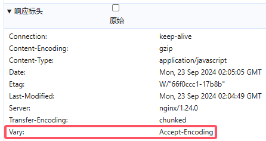
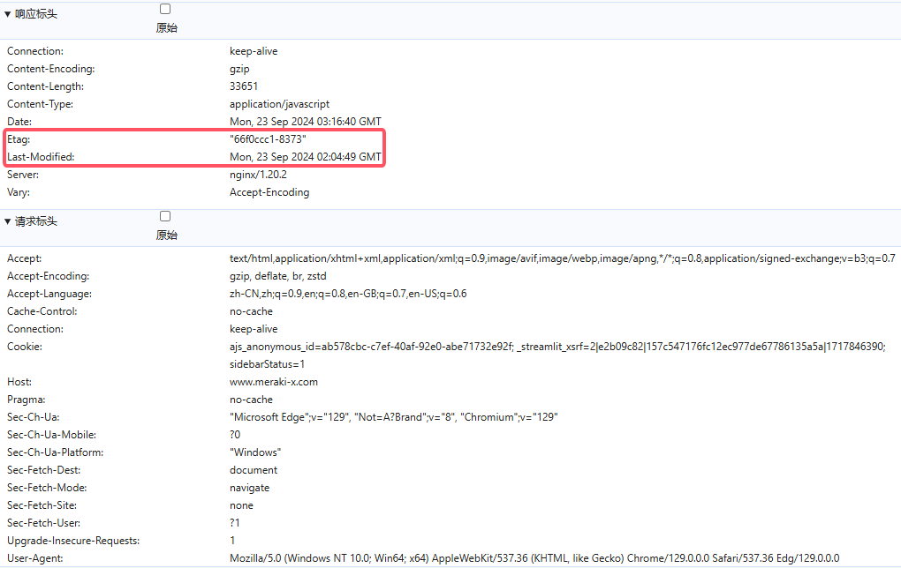
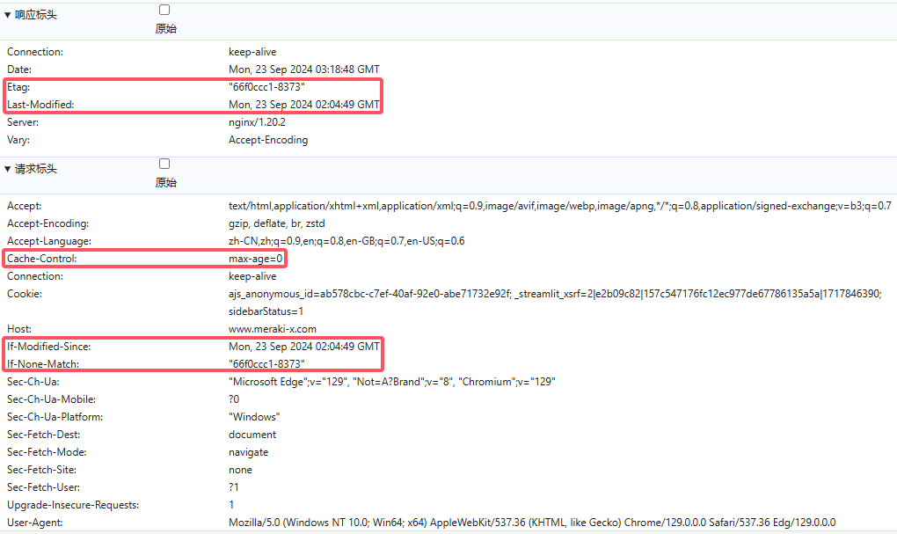
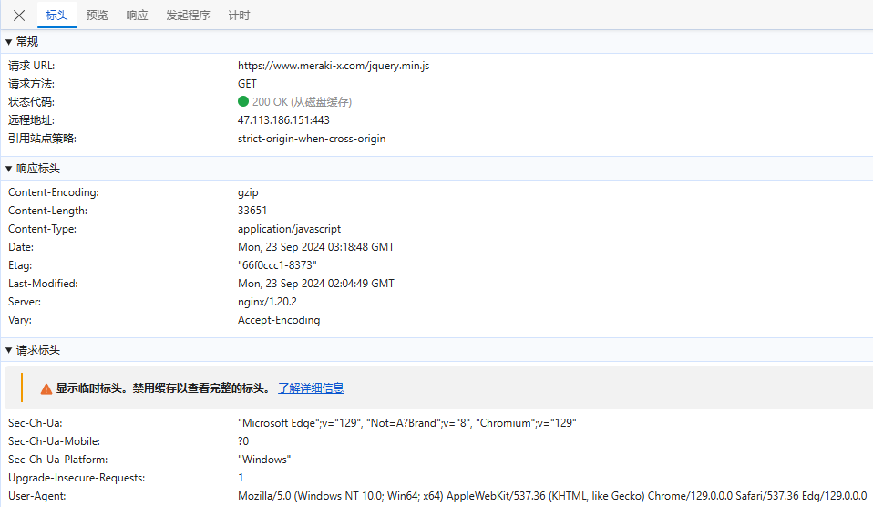
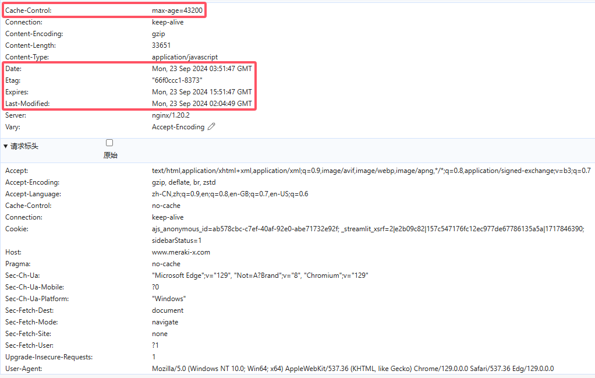

# Nginx静态资源压缩和缓存

## Nginx静态资源压缩

> 在Nginx的配置文件中可以通过配置gzip来对静态资源进行压缩，相关的指令可以配置在http块、server块和location块中，Nginx可以通过

```
ngx_http_gzip_module模块
ngx_http_gzip_static_module模块
ngx_http_gunzip_module模块
```

### Gzip模块配置指令

> 来自`ngx_http_gzip_module`模块，该模块会在nginx安装的时候内置到nginx的安装环境中

#### gzip指令

> 该指令用于开启或者关闭gzip功能

| 语法   | gzip on\|off;             |
| ------ | ------------------------- |
| 默认值 | gzip off;                 |
| 位置   | http、server、location... |

> 只有该指令为打开状态，下面的指令才有效果
>
> ```nginx
> http{
> 	gzip on;
> }
> ```

#### gzip_types指令

> 该指令可以根据响应页的MIME类型选择性地开启Gzip压缩功能

| 语法   | gzip_types mime-type ...; |
| ------ | ------------------------- |
| 默认值 | gzip_types text/html;     |
| 位置   | http、server、location    |

> 所选择的值可以从mime.types文件中进行查找，也可以使用"*"代表所有
>
> ```nginx
> http{
> 	gzip_types application/javascript;
> }
> ```

#### gzip_comp_level指令

> 该指令用于设置Gzip压缩程度，级别从1-9,1表示要是程度最低，要是效率最高，9刚好相反，压缩程度最高，但是效率最低最费时间

| 语法   | gzip_comp_level level; |
| ------ | ---------------------- |
| 默认值 | gzip_comp_level 1;     |
| 位置   | http、server、location |

> 压缩级别一般在5和6之间，太高会有边际效应
>
> ```nginx
> http{
> 	gzip_comp_level 6;
> }
> ```

#### gzip_vary指令

> 该指令用于设置使用Gzip进行压缩发送是否携带`Vary:Accept-Encoding`头域的响应头部。主要是告诉接收方，所发送的数据经过了Gzip压缩处理

| 语法   | gzip_vary on\|off;     |
| ------ | ---------------------- |
| 默认值 | gzip_vary off;         |
| 位置   | http、server、location |

> 

#### gzip_buffers指令

> 该指令用于处理请求压缩的缓冲区数量和大小

| 语法   | gzip_buffers number size;  |
| ------ | -------------------------- |
| 默认值 | gzip_buffers 32 4k\|16 8k; |
| 位置   | http、server、location     |

> number：指定Nginx服务器向系统申请缓存空间个数，size指的是每个缓存空间的大小。主要实现的是申请number个每个大小为size的内存空间。这个值的设定一般会和服务器的操作系统有关，所以建议此项不设置，使用默认值即可
>
> ```nginx
> gzip_buffers 4 16K;	  #缓存空间大小
> ```

#### gzip_disable指令

> 针对不同种类客户端发起的请求，可以选择性地开启和关闭Gzip功能

| 语法   | gzip_disable regex ...; |
| ------ | ----------------------- |
| 默认值 | —                       |
| 位置   | http、server、location  |

> regex：根据客户端的浏览器标志(user-agent)来设置，支持使用正则表达式。指定的浏览器标志不使用Gzip.该指令一般是用来排除一些明显不支持Gzip的浏览器
>
> ```nginx
> gzip_disable "MSIE [1-6]\.";
> ```

#### gzip_http_version指令

> 针对不同的HTTP协议版本，可以选择性地开启和关闭Gzip功能

| 语法   | gzip_http_version 1.0\|1.1; |
| ------ | --------------------------- |
| 默认值 | gzip_http_version 1.1;      |
| 位置   | http、server、location      |

> 该指令是指定使用Gzip的HTTP最低版本，该指令一般采用默认值即可
>
> ```nginx
> gzip_http_version 1.1;
> ```

#### gzip_proxied指令

> 该指令设置是否对服务端返回的结果进行Gzip压缩

| 语法   | gzip_proxied  off\|expired\|no-cache\|<br/>no-store\|private\|no_last_modified\|no_etag\|auth\|any; |
| ------ | ------------------------------------------------------------ |
| 默认值 | gzip_proxied off;                                            |
| 位置   | http、server、location                                       |

> - `off`：关闭所有的代理结果数据压缩
> - `expired`：如果header中包含`Expires`头信息，启用压缩
> - `no-cache`：如果header中包含`Cache-Control:no-cache`头信息，启用压缩
> - `no-store`：如果header中包含`Cache-Control:no-store`头信息，启用压缩
> - `private`：如果header中包含`Cache-Control:private`头信息，启用压缩
> - `no_last_modified`：启用压缩，如果header中包含`Last_Modified`头信息，启用压缩
> - `no_etag`：启用压缩，如果header中包含`ETag`头信息，启用压缩
> - `auth`：启用压缩，如果header中包含`Authorization`头信息，启用压缩
> - `any`：无条件压缩所有结果数据

### Gzip和sendfile共存问题

> 开启`sendfile`以后，在读取磁盘上的静态资源文件的时候，可以减少拷贝的次数，可以不经过用户进程将静态文件通过网络设备发送出去，但是Gzip要想对资源压缩，是需要经过用户进程进行操作的。所以需要解决两个设置的共存问题，可以使用`ngx_http_gzip_static_module`模块的`gzip_static`指令来解决

#### gzip_static指令

> 检查与访问资源同名的`.gz`文件时，`response`中以`gzip`相关的`header`返回`.gz`文件的内容

| 语法   | **gzip_static** on \| off \| always; |
| ------ | ------------------------------------ |
| 默认值 | gzip_static off;                     |
| 位置   | http、server、location               |

> `always`：无论客户端是否支持`gzip`，都会发送文件`.gz`文件，生成`.gz`文件
>
> ```
> gzip jquery.min.js
> ```
>
> 
>
> 第一个为开启`gzip_static on;`，第二个为`gzip on;`

## Nginx静态资源缓存

> 缓存（cache），原始意义是指访问速度比一般随机存取存储器（RAM）快的一种高速存储器，通常它不像系统主存那样使用DRAM技术，而使用昂贵但较快速的SRAM技术。缓存的设置是所有现代计算机系统发挥高性能的重要因素之一

### Web缓存

> Web缓存是指一个Web资源（如html页面，图片，js，数据等）存在于Web服务器和客户端（浏览器）之间的副本。缓存会根据进来的请求保存输出内容的副本

**Web缓存的种类**

```
客户端缓存
	浏览器缓存
服务端缓存
	Nginx / Redis / Memcached等
```

**浏览器缓存**

> 当下一个请求来到的时候，如果是相同的URL，缓存会根据缓存机制决定是直接使用副本响应访问请求，还是向源服务器再次发送请求
>
> 比较常见的就是浏览器会缓存访问过网站的网页，当再次访问这个URL地址的时候，如果网页没有更新，就不会再次下载网页，而是直接使用本地缓存的网页。只有当网站明确标识资源已经更新，浏览器才会再次下载网页

浏览器缓存的好处：

- 成本最低的一种缓存实现
- 减少网络带宽消耗
- 降低服务器压力
- 减少网络延迟，加快页面打开速度

### 浏览器缓存的执行流程

> HTTP协议中和页面缓存相关的字段

| header        | 说明                                        |
| ------------- | ------------------------------------------- |
| Expires       | 缓存过期的日期和时间                        |
| Cache-Control | 设置和缓存相关的配置信息                    |
| Last-Modified | 请求资源最后修改时间                        |
| ETag          | 请求变量的实体标签的当前值，比如文件的MD5值 |


1. 用户首次通过浏览器发送请求到服务端获取数据，客户端是没有对应的缓存，所以需要发送request请求来获取数据
2. 服务端接收到请求后，获取服务端的数据及服务端缓存的允许后，返回200的成功状态码并且在响应头上附上对应资源以及缓存信息
3. 当用户再次访问相同资源的时候，客户端会在浏览器的缓存目录中查找是否存在响应的缓存文件
4. 如果没有找到对应的缓存文件，则走(2)步
5. 如果有缓存文件，接下来对缓存文件是否过期进行判断，过期的判断标准是(Expires)
6. 如果没有过期，则直接从本地缓存中返回数据进行展示
7. 如果**Expires**过期，接下来需要判断缓存文件是否发生过变化
8. 判断的标准有两个，一个是**ETag(Entity Tag)**(标识一个服务器资源的特定版本)，一个是**Last-Modified**(包含了资源最后一次修改的日期和时间)
9. 判断结果是未发生变化，则服务端返回304，直接从缓存文件中获取数据
10. 如果判断是发生了变化，重新从服务端获取数据，并根据缓存协商(服务端所设置的是否需要进行缓存数据的设置)来进行数据缓存

> 缓存分为强缓存和弱缓存，强缓存直接从缓存中读取数据，弱缓存通过返回的状态码304决定来启用缓存

#### 弱缓存

第一次请求，状态码200：



直接刷新，第二次请求，状态码`304`：



#### 强缓存

在第一次请求的基础上，新开一个窗口，因为浏览器会先判断缓存是否过期(浏览器有默认的强缓存时间)再决定是否发送请求，在时间范围内，直接走从磁盘读取：



### 浏览器缓存相关指令

#### expires指令

> 该指令用来控制页面缓存的作用。可以通过该指令控制HTTP应答中的`Expires`（HTTP1.0）和`Cache-Control`（HTTP1.1），两者作用类似，`Cache-Control`解决了**客户端和服务端时间不一致导致的缓存问题**

| 语法   | expires [modified] time<br/>expires epoch\|max\|off; |
| ------ | ---------------------------------------------------- |
| 默认值 | expires off;                                         |
| 位置   | http、server、location                               |

> - `time`：单位为秒，可以整数也可以是负数，指定过期时间。对`Expires`来说，值为服务器的时间加上指定的值。对`Cache-Control`来说，如果是负数，`Cache-Control`则为`no-cache`，如果为整数或0，则`Cache-Control`的值为`max-age=time`
> - `epoch`：指定`Expires`的值为`1 January,1970,00:00:01 GMT`相当于`(1970-01-01 00:00:01)`，同时`Cache-Control`的值为`no-cache`
> - `max`：指定`Expires`的值为`31 December2037 23:59:59GMT`相当于` (2037-12-31 23:59:59)` ，同时`Cache-Control`的值为`10`年
> - `off`：默认不添加缓存头`Expires`和`Cache-Control`
>
> GMT代表"格林威治标准时间"（Greenwich Mean Time），被用作世界标准时间，是国际时间标准的基础，也是世界时（UT, Universal Time）的一个形式
>
> ```nginx
>      location ~ .*\.(js|css)?$
>     {
>          expires      12h;
>         }
> ```
>
>    第一次请求，控制缓存：
>
> 

#### add_header指令

> 该指令是用来添加指定的响应头和响应值

| 语法   | add_header name value [always]; |
| ------ | ------------------------------- |
| 默认值 | —                               |
| 位置   | http、server、location...       |

> 使用`always`后代表无论响应状态码是什么，都会添加指定的响应头，`Cache-Control`作为响应头信息，可以设置如下值：
>
> | 指令             | 说明                                           |
> | ---------------- | ---------------------------------------------- |
> | must-revalidate  | 可缓存但必须再向源服务器进行确认               |
> | no-cache         | 缓存前必须确认其有效性                         |
> | no-store         | 不缓存请求或响应的任何内容                     |
> | no-transform     | 代理不可更改媒体类型                           |
> | public           | 可向任意方提供响应的缓存                       |
> | private          | 仅向特定用户返回响应                           |
> | proxy-revalidate | 要求中间缓存服务器对缓存的响应有效性再进行确认 |
> | max-age=<秒>     | 响应最大Age值                                  |
> | s-maxage=<秒>    | 公共缓存服务器响应的最大Age值                  |
>
> 不允许使用任何缓存，刷新都是直接重新获取(状态码`200`)：
>
> ```nginx
> add_header Cache-Control no-store always;
> ```