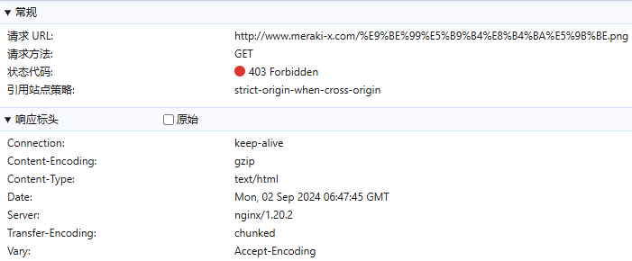
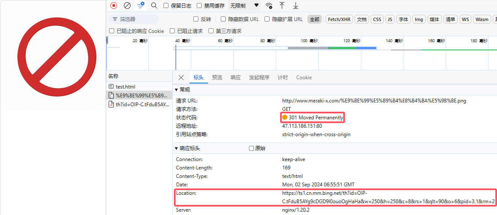

# Nginx跨域和防盗链

## Nginx跨域

> 同源:  协议、域名(IP)、端口相同即为同源
>
> 浏览器的同源策略：是一种约定，是浏览器最核心也是最基本的安全功能，限制从一个源加载的文档或脚本如何与另一个源的资源进行交互，可以防止恶意网站读取另一个网站的敏感数据，例如cookies、session storage、local storage等。这样可以有效减少跨站脚本攻击（XSS）和数据泄露的风险

### 跨域配置

> 可以在`http`、`server`、`location`处设置

```nginx
		# 为特定的URL匹配
		location / {
			# 允许跨域的配置
			add_header 'Access-Control-Allow-Origin' '*' always;
			add_header 'Access-Control-Allow-Methods' 'GET, POST, OPTIONS';
			# 服务器允许跨域请求包含以下请求头
			add_header 'Access-Control-Allow-Headers' 'DNT,X-CustomHeader,Keep-Alive,User-Agent,X-Requested-With,If-Modified-Since,Cache-Control,Content-Type,Authorization';
			# 客户端在执行实际请求之前，可能会发送一个OPTIONS请求来询问服务器是否允许跨源请求，直接返回204可以减少服务器的负担
			if ($request_method = 'OPTIONS') {
				return 204;
			}
			index  index.html index.htm;
			try_files $uri $uri/ /index.html;
		}
```

> 只想允许特定的域名跨域请求，可以将`Access-Control-Allow-Origin`的值从`*`改为特定的域名：
>
> ```nginx
> add_header 'Access-Control-Allow-Origin' 'https://example.com' always;
> ```
>
> 允许所有常见的HTTP方法跨域，需要明确的列出：
>
> ```nginx
> add_header 'Access-Control-Allow-Methods' 'GET, POST, PUT, DELETE, OPTIONS';
> ```
>
> 应用需要处理Cookie或者认证信息，可能还需要设置`Access-Control-Allow-Credentials`头：
>
> ```nginx
> add_header 'Access-Control-Allow-Credentials' 'true';
> ```
>
> > 对于OPTIONS预检请求，不是只有PUT和DELETE请求才会发送预检请求。预检请求（preflight request）是在某些情况下由浏览器自动发送的，用于确定实际请求是否安全可以发送。可能触发预检请求的条件：
> >
> > - 使用了除GET、HEAD和POST之外的HTTP方法（如PUT、DELETE、CONNECT、OPTIONS、TRACE和PATCH）
> > - 发送的自定义请求头（不是简单头部，如`Accept`，`Accept-Language`，`Content-Language`，`Content-Type`（只限于特定值）等）
> > - `Content-Type`请求头的值不是`application/x-www-form-urlencoded`, `multipart/form-data`, 或`text/plain`
> >
> > 如果请求满足上述任何条件，浏览器将发送一个OPTIONS预检请求到服务器

## Nginx防盗链

> 资源盗链：指的是在未经资源所有者许可的情况下，通过技术手段在第三方网站上显示或使用他人服务器上的资源（如图片、视频、文件等）的行为


### valid_referers指令

> 该指令可以通过查看`referer`自动和`valid_referers`后面的内容进行匹配，如果匹配到了就将`$invalid_referer`变量置0，如果没有匹配到，则将`$invalid_referer`变量置为1，匹配的过程中不区分大小写

| 语法   | valid_referers none\|blocked\|server_names\|string... |
| ------ | ----------------------------------------------------- |
| 默认值 | —                                                     |
| 位置   | server、location                                      |

> 常用配置：
>
> ```nginx
>         location ~ .*\.(wma|wmv|asf|mp3|mmf|zip|rar|jpg|gif|png|swf|flv|mp4)$ {
>             valid_referers none blocked example.com *.example.com;
>             # 如果referer不在白名单中，则返回一个错误图片
>             if ($invalid_referer) {
>                 return 403; # 或者 return 301 https://yourdomain.com/forbidden.jpg;
>             }
>         }
> ```
>
> - `valid_referers`：指令用于设置合法的referer白名单
> - `none`：允许没有referer头的请求
> - `blocked`：允许referer头存在但被阻止或修改的请求，代表referer信息存在，但是由于某些原因（如用户代理设置或隐私设置）被阻止或修改了。例如，当用户的浏览器设置为不发送referer信息，或者referer信息被代理服务器修改为一个空字符串时，这种情况就会被归类为`blocked`
> - `example.com`：允许来自`example.com`域的请求
> - `$invalid_referer`：是一个内置变量，当`valid_referers`指令检查发现referer不合法时，它的值为真
> - `return 301 https://yourdomain.com/forbidden.jpg;`：是另一种处理方式，即如果referer不合法，则将请求重定向到一个错误图片
>
> 防盗链效果：
>
> 
>
> 实际返回信息：
>
> ```html
> <html>
> <head><title>403 Forbidden</title></head>
> <body>
> <center><h1>403 Forbidden</h1></center>
> <hr><center>nginx/1.20.2</center>
> </body>
> </html>
> ```
>
> 重定向图片效果：
>
> 