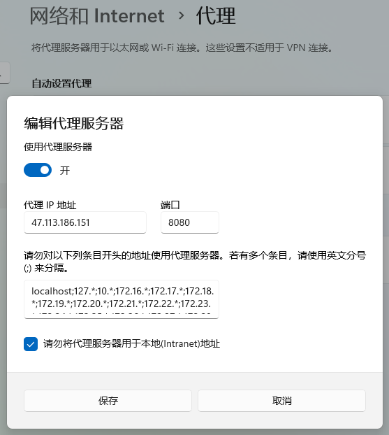
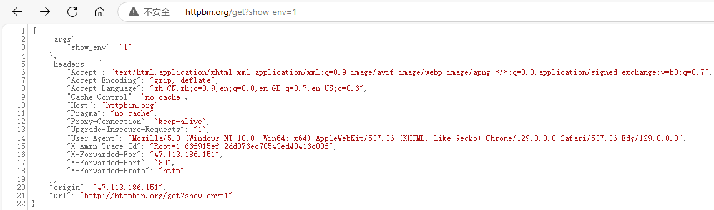
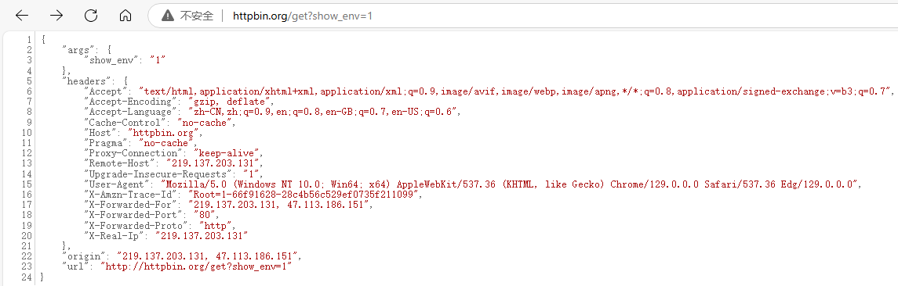

# Nginx代理

## 正向代理

> Nginx可以作为正向代理来代理HTTP流量，但是无法代理其它请求

Nginx配置：

```nginx
	server {
		listen  8080;
		# DNS服务器地址
		resolver 8.8.8.8;
		location / {
			proxy_pass http://$http_host$request_uri;
		}
	}
```

> 开启代理：
>
> 
>
> 访问：`http://httpbin.org/get?show_env=1`
>
> 
>
> 带其它参数信息：
>
> ```nginx
> 	server {
> 		listen  8080;
> 		# DNS服务器地址
> 		resolver 8.8.8.8;
> 		location / {
> 			proxy_set_header Host $host;
> 			proxy_set_header X-Real-IP $remote_addr;
> 			proxy_set_header X-Forwarded-For $proxy_add_x_forwarded_for;
> 			# 告诉后端服务器原始请求使用的是哪种协议（http或https）
> 			proxy_set_header X-Forwarded-Proto $scheme;
> 			proxy_pass http://$http_host$request_uri;
> 		}
> 	}
> ```
>
> 

## 反向代理

> Nginx反向代理模块的指令是由`ngx_http_proxy_module`模块进行解析，该模块在安装Nginx的时候已经加装到Nginx中了


### proxy_pass指令

> 该指令用来设置被代理服务器地址，可以是主机名称、IP地址加端口号形式

| 语法   | proxy_pass URL; |
| ------ | --------------- |
| 默认值 | —               |
| 位置   | location        |

> URL：为要设置的被代理服务器地址，包含传输协议(`http`、`https://`)、主机名称或IP地址加端口号、URI等要素

### proxy_set_header指令

> 该指令可以更改Nginx服务器接收到的客户端请求的请求头信息，然后将新的请求头发送给代理的服务器

| 语法   | proxy_set_header field value;                                |
| ------ | ------------------------------------------------------------ |
| 默认值 | proxy_set_header Host $proxy_host;<br/>proxy_set_header Connection close; |
| 位置   | http、server、location                                       |

### proxy_redirect指令

> 该指令是用来重置头信息中的"Location"和"Refresh"的值

| 语法   | proxy_redirect redirect replacement;<br/>proxy_redirect default;<br/>proxy_redirect off; |
| ------ | ------------------------------------------------------------ |
| 默认值 | proxy_redirect default;                                      |
| 位置   | http、server、location                                       |

## 反向代理系统调优

### proxy_buffering指令

> 该指令用来开启或者关闭代理服务器的缓冲区

| 语法   | proxy_buffering on\|off; |
| ------ | ------------------------ |
| 默认值 | proxy_buffering on;      |
| 位置   | http、server、location   |

### proxy_buffers指令

| 语法   | proxy_buffers number size;                |
| ------ | ----------------------------------------- |
| 默认值 | proxy_buffers 8 4k \| 8K;(与系统平台有关) |
| 位置   | http、server、location                    |

> number：缓冲区的个数
>
> size：每个缓冲区的大小，缓冲区的总大小就是`number*size`

### proxy_buffer_size指令

| 语法   | proxy_buffer_size size;                     |
| ------ | ------------------------------------------- |
| 默认值 | proxy_buffer_size 4k \| 8k;(与系统平台有关) |
| 位置   | http、server、location                      |

### proxy_busy_buffers_size指令

> 该指令用来限制同时处于BUSY状态的缓冲总大小

| 语法   | proxy_busy_buffers_size size;    |
| ------ | -------------------------------- |
| 默认值 | proxy_busy_buffers_size 8k\|16K; |
| 位置   | http、server、location           |

### proxy_temp_path指令

| 语法   | proxy_temp_path  path;      |
| ------ | --------------------------- |
| 默认值 | proxy_temp_path proxy_temp; |
| 位置   | http、server、location      |

> path最多设置三层

### proxy_temp_file_write_size指令

> 该指令用来设置磁盘上缓冲文件的大小

| 语法   | proxy_temp_file_write_size size;    |
| ------ | ----------------------------------- |
| 默认值 | proxy_temp_file_write_size 8K\|16K; |
| 位置   | http、server、location              |

### 网站设置

```nginx
    proxy_buffering on;
    proxy_buffer_size 4 32k;
    proxy_busy_buffers_size 64k;
    proxy_temp_file_write_size 64k;
```

## Nginx的安全控制

> 通过代理分开了客户端到应用程序服务器端的连接，实现了安全措施。在反向代理之前设置防火墙，仅留一个入口供代理服务器访问，实现了安全隔离

### SSL对流量进行加密

> 常用的http请求转变成https请求，那么这两个之间的区别简单的来说两个都是HTTP协议，只不过https是身披SSL外壳的http
>
> HTTPS是一种通过计算机网络进行安全通信的传输协议。它经由HTTP进行通信，利用SSL/TLS建立全通信，加密数据包，确保数据的安全性
>
> - SSL(Secure Sockets Layer)安全套接层
> - TLS(Transport Layer Security)传输层安全
>
> 上述这两个是为网络通信提供安全及数据完整性的一种安全协议，TLS和SSL在传输层和应用层对网络连接进行加密
>
> Nginx要想使用SSL，需要满足一个条件即需要添加一个模块`--with-http_ssl_module`，而该模块在编译的过程中又需要OpenSSL的支持

### ssl指令

> 该指令用来在指定的服务器开启HTTPS,可以使用`listen 443 ssl`，后面这种方式更通用些

| 语法   | ssl on \| off; |
| ------ | -------------- |
| 默认值 | ssl off;       |
| 位置   | http、server   |

### ssl_certificate指令

> 为当前这个虚拟主机指定一个带有PEM格式证书的证书

| 语法   | ssl_certificate file; |
| ------ | --------------------- |
| 默认值 | —                     |
| 位置   | http、server          |

### ssl_certificate_key指令

> 该指令用来指定PEM secret key文件的路径

| 语法   | ssl_ceritificate_key file; |
| ------ | -------------------------- |
| 默认值 | —                          |
| 位置   | http、server               |

### ssl_session_cache指令

| 语法   | ssl_sesion_cache off\|none\|[builtin[:size]] [shared:name:size] |
| ------ | ------------------------------------------------------------ |
| 默认值 | ssl_session_cache none;                                      |
| 位置   | http、server                                                 |

> off：禁用会话缓存，客户端不得重复使用会话
>
> none：禁止使用会话缓存，客户端可以重复使用，但是并没有在缓存中存储会话参数
>
> builtin：内置OpenSSL缓存，仅在一个工作进程中使用。
>
> shared：所有工作进程之间共享缓存，缓存的相关信息用name和size来指定

### ssl_session_timeout指令

> 开启SSL会话功能后，设置客户端能够反复使用储存在缓存中的会话参数时间

| 语法   | ssl_session_timeout time; |
| ------ | ------------------------- |
| 默认值 | ssl_session_timeout 5m;   |
| 位置   | http、server              |

### ssl_ciphers指令

> 指出允许的密码，密码指定为OpenSSL支持的格式

| 语法   | ssl_ciphers ciphers;          |
| ------ | ----------------------------- |
| 默认值 | ssl_ciphers HIGH:!aNULL:!MD5; |
| 位置   | http、server                  |

> 可以使用`openssl ciphers`查看openssl支持的格式

### ssl_prefer_server_ciphers指令

> 指出允许的密码，密码指定为OpenSSL支持的格式

| 语法   | ssl_perfer_server_ciphers on\|off; |
| ------ | ---------------------------------- |
| 默认值 | ssl_perfer_server_ciphers off;     |
| 位置   | http、server                       |

### ssl_prefer_server_ciphers指令

> 该指令指定是否服务器密码优先客户端密码

| 语法   | ssl_perfer_server_ciphers on\|off; |
| ------ | ---------------------------------- |
| 默认值 | ssl_perfer_server_ciphers off;     |
| 位置   | http、server                       |

