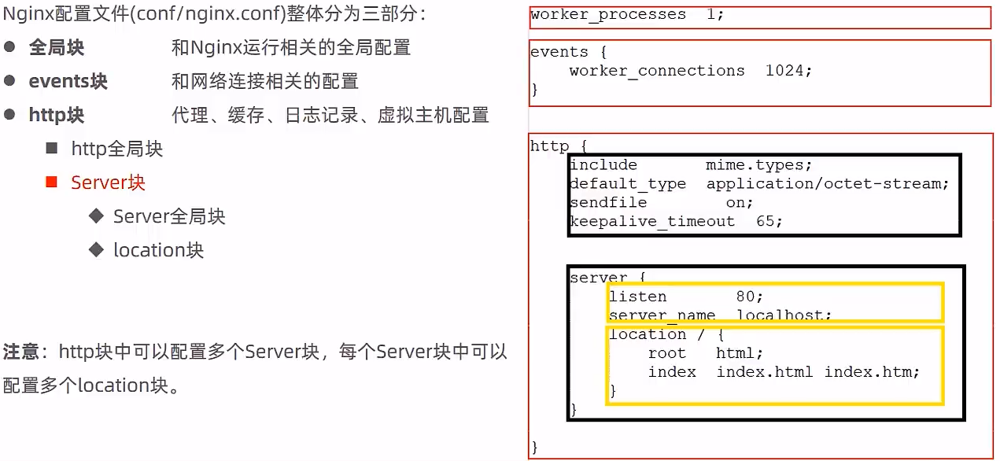
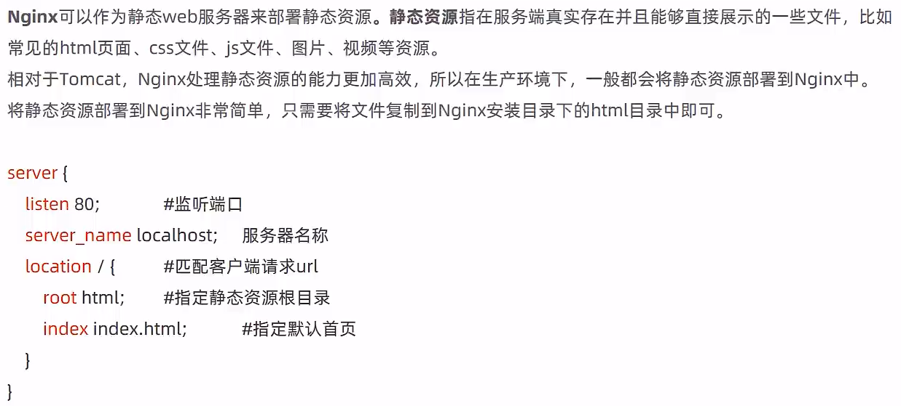
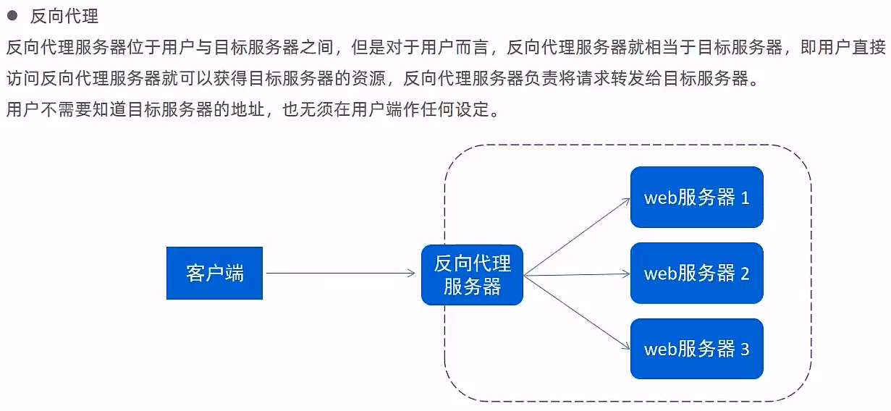
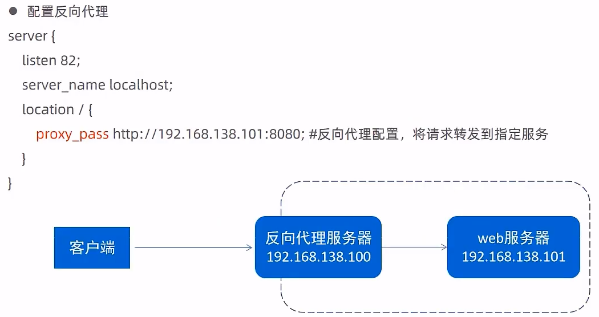
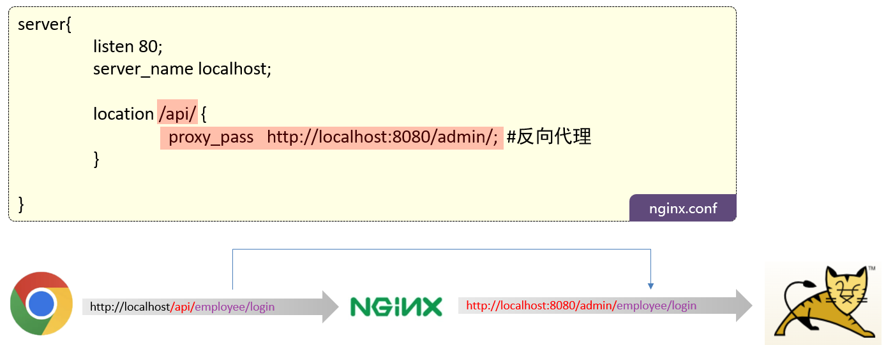
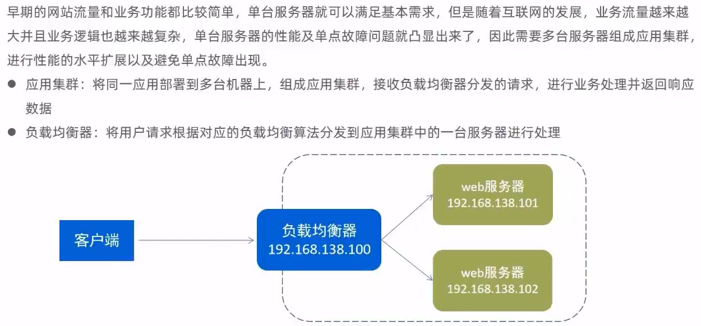
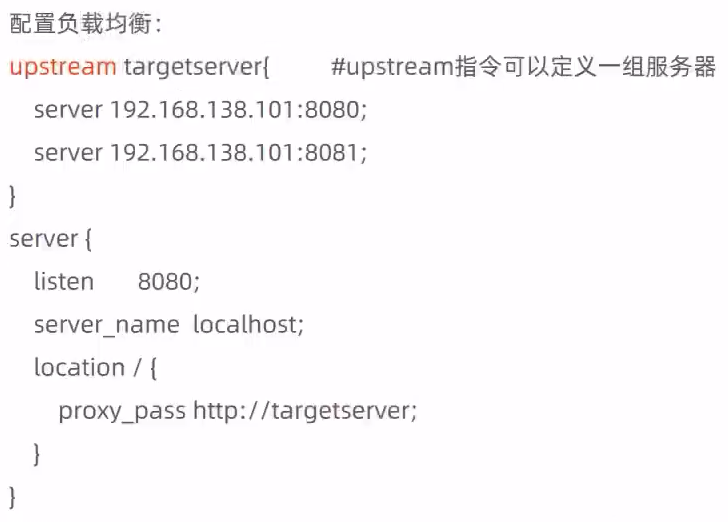
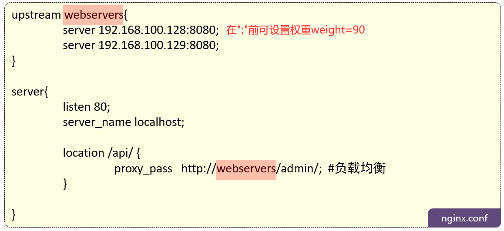
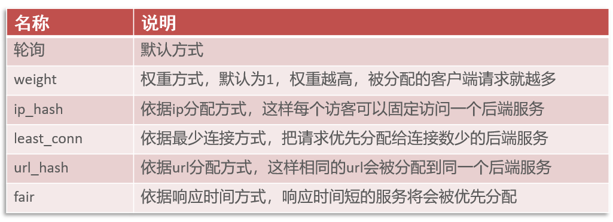

# Nginx配置

## 配置文件结构



```
cd /usr/local/nginx/conf

vim nginx.conf
```

## 部署静态资源



将hello.html文件放入根目录

```html
<html>
    <head>
        <title>Hello Nginx</title>
    </head>
    <body>
        <h2>
            Hello Nginx...
        </h2>
    </body>
</html>
```

部署资源到html目录

```
cp hello.html /usr/local/nginx/html/

cd /usr/local/nginx/html

nginx -s reload
```

> 

### 反向代理


正向代理其实是客户端的代理，帮助客户端访问其无法访问的服务器资源。反向代理则是服务器的代理，帮助服务器做负载均衡，安全防护等



全部请求反向代理



> 这里所有的请求都会被转发到`192.168.138.101:8080`去，返回的数据再通过反向代理服务器返回

满足请求的反向代理



> `location ^~/api/`和`location /api/`相比，`^~/api/`具有更高的优先级，并且一旦匹配成功，将不会考虑后续的正则表达式匹配，而`/api/`可能会在匹配成功后，仍然允许后续的正则表达式匹配，匹配优先级：
>
> - 精确匹配：`=`
> - 前缀匹配：`^~`(匹配成功就停止搜索)
> - 正则匹配：`~`, `~*`(区分大小写或不区分大小写)
> - 通用匹配：`/`
>
> ```
> location = / {
>     # 精确匹配，优先级最高
> }
> 
> location ^~ /images/ {
>     # 前缀匹配，次高优先级
> }
> 
> # 正则匹配
> location ~ \.png$ {
>     # 区分大小写的正则匹配
> }
> location ~* \.(gif|jpg|jpeg)$ {
>     # 不区分大小写的正则匹配
> }
> # 正则非匹配
> location !~ \.png$ {
>     # 区分大小写的正则非匹配
> }
> location !~* \.(gif|jpg|jpeg)$ {
>     # 不区分大小写的正则非匹配
> }
> 
> location / {
>     # 普通前缀匹配，优先级最低
> }
> ```
>
> `proxy_pass`指令后跟的URL末尾是否有`/`，对请求转发有重要影响：
>
> - 末尾有`/`
>
>   - ```nginx
>     location /some/path/ {
>         proxy_pass http://backend/;
>     }
>     ```
>
>   - 当客户端请求`/some/path/page.html`时，Nginx会将请求转发到`http://backend/page.html`
>
> - 末尾没有`/`
>
>   - ```nginx
>     location /some/path/ {
>         proxy_pass http://backend;
>     }
>     ```
>
>   - 当客户端请求`/some/path/page.html`时，Nginx会将请求转发到`http://backend/some/path/page.html`

## 负载均衡



实现负载均衡



> 在实际开发中这里对应的是两个不同的ip，这里通过不同的端口来进行模拟，默认采取轮询的方式来实现负载均衡，即将请求第一次由第一个服务器处理，第二次由第二个服务器处理，以此类推

带weight方式



> `webservers`作为一个变量，可以在反向代理和负载均衡的配置中使用

### 负载均衡策略



> ip_hash策略可以确保来自同一客户端IP的请求总是被分配到同一服务器，可以将会话保持在同一台服务器

在http中的upstream中添加`least_conn;`的方式配置，参考配置示例

```nginx
http {
    upstream backend {
        least_conn;
        server backend1.example.com;
        server backend2.example.com;
        server backend3.example.com;
    }

    server {
        listen 80;

        location / {
            proxy_pass http://backend;
        }
    }
}
```
