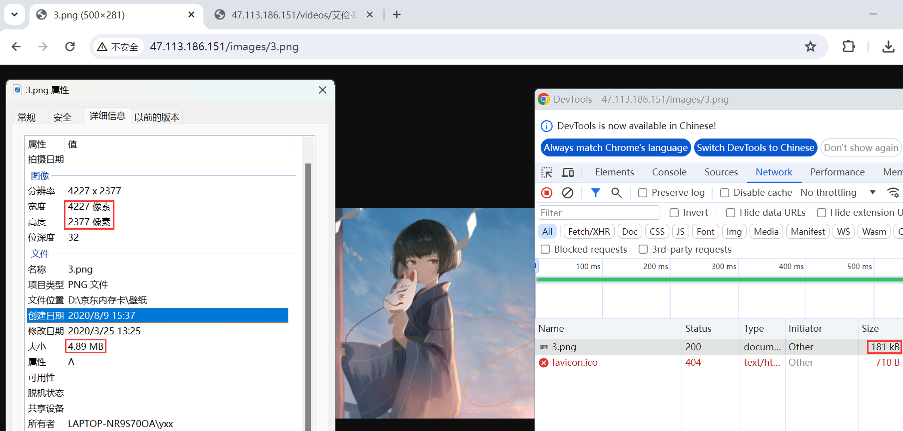
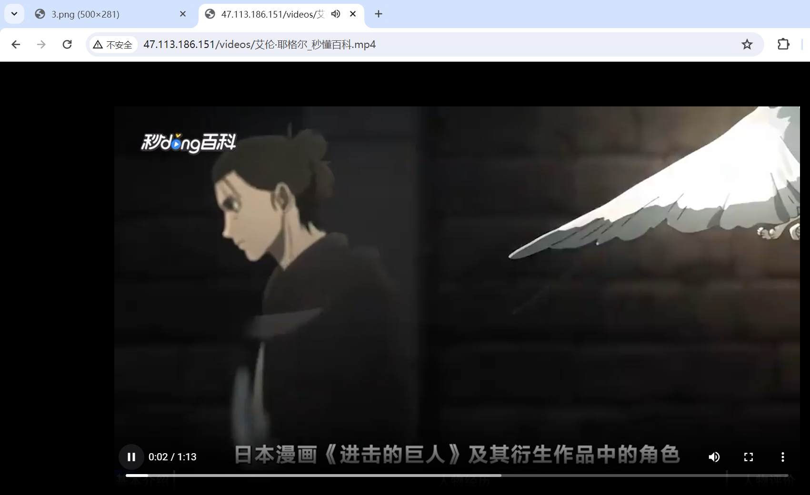

# Nginx代理图片和视频

> nginx本身是可以直接代理图片的，但是如果需要对图片进行操作的话，需要在编译时安装`ngx_http_image_filter_module`模块，视频则是`ngx_http_mp4_module`模块

参考官方文档：

[Nginx 中文文档 - Module ngx_http_image_filter_module | Docs4dev](https://www.docs4dev.com/docs/zh/nginx/current/reference/http-ngx_http_image_filter_module.html)

[Nginx 中文文档 - Module ngx_http_mp4_module | Docs4dev](https://www.docs4dev.com/docs/zh/nginx/current/reference/http-ngx_http_mp4_module.html)

## 模块安装

安装需要的依赖：

```
sudo yum install -y gcc-c++ pcre-devel zlib-devel openssl-devel gd-devel
```

下载nginx源代码包：

```
wget https://nginx.org/download/nginx-1.20.2.tar.gz
tar zxvf nginx-1.20.2.tar.gz
cd nginx-1.20.2
```

编译安装Nginx：

```
./configure
  --with-http_ssl_module \
  --with-http_image_filter_module \
  --with-http_mp4_module \
  --prefix="usr/local/nginx"
```

## 代理图片

配置nginx

```nginx
		# 匹配以'/images/'或者以'/IMAGES/'开头的URI，并且以.jpg、.gif或.png结尾的文件
		location ~* /images/.*\.(jpg|gif|png)$ {

			# 只设置此项，以 JSON 格式输出有关图像的信息
			# image_filter size;

			# 确保响应是确保响应是 JPEG，GIF，PNG 或 WebP 格式的图像。否则，返回 415(不支持的媒体类型)错误
			image_filter test;

			# 对于长度超过500或者宽度超过300的图片会进行压缩，值可以为'-'，代表不进行匹配
			# 将长度超过的边压缩为指定长度，另外一个边等比缩放
			# 第一次压缩后，如果'长'缩放结果后，'宽'还超过了宽的设置值，则会进行第二次压缩，让'宽'等于设定值，此时'长'因为等比缩放所以会小于设定值
			image_filter resize 500 300;

			# image_filter rotate 90; 旋转角度值为 90 180 270
			# 需要设置resize或者rotate后才生效，默认是75
			image_filter_jpeg_quality 30;

			# 默认缓冲区大小为1M，如果图片超过此大小，会报415 Unsupported Media Type 错误
			image_filter_buffer 10M;
		}
```

> 访问`http://47.113.186.151/images/3.png`
>
> 
>
> 只设置`image_filter size;`，将只返回json格式数据
>
> ```json
> { "img" : { "width": 4227, "height": 2377, "type": "png" } }
> ```

## 代理视频

配置nginx

```nginx
		# 匹配视频请求
		location /videos/ {
			# alias 指令用于将请求的 URI 映射到文件系统的实际路径，因为前面有定义root，这里可不配
			alias /usr/local/nginx/html/test/videos/;
			types {
				# 定义了当请求的文件扩展名为 m3u8 时，Nginx 应该使用 application/vnd.apple.mpegurl 这个 MIME 类型
				application/vnd.apple.mpegurl m3u8;
				# 定义了当请求的文件扩展名为 mp4 时，Nginx 应该使用 video/mp4 这个 MIME 类型
				video/mp4 mp4;
			}
			# 启用了 Nginx 的 MP4 模块，该模块允许 Nginx 处理 MP4 文件的特定请求，如 HTTP Range 请求，允许客户端请求视频文件的特定部分
			mp4;
		}
```

> 访问`http://47.113.186.151/videos/%E8%89%BE%E4%BC%A6%C2%B7%E8%80%B6%E6%A0%BC%E5%B0%94_%E7%A7%92%E6%87%82%E7%99%BE%E7%A7%91.mp4`
>
> 
>
> 使用html代码引入
>
> ```html
> <video width="600" height="400" controls>
> <source src="http://47.113.186.151/videos/%E8%89%BE%E4%BC%A6%C2%B7%E8%80%B6%E6%A0%BC%E5%B0%94_%E7%A7%92%E6%87%82%E7%99%BE%E7%A7%91.mp4" type="video/mp4">
> Your browser does not support the video tag.
> </video>
> ```
>
> 