# Nginx配置SSL

## 域名备案流程

网站整体上线使用流程：

- 域名注册：[域名控制台 (aliyun.com)](https://dc.console.aliyun.com/next/index#/overview)
  - 阿里域名注册指南：[域名注册_域名(Domain)-阿里云帮助中心 (aliyun.com)](https://help.aliyun.com/zh/dws/user-guide/quick-start-1/)
- SSL证书申请：[数字证书管理服务管理控制台 - 概览 (aliyun.com)](https://yundun.console.aliyun.com/?spm=5176.100251.top-nav.122.35a64f15vlzXbP&p=cas#/overview/cn-hangzhou)
  - 阿里SSL证书指南：[数字证书管理服务（原SSL证书）(SSL Certificate)-阿里云帮助中心 (aliyun.com)](https://help.aliyun.com/zh/ssl-certificate/)
- ICP备案：[ICP代备案管理系统 (aliyun.com)](https://beian.aliyun.com/pcContainer/myorder)
  - ICP官网：[ICP/IP地址/域名信息备案管理系统 (miit.gov.cn)](https://beian.miit.gov.cn/#/Integrated/index)
  - 阿里ICP备案指南：[阿里云ICP备案流程概述_备案(ICP Filing)-阿里云帮助中心 (aliyun.com)](https://help.aliyun.com/zh/icp-filing/basic-icp-service/user-guide/icp-filing-application-overview)
- 公安备案：[全国互联网安全管理平台 (mps.gov.cn)](https://beian.mps.gov.cn/#/)，个人主页：[我的主页 - 全国互联网安全管理服务平台 (mps.gov.cn)](https://beian.mps.gov.cn/web/dashboard/home)
  - 阿里公安备案指南：[公安联网备案及注销介绍_备案(ICP Filing)-阿里云帮助中心 (aliyun.com)](https://help.aliyun.com/zh/icp-filing/basic-icp-service/user-guide/the-public-security-network-for-record-and-cancellation)
  - 阿里公安备案信息填写指南：[如何填写公安联网备案公安联网备案信息指南_备案(ICP Filing)-阿里云帮助中心](https://help.aliyun.com/zh/icp-filing/basic-icp-service/the-public-security-network-for-the-record-information-fill-in-the-guide)

### ICP备案

参考ICP备案内容：

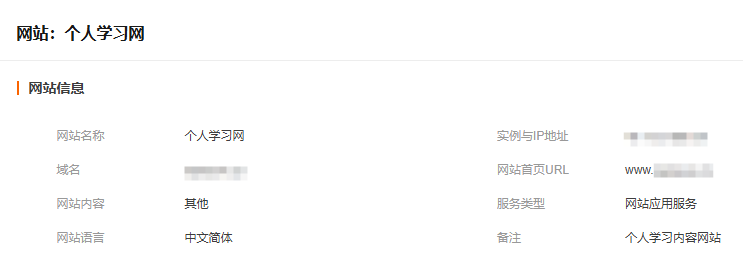

> `个人学习网`可能已经被拉黑，可以取其它名字，像是`个人介绍网`也行

如果没有进行ICP备案，解析域名后会被阿里云拦截：

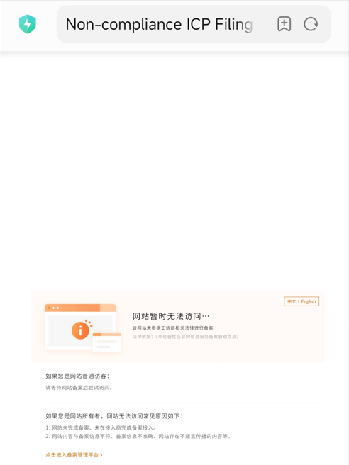

### 公安备案

阿里云公安备案文档：

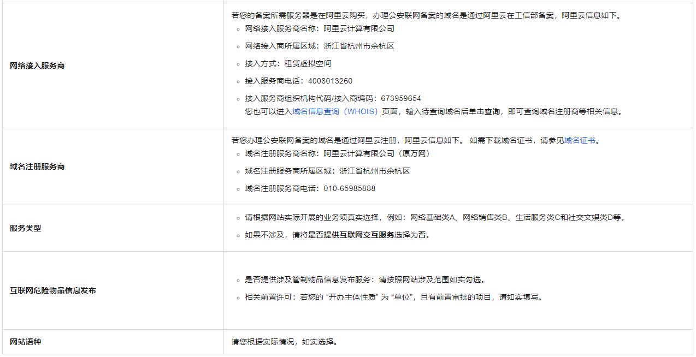

填写示例：

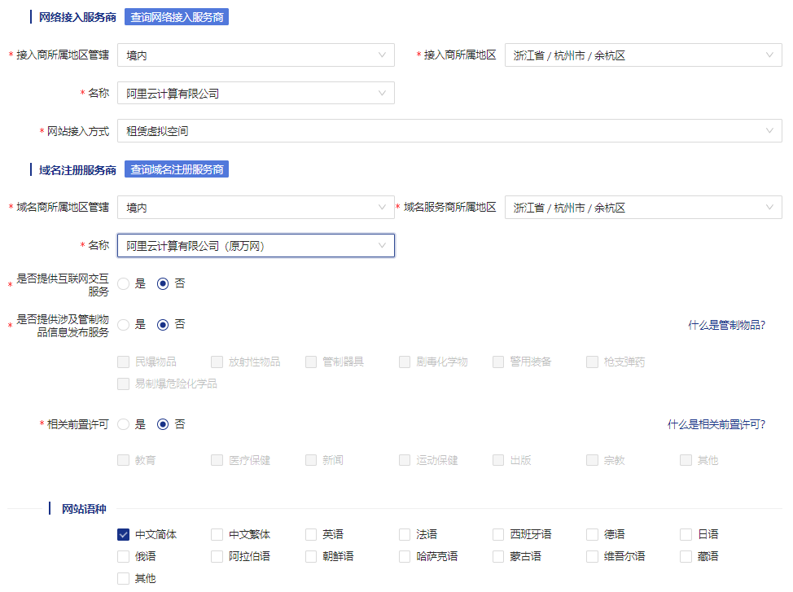

### 底部跳转代码

```html
<div style="margin:0 auto; padding:20px 0;">
    <a target="_blank" href="http://www.beian.gov.cn/portal/registerSystemInfo?recordcode=xxxxxxxxxxxxxx"
       style="display:inline-block;text-decoration:none;height:20px;line-height:20px;">
        
        <p style="float:left;height:20px;line-height:20px;margin: 0px 0px 0px 5px; color:#939393;">
            京公安备xxxxxxxxxxxxxx号</p>
    </a>
    <a target="_blank" href="https://beian.miit.gov.cn/#/Integrated/index"
       style="display:inline-block;text-decoration:none;height:20px;line-height:20px;">
        <p style="float:left;height:20px;line-height:20px;margin: 0px 0px 0px 5px; color:#939393;">
            湘ICP备xxxxxxxxxx号</p>
    </a>
</div>
```

> 图标：
>
> 
>
> 效果：
>
> 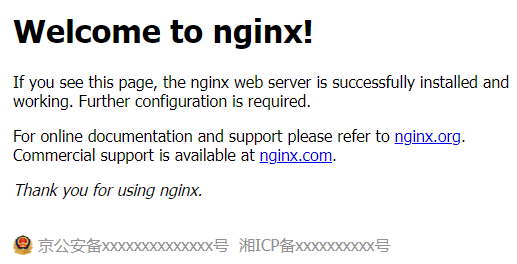
>
> Vue代码：
>
> ```vue
> <template>
>      <el-row justify="space-between" style="margin-top: 5%;">
>        <el-col :span="4"></el-col>
>        <el-col :span="16" style="min-width: 260px; text-align: center;">
>          <div style="margin:0 auto; padding:20px 0;">
>            <a target="_blank" href="http://www.beian.gov.cn/portal/registerSystemInfo?recordcode=xxxxxxxxxxxxxx"
>              style="display:inline-block;text-decoration:none;height:20px;line-height:20px;">
>              
>              <p style="float:left;height:20px;line-height:20px;margin: 0px 0px 0px 5px; color:#939393;">
>                京公安备xxxxxxxxxxxxxx号</p>
>            </a>
>            <a target="_blank" href="https://beian.miit.gov.cn/#/Integrated/index"
>              style="display:inline-block;text-decoration:none;height:20px;line-height:20px;">
>              <p style="float:left;height:20px;line-height:20px;margin: 0px 0px 0px 5px; color:#939393;">
>                湘ICP备xxxxxxxxxx号</p>
>            </a>
>          </div>
>        </el-col>
>        <el-col :span="4"></el-col>
>      </el-row>
> </template>
> ```

## 下载证书

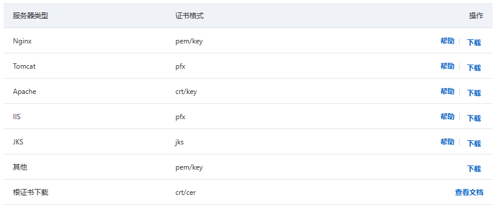

## Nginx配置文件

```nginx
	server {
		# 服务器端口使用443，开启ssl
		listen       443 ssl;
		# 域名，多个以空格分开
		server_name  example.com www.example.com;

		# ssl证书地址
		ssl_certificate     /usr/local/nginx/cert/ssl.pem;  # pem文件的路径(或者crt文件)
		ssl_certificate_key  /usr/local/nginx/cert/ssl.key; # key文件的路径

		# ssl验证相关配置
		ssl_session_timeout  5m;    #缓存有效期
		ssl_ciphers ECDHE-RSA-AES128-GCM-SHA256:ECDHE:ECDH:AES:HIGH:!NULL:!aNULL:!MD5:!ADH:!RC4;    #加密算法
		ssl_protocols TLSv1 TLSv1.1 TLSv1.2;    #安全链接可选的加密协议
		ssl_prefer_server_ciphers on;    #使用服务器端的首选算法

		location / {
			root   html;
			index  index.html index.htm;
		}
	}
```

> 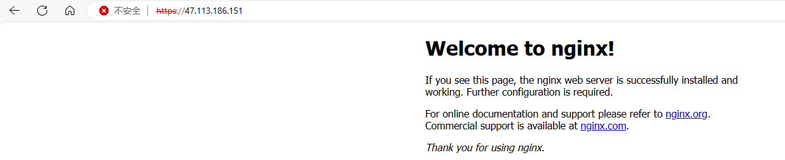
>
> 配置SSL之后，需要重启nginx，此时配合域名访问使用就可以成功使用https了
>
> 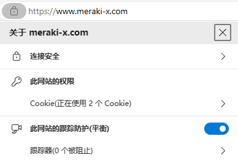
>
> https只是默认的端口在443，可以通过指定端口号，对应端口号开启了SSL即可
>
> 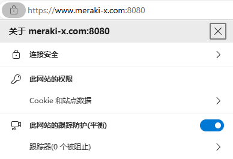

## 升级TLS协议

> 业务网络环境可能对TLS协议版本协议有要求，需要`TLS 1.2`或者`TLS 1.3`版本
>
> 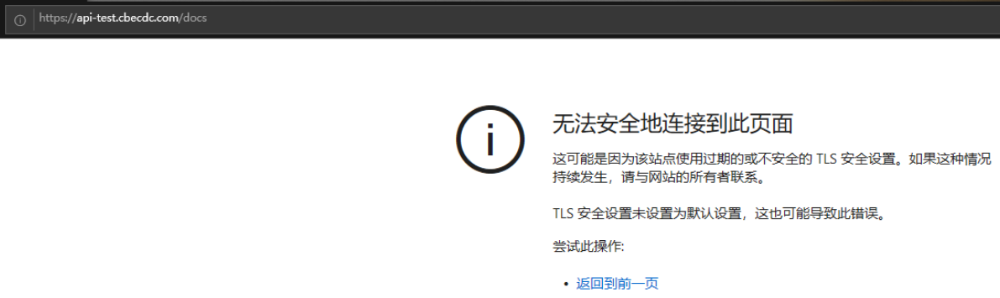

```nginx
	server {
		listen 443 ssl;
		server_name api-test.cbecdc.com;
		# ssl证书地址
		ssl_certificate     vhost/certificate/api-test.cbecdc/api-test.cbecdc.com_bundle.pem;  # pem文件的路径
		ssl_certificate_key  vhost/certificate/api-test.cbecdc/api-test.cbecdc.com.key; # key文件的路径

		# ssl验证相关配置
		ssl_session_timeout  5m;    #缓存有效期
		# 更新后的加密算法，只包含推荐的加密套件
		ssl_ciphers 'ECDHE-ECDSA-AES128-GCM-SHA256:ECDHE-RSA-AES128-GCM-SHA256:ECDHE-ECDSA-AES256-GCM-SHA384:ECDHE-RSA-AES256-GCM-SHA384:ECDHE-ECDSA-CHACHA20-POLY1305:ECDHE-RSA-CHACHA20-POLY1305:DHE-RSA-AES128-GCM-SHA256:DHE-RSA-AES256-GCM-SHA384';
		# 更新后的加密协议，移除了不安全的 TLSv1.0 和 TLSv1.1
		ssl_protocols TLSv1.2 TLSv1.3;    # 安全链接可选的加密协议
		ssl_prefer_server_ciphers on;    #使用服务器端的首选算法

		# 为特定的URL匹配请求设置根目录
		location / {
			proxy_set_header Host $http_host;
			proxy_set_header X-Real-IP $remote_addr;
			proxy_set_header REMOTE-HOST $remote_addr;
			proxy_set_header X-Forwarded-For $proxy_add_x_forwarded_for;
			proxy_pass http://localhost:444/;
		}
	}
```

> 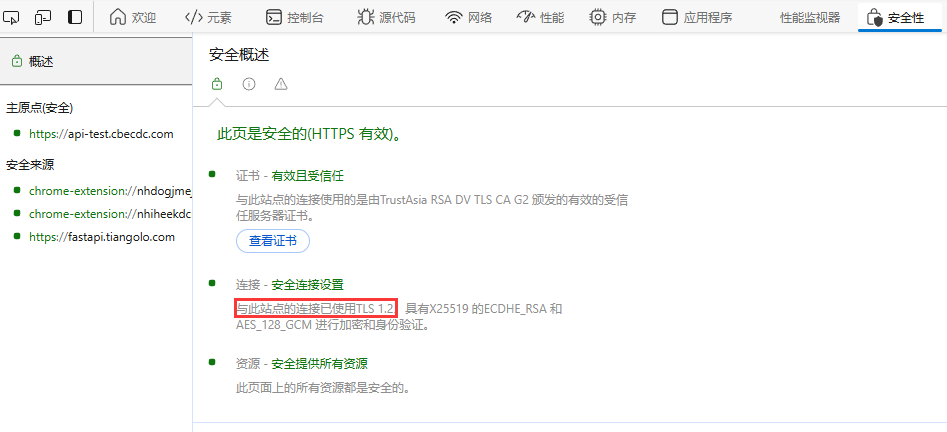

## 域名与服务器不在同一服务商

> 参考博客：[报错：Error: read ECONNRESET，要求网站备案的问题解决 - 豆汤 - 博客园 (cnblogs.com)](https://www.cnblogs.com/CarlJohnson9527/p/18265542)
>
> 腾讯和阿里都是信管局的代理商，在腾讯备案信管局通过了，按道理就直接可以查询到域名备案情况和信息。实际情况是信管局的代理商之间是隔离的分裂的，可能也是竞争关系导致，备案和服务器必须要是同一个代理商，比如都是腾讯云，或者都是阿里云

背景：**服务器为阿里云**、**域名为腾讯云**，当不一致的时候除了chrome，手机端和其它浏览器无法正常访问

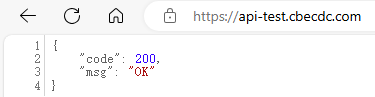

api工具调用登录接口报错`Error: read ECONNRESET`，代码调用需要通过ip加端口的方式

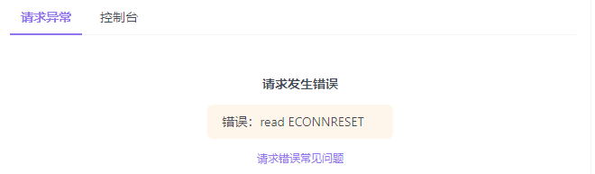

但是在对应网站的加载页面是可以使用js代码去调用接口的

```js
fetch('https://api-test.cbecdc.com/')
  .then(response => {
    // 检查响应状态码是否为200
    if (response.status === 200) {
      // 解析JSON数据
      return response.json();
    } else {
      throw new Error('网络请求错误，状态码：' + response.status);
    }
  })
  .then(data => {
    // 打印JSON数据
    console.log(data);
  })
  .catch(error => {
    // 打印错误信息
    console.error('请求失败:', error);
  });
```

> 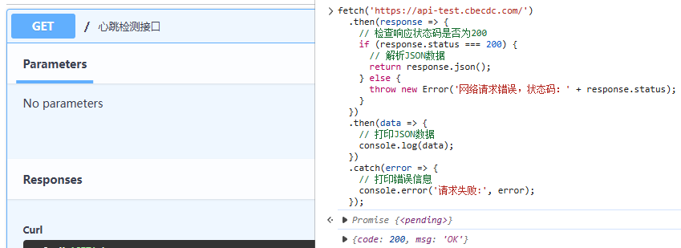

通过http请求的方式访问，阿里云会提示备案

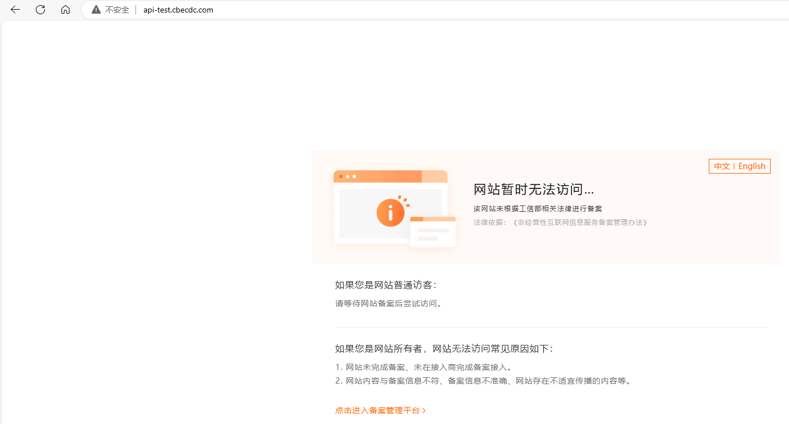

解决方式参考阿里云文档

阿里云文档：[域名与服务器不在同一服务商时如何备案_备案(ICP Filing)-阿里云帮助中心 (aliyun.com)](https://help.aliyun.com/zh/icp-filing/basic-icp-service/support/domain-name-and-how-the-server-is-not-in-the-same-service-provider-for-the-record)

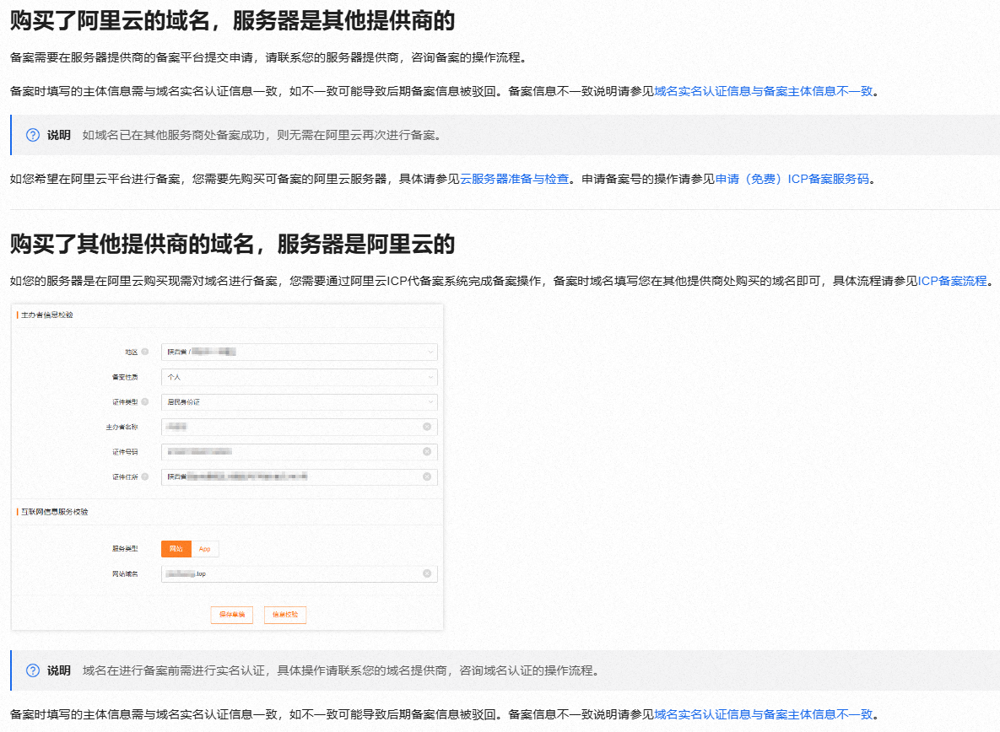
