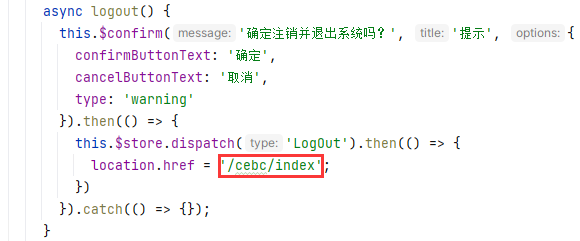
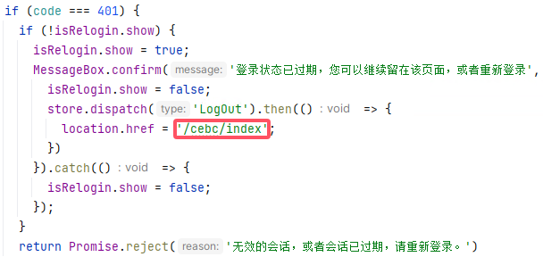

# Nginx配置网站子目录

## 配置子域名网站

### 配置Nginx

```nginx
	# 配置子域名网站，为特定的URL匹配请求设置根目录
    location ^~/cebc/ {
        alias /usr/local/cebc/dist/;
        # 一般配置"/index.html"，这里配置"/cebc/index.html"才能让请求"域名/cebc/"时请求到index.html
        try_files $uri $uri/ /cebc/index.html;
        index index.html index.htm;
    }

    # 代理图片请求api
    location ^~/uniapp-image/ {
        alias /usr/local/cebc/dist/uniapp-image/;
        # 最少两个参数，最多三个参数
        try_files $uri $uri/;
    }
```

### 配置Vue

配置路由`router.js`，控制地址栏跳转逻辑

```js
export default new Router({
  mode: 'history', // 去掉url中的#
  base: '/cebc/', // 与publicPath保持一致
  scrollBehavior: () => ({ y: 0 }),
  routes: constantRoutes
})
```

配置`vue.config.js`，控制静态文件请求路径

```js
// vue.config.js 配置说明
//官方vue.config.js 参考文档 https://cli.vuejs.org/zh/config/#css-loaderoptions
// 这里只列一部分，具体配置参考文档
module.exports = {
  // 部署生产环境和开发环境下的URL。
  // 默认情况下，Vue CLI 会假设你的应用是被部署在一个域名的根路径上
  // 例如 https://www.ruoyi.vip/。如果应用被部署在一个子路径上，你就需要用这个选项指定这个子路径。例如，如果你的应用被部署在 https://www.ruoyi.vip/admin/，则设置 baseUrl 为 /admin/。
  publicPath: process.env.NODE_ENV === "production" ? "/cebc/" : "/",
```

配置组件`Navbar.vue`退出登录重定向地址



配置`request.js`重新登录重定向地址



## 代理图片到其它端口

```nginx
    # 为特定的URL匹配请求设置根目录
    location ^~/uniapp-image/ {
        proxy_set_header Host $host;
        proxy_set_header X-Real-IP $remote_addr;
        proxy_set_header X-Forwarded-For $proxy_add_x_forwarded_for;
        # 告诉后端服务器原始请求使用的是哪种协议（http或https）
        proxy_set_header X-Forwarded-Proto $scheme;
        proxy_pass http://localhost:81/uniapp-image/;
    }
```

> 81端口nginx配置
>
> ```nginx
> server
> {
>    	listen 81;
> 	server_name  local_http;
> 	root   /usr/local/cebc/dist;
> 
> 	# 为特定的URL匹配请求设置根目录
> 	location / {
> 		index  index.html index.htm;
> 		try_files $uri $uri/ /index.html;
> 	}
> 
> 	location ~ .*\.(gif|jpg|jpeg|png|bmp|swf)$
> 	{
> 		expires      30d;
> 	}
> 	location ~ .*\.(js|css)?$
> 	{
> 		expires      12h;
> 	}
> 
> 	location ^~/prod-api/  {
> 			proxy_set_header Host $http_host;
> 			proxy_set_header X-Real-IP $remote_addr;
> 			proxy_set_header REMOTE-HOST $remote_addr;
> 			proxy_set_header X-Forwarded-For $proxy_add_x_forwarded_for;
> 			proxy_pass http://localhost:8080/;
> 	}
> 	location ^~/dev-api/ {
> 			proxy_set_header Host $http_host;
> 			proxy_set_header X-Real-IP $remote_addr;
> 			proxy_set_header REMOTE-HOST $remote_addr;
> 			proxy_set_header X-Forwarded-For $proxy_add_x_forwarded_for;
> 			proxy_pass http://localhost:8080/;
> 	}
> 	location ^~/stage-api/ {
> 			proxy_set_header Host $http_host;
> 			proxy_set_header X-Real-IP $remote_addr;
> 			proxy_set_header REMOTE-HOST $remote_addr;
> 			proxy_set_header X-Forwarded-For $proxy_add_x_forwarded_for;
> 			proxy_pass http://localhost:8080/;
> 	}
> 	location ^~/uniapp-api/ {
> 			proxy_set_header Host $http_host;
> 			proxy_set_header X-Real-IP $remote_addr;
> 			proxy_set_header REMOTE-HOST $remote_addr;
> 			proxy_set_header X-Forwarded-For $proxy_add_x_forwarded_for;
> 			proxy_pass http://localhost:8080/;
> 	}
> }
> ```
>
> 如下代理也可以
>
> ```nginx
>    	# 为特定的URL匹配请求设置根目录
>    	location ^~/uniapp-image/ {
> 			proxy_set_header Host $http_host;
> 			proxy_set_header X-Real-IP $remote_addr;
> 			proxy_set_header REMOTE-HOST $remote_addr;
> 			proxy_set_header X-Forwarded-For $proxy_add_x_forwarded_for;
>    			proxy_pass http://localhost:81/uniapp-image/;
>    	}
> ```