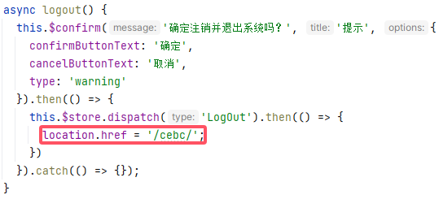
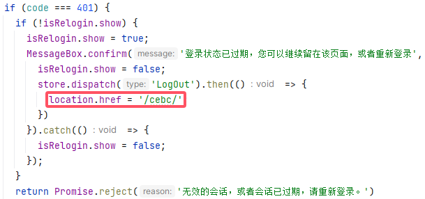

# Nginx配置网站子目录

## 配置子域名网站

### 配置Nginx

```nginx
	# 配置子域名网站，为特定的URL匹配请求设置根目录，'^~/cebc'代表结尾为'cebc'即可，而'^~/cebc/'代表必须结尾为'cebc/'，
    location ^~/cebc {
        alias /usr/local/cebc/dist/;
        try_files $uri $uri/ /cebc/index.html;
        index index.html index.htm;
    }

    # 代理图片请求api
    location ^~/uniapp-image/ {
        alias /usr/local/cebc/dist/uniapp-image/;
        try_files $uri $uri/;
    }
```

> 注意：
>
> - 在一个使用`Vue.js`或`React.js`构建的前端项目中，用户可能会请求`/about`
>   - 但是服务器上并没有`about`文件(`$uri`)
>   - 或`about`目录(`$uri/`，如果目录下能够匹配上`index`命令指定的文件，则会**返回重定向**`/about/`)
>   - 这时`try_files`指令就会确保返回第三个值，也就是`/index.html`，然后前端路由器会解析路径`/about`并展示相应的组件
>   - 所以前端浏览器地址变化时，并不会向服务器发送对应的GET请求，是由JS路由修改的值，只有在除非网页界面时浏览器会通过现在的路由重新去请求Nginx，如果有对应目录的文件则会返回，否则继续返回对应的`/index.html`文件
> - `try_files`中对于根目录来说就是直接配置`/index.html`
>   - 但是对于子目录来说，这里设置`/cebc/index.html`是为了让Nginx在前面两个都获取失败时**内部重定向**`/cebc/index.html`到`location`块
>   - 如果还是获取不到可能会内部重定向循环，或者`location`块不存在Nginx报错`404 Not Found`(设置为`/cebc/test.html`，由于没有文件报错`rewrite or internal redirection cycle while internally redirecting to "/cebc/test.html"`，Nginx返回`500 Internal Server Error`)
>   - 其实这里也可以写成`/cebc`，`$uri/`匹配成功后就会**多一步重定向**到`/cebc/`，重定向之后就可以获取到对应`/cebc/index.html`文件

### 配置Vue2

配置路由`router.js`，控制地址栏跳转逻辑：

```js
export default new Router({
  mode: 'history', // 去掉url中的#
  base: process.env.NODE_ENV === "production" ? "/cebc/" : "/", // 与publicPath保持一致
  scrollBehavior: () => ({ y: 0 }),
  routes: constantRoutes
})
```

配置`vue.config.js`，控制静态文件请求路径：

```js
// vue.config.js 配置说明
//官方vue.config.js 参考文档 https://cli.vuejs.org/zh/config/#css-loaderoptions
// 这里只列一部分，具体配置参考文档
module.exports = {
  // 部署生产环境和开发环境下的URL。
  // 默认情况下，Vue CLI 会假设你的应用是被部署在一个域名的根路径上
  // 例如 https://www.ruoyi.vip/。如果应用被部署在一个子路径上，你就需要用这个选项指定这个子路径。例如，如果你的应用被部署在 https://www.ruoyi.vip/admin/，则设置 baseUrl 为 /admin/。
  publicPath: process.env.NODE_ENV === "production" ? "/cebc/" : "/",
```

配置组件`Navbar.vue`退出登录重定向地址：



配置`request.js`重新登录重定向地址：



### 配置Vue3

配置路由`router.js`，控制地址栏跳转逻辑：

```js
const router = createRouter({
  history: createWebHistory(
    import.meta.env.MODE === 'production' ? '/cebc/' : '/'
  ),
```

配置`vite.config.js`，控制静态文件请求路径(这里需要修改原本的格式，原本格式可能为`export default defineConfig({})`)：

```js
import { defineConfig, loadEnv } from 'vite'

export default defineConfig(({ mode, command }) => {
  const env = loadEnv(mode, process.cwd())
  const { VITE_APP_ENV } = env
  // 所有原本的`({})`在这里return
  return {
    base: VITE_APP_ENV === 'production' ? '/cebc/' : '/', // 将 base 设置为子目录路径
```

## 代理图片到其它端口

```nginx
    # 为特定的URL匹配请求设置根目录
    location ^~/uniapp-image/ {
         proxy_http_version 1.1;
         proxy_set_header Host $http_host; # 包括端口号，$host仅域名
         proxy_set_header X-Real-IP $remote_addr;
         proxy_set_header REMOTE-HOST $remote_addr;
         proxy_set_header X-Forwarded-For $proxy_add_x_forwarded_for;
         proxy_set_header X-Forwarded-Proto $scheme;
         proxy_read_timeout 80s;
         proxy_buffering off; # 禁用代理缓冲
         proxy_cache off; # 禁用代理缓存
         proxy_pass http://localhost:81/uniapp-image/;
         client_max_body_size 4096M;
    }
```

> 81端口nginx配置：
>
> ```nginx
> server
> {
>        listen 81;
>        server_name  local_http;
>        root   /usr/local/cebc/dist;
> 
>        # 为特定的URL匹配请求设置根目录
>        location / {
>            index  index.html index.htm;
>            try_files $uri $uri/ /index.html;
>        }
> 
>        location ~ .*\.(gif|jpg|jpeg|png|bmp|swf)$
>        {
>            expires      30d;
>        }
>        location ~ .*\.(js|css)?$
>        {
>            expires      12h;
>        }
> 
>        location ^~/dev-api/ {
>             proxy_http_version 1.1;
>             proxy_set_header Host $http_host; # 包括端口号，$host仅域名
>             proxy_set_header X-Real-IP $remote_addr;
>             proxy_set_header REMOTE-HOST $remote_addr;
>             proxy_set_header X-Forwarded-For $proxy_add_x_forwarded_for;
>             proxy_set_header X-Forwarded-Proto $scheme;
>             proxy_read_timeout 80s;
>             proxy_buffering off; # 禁用代理缓冲
>             proxy_cache off; # 禁用代理缓存
>             proxy_pass http://localhost:8080/;
>             client_max_body_size 4096M;
>        }
>        location ^~/stage-api/ {
>             proxy_http_version 1.1;
>             proxy_set_header Host $http_host; # 包括端口号，$host仅域名
>             proxy_set_header X-Real-IP $remote_addr;
>             proxy_set_header REMOTE-HOST $remote_addr;
>             proxy_set_header X-Forwarded-For $proxy_add_x_forwarded_for;
>             proxy_set_header X-Forwarded-Proto $scheme;
>             proxy_read_timeout 80s;
>             proxy_buffering off; # 禁用代理缓冲
>             proxy_cache off; # 禁用代理缓存
>             proxy_pass http://localhost:8080/;
>             client_max_body_size 4096M;
>        }
>        location ^~/prod-api/ {
>             proxy_http_version 1.1;
>             proxy_set_header Host $http_host; # 包括端口号，$host仅域名
>             proxy_set_header X-Real-IP $remote_addr;
>             proxy_set_header REMOTE-HOST $remote_addr;
>             proxy_set_header X-Forwarded-For $proxy_add_x_forwarded_for;
>             proxy_set_header X-Forwarded-Proto $scheme;
>             proxy_read_timeout 80s;
>             proxy_buffering off; # 禁用代理缓冲
>             proxy_cache off; # 禁用代理缓存
>             proxy_pass http://localhost:8080/;
>             client_max_body_size 4096M;
>        }
>        location ^~/uniapp-api/ {
>             proxy_http_version 1.1;
>             proxy_set_header Host $http_host; # 包括端口号，$host仅域名
>             proxy_set_header X-Real-IP $remote_addr;
>             proxy_set_header REMOTE-HOST $remote_addr;
>             proxy_set_header X-Forwarded-For $proxy_add_x_forwarded_for;
>             proxy_set_header X-Forwarded-Proto $scheme;
>             proxy_read_timeout 80s;
>             proxy_buffering off; # 禁用代理缓冲
>             proxy_cache off; # 禁用代理缓存
>             proxy_pass http://localhost:8080/;
>             client_max_body_size 4096M;
>        }
> }
> ```