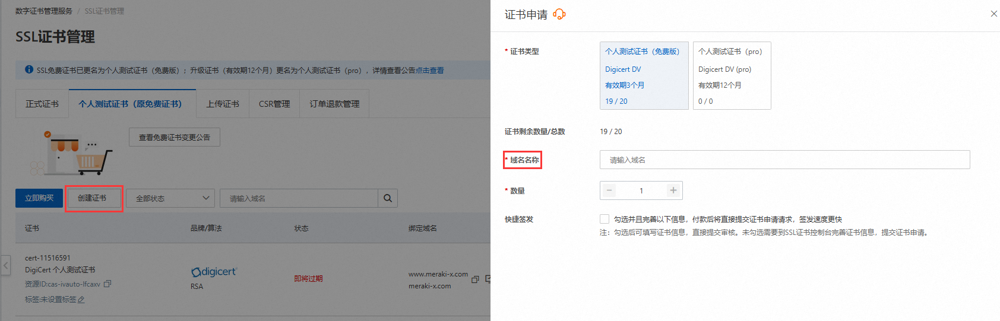

# Nginx多域名

> 可以给网站配置多个域名和ssl证书，`server`块可以监听相同的端口，通过不同的`server_name`指令来区分

## 准备工作

添加子域名解析：


> 优先匹配子域名，匹配到了就会跳转子域名指定的服务器，如果匹配不到，且父域名配置了"泛解析"，则会解析到父域名指定的服务器
>
> 测试网站：
>
> - https://boce.aliyun.com/detect/dns
> - [DNS Checker - DNS Check Propagation Tool](https://dnschecker.org/)

申请子域名证书：



> 免费的证书不支持"泛证书"，所以使用https会报错，对于子域名需要单独生成对应域名名称证书才能使用https
>
> 

## Nginx配置

api-test.360gpt.net.conf

```nginx
server {
	listen 443 ssl;
	server_name api-test.360gpt.net;
	# ssl证书地址
	ssl_certificate     vhost/certificate/api-test.360gpt.net/api-test.360gpt.net.pem;  # pem文件的路径
	ssl_certificate_key  vhost/certificate/api-test.360gpt.net/api-test.360gpt.net.key; # key文件的路径

	# ssl验证相关配置
	ssl_session_timeout  5m;    #缓存有效期
	ssl_ciphers ECDHE-RSA-AES128-GCM-SHA256:ECDHE:ECDH:AES:HIGH:!NULL:!aNULL:!MD5:!ADH:!RC4;    #加密算法
	ssl_protocols TLSv1 TLSv1.1 TLSv1.2;    #安全链接可选的加密协议
	ssl_prefer_server_ciphers on;   #使用服务器端的首选算法
	 # 为特定的URL匹配请求设置根目录
	location / {
		proxy_set_header Host $http_host;
		proxy_set_header X-Real-IP $remote_addr;
		proxy_set_header REMOTE-HOST $remote_addr;
		proxy_set_header X-Forwarded-For $proxy_add_x_forwarded_for;
		proxy_pass http://localhost:444/;
	}
}
```

> ```
> https://api-test.360gpt.net/
> ```

api-test.cbecdc.conf

```nginx
server {
	listen 443 ssl;
	server_name api-test.cbecdc.com;
	# ssl证书地址
	ssl_certificate     vhost/certificate/api-test.cbecdc/api-test.cbecdc.com_bundle.pem;  # pem文件的路径
	ssl_certificate_key  vhost/certificate/api-test.cbecdc/api-test.cbecdc.com.key; # key文件的路径

	# ssl验证相关配置
	ssl_session_timeout  5m;    #缓存有效期
	ssl_ciphers ECDHE-RSA-AES128-GCM-SHA256:ECDHE:ECDH:AES:HIGH:!NULL:!aNULL:!MD5:!ADH:!RC4;    #加密算法
	ssl_protocols TLSv1 TLSv1.1 TLSv1.2;    #安全链接可选的加密协议
	ssl_prefer_server_ciphers on;   #使用服务器端的首选算法
	 # 为特定的URL匹配请求设置根目录
	location / {
		proxy_set_header Host $http_host;
		proxy_set_header X-Real-IP $remote_addr;
		proxy_set_header REMOTE-HOST $remote_addr;
		proxy_set_header X-Forwarded-For $proxy_add_x_forwarded_for;
		proxy_pass http://localhost:444/;
	}
}
```

> ```
> https://api-test.cbecdc.com/
> ```