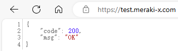
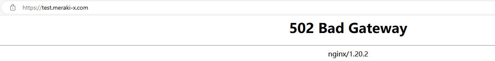
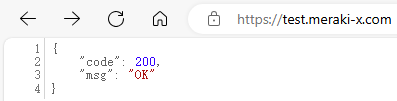
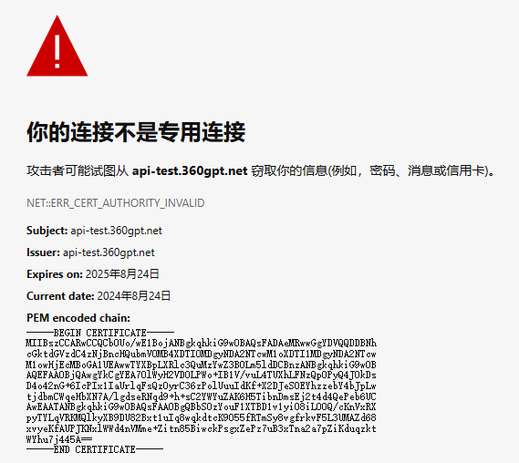
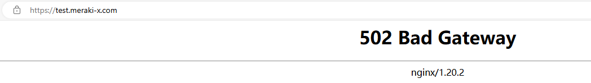
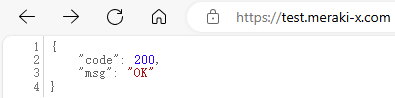

# Nginx转发HTTPS

## CA证书验证

> 在Linux系统中，CA证书的路径可能因发行版而异，以下是一些常见的路径：
>
> - `/etc/ssl/certs/ca-certificates.crt`(Debian, Ubuntu)
> - `/etc/pki/tls/certs/ca-bundle.crt`(CentOS, RHEL)
> - `/etc/ssl/certs/ca-bundle.crt`(OpenSUSE)
> - `/etc/ssl/certs/ca-bundle.trust.crt`(在一些基于Fedora的系统中)
>
> 在Windows操作系统中，CA证书通常存放在以下路径之一：
>
> - `%WINDIR%\System32\curl-ca-bundle.crt` (对于cURL)
> - `%WINDIR%\System32\cacerts` (对于Java)
> - `%WINDIR%\System32\certsrv\CertEnroll` (用于证书服务)
>
> 在macOS中，CA证书通常存放在以下路径：
>
> - `/System/Library/Keychains/TrustStore.sqlite` (系统信任的证书库)
> - `/etc/ssl/cert.pem` (系统范围的CA证书文件)
> - `~/.certs/` (用户自己的证书)

Centos下配置

```nginx
		location / {
			proxy_set_header Host $host; # 设置Host头，以传递原始请求的主机名
			proxy_set_header X-Real-IP $remote_addr; # 设置真实客户端IP
			proxy_set_header X-Forwarded-For $proxy_add_x_forwarded_for; # 设置X-Forwarded-For头
			proxy_set_header X-Forwarded-Proto $scheme; # 设置X-Forwarded-Proto头，表示原始请求的协议
			# 默认不验证证书的有效性
			proxy_pass https://api-test.360gpt.net/; # 将请求代理到后端的HTTPS服务器

			# 开启服务器需要HTTPS证书验证
			proxy_ssl_verify on;
			# CA证书路径，依据操作系统不同而不同
			proxy_ssl_trusted_certificate /etc/pki/tls/certs/ca-bundle.trust.crt;
			# 设置了证书链的验证深度，通常深度设置为2或3，大多数证书链包含一个或两个中间证书
			proxy_ssl_verify_depth 2;
			# 用于设置代理服务器与上游服务器通信时使用的HTTP协议版本(1.0 1.1 2)
			# proxy_http_version 2
		}
```

> 
>
> 如果代理服务器的证书错误，访问nginx服务器并不会报https访问错误(因为访问服务器证书没有问题)，nginx会返回网页提示网关错误
>
> 
>
> ```
> 2024/08/24 13:10:26 [error] 3681#0: *13624 upstream SSL certificate verify error: (10:certificate has expired) while SSL handshaking to upstream, client: 121.32.181.121, server: test.meraki-x.com, request: "GET /favicon.ico HTTP/1.1", upstream: "https://8.134.145.242:443/favicon.ico", host: "test.meraki-x.com", referrer: "https://test.meraki-x.com/"
> ```

## 自签名证书验证

### 单向通信

**客户端**：客户端需要信任服务端的证书，需要文件`.crt`

- `server.crt`：服务端自签名证书（用于信任）

**服务端**：服务端需要有私钥`.key`和证书`.crt`去生成`.pem`文件

- `server.key`：服务端私钥
- `server.crt`：服务端自签名证书

**生成服务端私钥和证书签名**

```
# 生成私钥server.key
openssl genpkey -algorithm RSA -out server.key

# 生成证书请求server.csr
# openssl req -new -key server.key -out server.csr # 手动填写信息
openssl req -new -key server.key -out server.csr -subj "/CN=api-test.360gpt.net" # /CN通用名称（Common Name），通常是服务器的域名或IP地址，必填项，否则在检查证书的通用名称是否与试图连接的域名或IP地址相匹配时会报错

# 生成自签名证书server.crt
openssl x509 -req -days 365 -in server.csr -signkey server.key -out server.crt # -days 365代表有效期为365天

# 合并私钥和证书为pem文件
cat server.key server.crt > server.pem

# 删除.csr文件
rm -f server.csr

```

**客户端nginx配置**

```nginx
	server {
		# 服务器端口使用443，开启ssl
		listen       443 ssl;
		# 域名，多个以空格分开
		server_name  test.meraki-x.com;

		# ssl证书地址
		ssl_certificate     /usr/local/nginx/cert/test.meraki-x.com.pem;  # pem文件的路径
		ssl_certificate_key  /usr/local/nginx/cert/test.meraki-x.com.key; # key文件的路径

		# ssl验证相关配置
		ssl_session_timeout  5m;    #缓存有效期
		ssl_ciphers ECDHE-RSA-AES128-GCM-SHA256:ECDHE:ECDH:AES:HIGH:!NULL:!aNULL:!MD5:!ADH:!RC4;    #加密算法
		ssl_protocols TLSv1 TLSv1.1 TLSv1.2;    #安全链接可选的加密协议
		ssl_prefer_server_ciphers on;    #使用服务器端的首选算法

		location / {
			proxy_set_header Host $host; # 设置Host头，以传递原始请求的主机名
			proxy_set_header X-Real-IP $remote_addr; # 设置真实客户端IP
			proxy_set_header X-Forwarded-For $proxy_add_x_forwarded_for; # 设置X-Forwarded-For头
			proxy_set_header X-Forwarded-Proto $scheme; # 设置X-Forwarded-Proto头，表示原始请求的协议
			# 默认不验证证书的有效性
			proxy_pass https://api-test.360gpt.net/; # 将请求代理到后端的HTTPS服务器

			# 开启服务器需要HTTPS证书验证
			proxy_ssl_verify on;
			# 使用自签名证书
			proxy_ssl_trusted_certificate /usr/local/nginx/cert/server.crt;
			# 设置了证书链的验证深度，通常深度设置为2或3，大多数证书链包含一个或两个中间证书
			# proxy_ssl_verify_depth 2;
		}

	}
```

**服务端nginx配置**

```nginx
	server {
		listen 443 ssl;
		server_name api-test.360gpt.net;
		# ssl证书地址
		ssl_certificate     vhost/certificate/api-test.360gpt.net/server.pem;  # pem文件的路径
		ssl_certificate_key  vhost/certificate/api-test.360gpt.net/server.key; # key文件的路径

		# ssl验证相关配置
		ssl_session_timeout  5m;    #缓存有效期
		ssl_ciphers ECDHE-RSA-AES128-GCM-SHA256:ECDHE:ECDH:AES:HIGH:!NULL:!aNULL:!MD5:!ADH:!RC4;    #加密算法
		ssl_protocols TLSv1 TLSv1.1 TLSv1.2;    #安全链接可选的加密协议
		ssl_prefer_server_ciphers on;   #使用服务器端的首选算法
		# 为特定的URL匹配请求设置根目录
		location / {
			proxy_set_header Host $http_host;
			proxy_set_header X-Real-IP $remote_addr;
			proxy_set_header REMOTE-HOST $remote_addr;
			proxy_set_header X-Forwarded-For $proxy_add_x_forwarded_for;
			proxy_pass http://localhost:444/;
		}

	}
```

> 访问客户端的nginx，客户端nginx成功和服务端nginx进行https通信
>
> 
>
> 由于自签名证书未知，浏览器https访问服务端nginx不会信任
>
> 
>
> 如果https证书验证错误，客户端nginx会返回网页提示网关错误
>
> 

### 双向通信

> 双向通信其实就是允许服务端nginx也通过https访问客户端nginx

**生成客户端私钥和证书签名**

```
# 生成私钥client.key
openssl genpkey -algorithm RSA -out client.key

# 生成证书请求client.csr
# openssl req -new -key client.key -out client.csr # 手动填写信息
openssl req -new -key client.key -out client.csr -subj "/CN=test.meraki-x.com" # /CN通用名称（Common Name），通常是服务器的域名或IP地址，必填项，否则在检查证书的通用名称是否与试图连接的域名或IP地址相匹配时会报错

# 生成自签名证书client.csr
openssl x509 -req -days 365 -in client.csr -signkey client.key -out client.crt # -days 365代表有效期为365天

# 合并私钥和证书为pem文件
cat client.key client.crt > client.pem

# 删除.csr文件
rm -f client.csr

```

**客户端nginx配置**

```nginx
	server {
		# 服务器端口使用443，开启ssl
		listen       443 ssl;
		# 域名，多个以空格分开
		server_name  test.meraki-x.com;

		# ssl证书地址
		ssl_certificate     /usr/local/nginx/cert/test.meraki-x.com.pem;  # pem文件的路径
		ssl_certificate_key  /usr/local/nginx/cert/test.meraki-x.com.key; # key文件的路径

		# ssl验证相关配置
		ssl_session_timeout  5m;    #缓存有效期
		ssl_ciphers ECDHE-RSA-AES128-GCM-SHA256:ECDHE:ECDH:AES:HIGH:!NULL:!aNULL:!MD5:!ADH:!RC4;    #加密算法
		ssl_protocols TLSv1 TLSv1.1 TLSv1.2;    #安全链接可选的加密协议
		ssl_prefer_server_ciphers on;    #使用服务器端的首选算法

		location / {
			proxy_set_header Host $host; # 设置Host头，以传递原始请求的主机名
			proxy_set_header X-Real-IP $remote_addr; # 设置真实客户端IP
			proxy_set_header X-Forwarded-For $proxy_add_x_forwarded_for; # 设置X-Forwarded-For头
			proxy_set_header X-Forwarded-Proto $scheme; # 设置X-Forwarded-Proto头，表示原始请求的协议
			# 默认不验证证书的有效性
			proxy_pass https://api-test.360gpt.net:3306/; # 将请求代理到后端的HTTPS服务器

			# 开启服务器需要HTTPS证书验证
			proxy_ssl_verify off;
			# 使用自签名证书
			proxy_ssl_trusted_certificate /usr/local/nginx/cert/server.crt;
			# 设置了证书链的验证深度，通常深度设置为2或3，大多数证书链包含一个或两个中间证书
			# proxy_ssl_verify_depth 2;
		}

	}

	server {
		# 服务器端口使用8080，开启ssl
		listen       8080 ssl;
		# 域名，多个以空格分开
		server_name  test.meraki-x.com;

		# ssl证书地址
		ssl_certificate     /usr/local/nginx/cert/client.pem;  # pem文件的路径
		ssl_certificate_key  /usr/local/nginx/cert/client.key; # key文件的路径

		# ssl验证相关配置
		ssl_session_timeout  5m;    #缓存有效期
		ssl_ciphers ECDHE-RSA-AES128-GCM-SHA256:ECDHE:ECDH:AES:HIGH:!NULL:!aNULL:!MD5:!ADH:!RC4;    #加密算法
		ssl_protocols TLSv1 TLSv1.1 TLSv1.2;    #安全链接可选的加密协议
		ssl_prefer_server_ciphers on;    #使用服务器端的首选算法

		location / {
			proxy_set_header Host $host; # 设置Host头，以传递原始请求的主机名
			proxy_set_header X-Real-IP $remote_addr; # 设置真实客户端IP
			proxy_set_header X-Forwarded-For $proxy_add_x_forwarded_for; # 设置X-Forwarded-For头
			proxy_set_header X-Forwarded-Proto $scheme; # 设置X-Forwarded-Proto头，表示原始请求的协议
			# 默认不验证证书的有效性
			proxy_pass https://api-test.360gpt.net/; # 将请求代理到后端的HTTPS服务器

			# 开启服务器需要HTTPS证书验证
			proxy_ssl_verify on;
			# 使用自签名证书
			proxy_ssl_trusted_certificate /usr/local/nginx/cert/server.crt;
			# 设置了证书链的验证深度，通常深度设置为2或3，大多数证书链包含一个或两个中间证书
			# proxy_ssl_verify_depth 2;
		}

	}
```

**服务端nginx配置**

```nginx
	server {
		listen 443 ssl;
		server_name api-test.360gpt.net;
		# ssl证书地址
		ssl_certificate     vhost/certificate/api-test.360gpt.net/server.pem;  # pem文件的路径
		ssl_certificate_key  vhost/certificate/api-test.360gpt.net/server.key; # key文件的路径

		# ssl验证相关配置
		ssl_session_timeout  5m;    #缓存有效期
		ssl_ciphers ECDHE-RSA-AES128-GCM-SHA256:ECDHE:ECDH:AES:HIGH:!NULL:!aNULL:!MD5:!ADH:!RC4;    #加密算法
		ssl_protocols TLSv1 TLSv1.1 TLSv1.2;    #安全链接可选的加密协议
		ssl_prefer_server_ciphers on;   #使用服务器端的首选算法
		# 为特定的URL匹配请求设置根目录
		location / {
			proxy_set_header Host $http_host;
			proxy_set_header X-Real-IP $remote_addr;
			proxy_set_header REMOTE-HOST $remote_addr;
			proxy_set_header X-Forwarded-For $proxy_add_x_forwarded_for;
			proxy_pass http://localhost:444/;
		}

	}

	server {
		listen 3306 ssl;
		server_name api-test.360gpt.net;
		# ssl证书地址
		ssl_certificate     vhost/certificate/api-test.360gpt.net/server.pem;  # pem文件的路径
		ssl_certificate_key  vhost/certificate/api-test.360gpt.net/server.key; # key文件的路径

		# ssl验证相关配置
		ssl_session_timeout  5m;    #缓存有效期
		ssl_ciphers ECDHE-RSA-AES128-GCM-SHA256:ECDHE:ECDH:AES:HIGH:!NULL:!aNULL:!MD5:!ADH:!RC4;    #加密算法
		ssl_protocols TLSv1 TLSv1.1 TLSv1.2;    #安全链接可选的加密协议
		ssl_prefer_server_ciphers on;   #使用服务器端的首选算法
		# 为特定的URL匹配请求设置根目录
		location / {
			proxy_set_header Host $http_host;
			proxy_set_header X-Real-IP $remote_addr;
			proxy_set_header REMOTE-HOST $remote_addr;
			proxy_set_header X-Forwarded-For $proxy_add_x_forwarded_for;
			proxy_pass https://test.meraki-x.com:8080/;

			# 开启服务器需要HTTPS证书验证
			proxy_ssl_verify off;
			# 使用自签名证书
			proxy_ssl_trusted_certificate vhost/certificate/api-test.360gpt.net/client.crt;
			# 设置了证书链的验证深度，通常深度设置为2或3，大多数证书链包含一个或两个中间证书
			# proxy_ssl_verify_depth 2;
		}

	}
```

> 代理顺序为`https://test.meraki-x.com/`->`https://api-test.360gpt.net:3306/`->`https://test.meraki-x.com:8080/`->`https://api-test.360gpt.net/`->`http://localhost:444/`
>
> 
