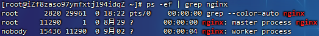
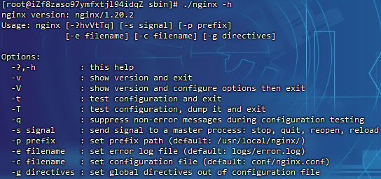
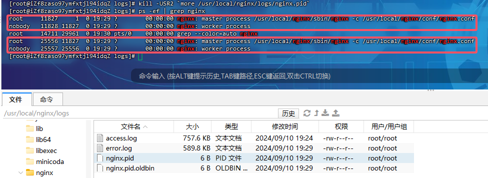
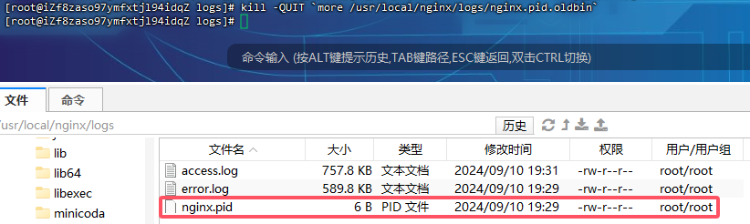
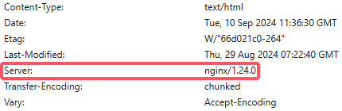
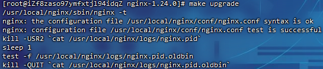
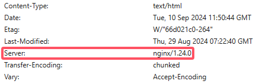

# Nginx服务器启停命令

> 对于Nginx的启停在linux系统中也有很多种方式：
>
> - Nginx服务的信号控制
> - Nginx服务的命令行控制

## 信号控制

> 通过给master进程发送信号就可以来控制Nginx，需要有两个前提条件，一个是要操作的master进程，一个是信号

Nginx默认采用的是多进程的方式来工作的，当将Nginx启动后，可以通过`ps -ef | grep nginx`命令可以查看到如下内容：



Nginx后台进程中包含一个master进程和多个worker进程，**master进程主要用来管理worker进程**，包含接收外界的信息，并将接收到的信号发送给各个worker进程，监控worker进程的状态，当worker进程出现异常退出后，会自动重新启动新的worker进程。而**worker进程则是专门用来处理用户请求**的，各个worker进程之间是平等的并且相互独立，处理请求的机会也是一样的。nginx的进程模型：


获取到master进程的进程号ID：

- 方式一：通过`ps -ef | grep nginx`
- 方式二：nginx的`./configure`的配置参数的时候，有一个参数是`--pid-path=PATH`默认是`/usr/local/nginx/logs/nginx.pid`，所以可以通过查看该文件来获取nginx的master进程ID

| 信号     | 作用                                                       |
| -------- | ---------------------------------------------------------- |
| TERM/INT | 立即关闭整个服务                                           |
| QUIT     | "优雅"地关闭整个服务                                       |
| HUP      | 重读配置文件并使用服务对新配置项生效                       |
| USR1     | 重新打开日志文件，可以用来进行日志切割                     |
| USR2     | 平滑升级到最新版的nginx                                    |
| WINCH    | 所有子进程不在接收处理新连接，相当于给work进程发送QUIT指令 |

> 调用命令为`kill -signal PID`
>
> - signal：即为信号
> - PID：即为获取到的master线程ID

### 信号命令

- 发送`TERM/INT`信号给master进程，会将Nginx服务立即关闭

  - ```
    kill -TERM PID / kill -TERM `cat /usr/local/nginx/logs/nginx.pid`
    kill -INT PID / kill -INT `cat /usr/local/nginx/logs/nginx.pid`
    ```

- 发送`QUIT`信号给master进程，master进程会控制所有的work进程不再接收新的请求，等所有请求处理完后，在把进程都关闭掉

  - ```
    kill -QUIT PID / kill -TERM `cat /usr/local/nginx/logs/nginx.pid`
    ```

- 发送`HUP`信号给master进程，master进程会把控制旧的work进程不再接收新的请求，等处理完请求后将旧的work进程关闭掉，然后根据nginx的配置文件重新启动新的work进程

  - ```
    kill -HUP PID / kill -TERM `cat /usr/local/nginx/logs/nginx.pid`
    ```

- 发送`USR1`信号给master进程，告诉Nginx重新开启日志文件

  - ```
    kill -USR1 PID / kill -TERM `cat /usr/local/nginx/logs/nginx.pid`
    ```

- 发送`USR2`信号给master进程，告诉master进程要平滑升级，这个时候，会**重新开启对应的master进程和work进程**，整个系统中将会**有两个master进程**，并且新的master进程的PID会被记录在`/usr/local/nginx/logs/nginx.pid`而之前的旧的master进程PID会被记录在`/usr/local/nginx/logs/nginx.pid.oldbin`文件中，接着**再次发送QUIT信号给旧的master进程**，让其处理完请求后再进行关闭，实现平滑升级

  - ```
    kill -USR2 PID / kill -USR2 `cat /usr/local/nginx/logs/nginx.pid`
    
    kill -QUIT PID / kill -QUIT `cat /usr/local/nginx/logs/nginx.pid.oldbin`
    ```

  - 

- 发送`WINCH`信号给master进程，让master进程控制不让所有的work进程在接收新的请求了，请求处理完后关闭work进程。注意master进程不会被关闭掉

  - ```
    kill -WINCH PID /kill -WINCH`cat /usr/local/nginx/logs/nginx.pid`
    ```

## 命令行控制

> 此方式是通过Nginx安装目录下的sbin下的可执行文件nginx来进行Nginx状态的控制，可以通过`nginx -h`来查看都有哪些参数可以用
>
> 

- `-?和-h`：显示帮助信息
- `-v`：打印版本号信息并退出
- `-V`：打印版本号信息和配置信息并退出
- `-t`：测试nginx的配置文件语法是否正确并退出
- `-T`：测试nginx的配置文件语法是否正确并列出用到的配置文件内容然后退出
- `-q`：在配置测试期间禁止显示非错误消息
- `-s`：signal信号，后面可以跟：
  - `stop`[快速关闭，类似于`TERM/INT`信号的作用]
  - `quit`[优雅的关闭，类似于`QUIT`信号的作用]
  - `reopen`[重新打开日志文件类似于`USR1`信号的作用]
  - `reload`[类似于`HUP`信号的作用]
- `-p`：prefix，指定Nginx的prefix路径，(默认为：`/usr/local/nginx/`)
- `-c`：filename,指定Nginx的配置文件路径，(默认为：`conf/nginx.conf`)
- `-g`：用来补充Nginx配置文件，向Nginx服务指定启动时应用全局的配置

## 服务器版本升级和新增模块

> 在整个过程中，Nginx需要一直对外提供服务
>
> 注意：Nginx启动时必须是以`/usr/local/nginx/sbin/nginx -c /usr/local/nginx/conf/nginx.conf`的方式启动的，nginx是不读取path环境变量的

### 服务信号进行升级

将原本版本的sbin目录下的nginx进行备份

```
cd /usr/local/nginx/sbin
mv nginx nginxold
```

将nginx安装目录编译后的objs目录下的nginx文件，拷贝到原来`/usr/local/nginx/sbin`目录下

```
cd /usr/local/en/nginx-1.24.0
# 注意这里编译的模块至少要能够成功启动原进程指向的配置文件
./configure \
  --with-http_ssl_module \
  --with-http_v2_module

make

cd /usr/local/en/nginx-1.24.0/objs
cp nginx /usr/local/nginx/sbin

cd /usr/local/nginx/logs
```

发送信号`USR2`给Nginx的旧版本对应的master进程

```
kill -USR2 `more /usr/local/nginx/logs/nginx.pid`
```

> 

发送信号`QUIT`给Nginx的旧版本对应的master进程

```
kill -QUIT `more /usr/local/nginx/logs/nginx.pid.oldbin`
```

> 
>
> 

### make命令完成升级

将原本版本的sbin目录下的nginx进行备份

```
cd /usr/local/nginx/sbin
mv nginx nginxold
```

将nginx安装目录编译后的objs目录下的nginx文件，拷贝到原来`/usr/local/nginx/sbin`目录下

```
cd /usr/local/en/nginx-1.24.0
# 注意这里编译的模块至少要能够成功启动原进程指向的配置文件
./configure \
  --with-http_ssl_module \
  --with-http_v2_module

make

cd /usr/local/en/nginx-1.24.0/objs
cp nginx /usr/local/nginx/sbin
```

进入到安装目录，执行`make upgrade`

```
cd /usr/local/en/nginx-1.24.0
make upgrade
```

> 
>
> 