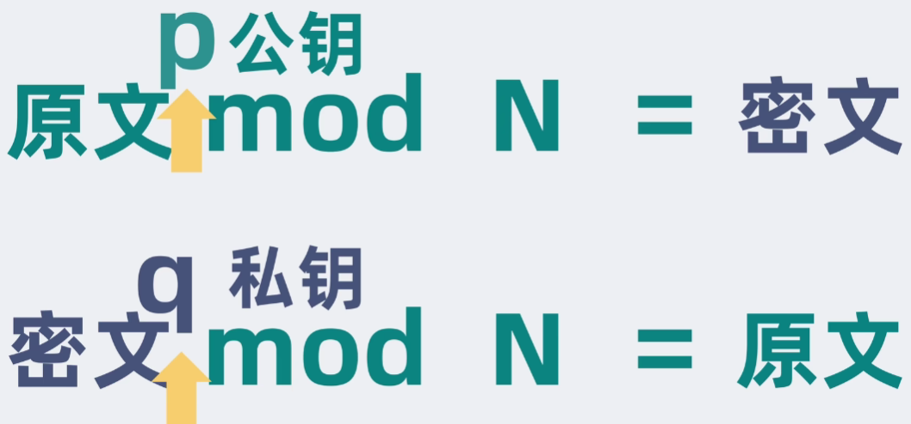
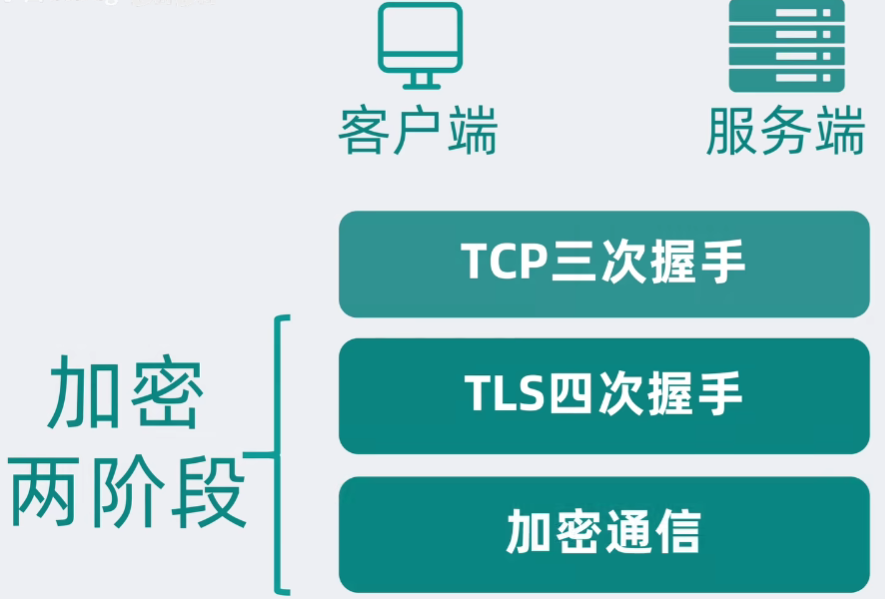
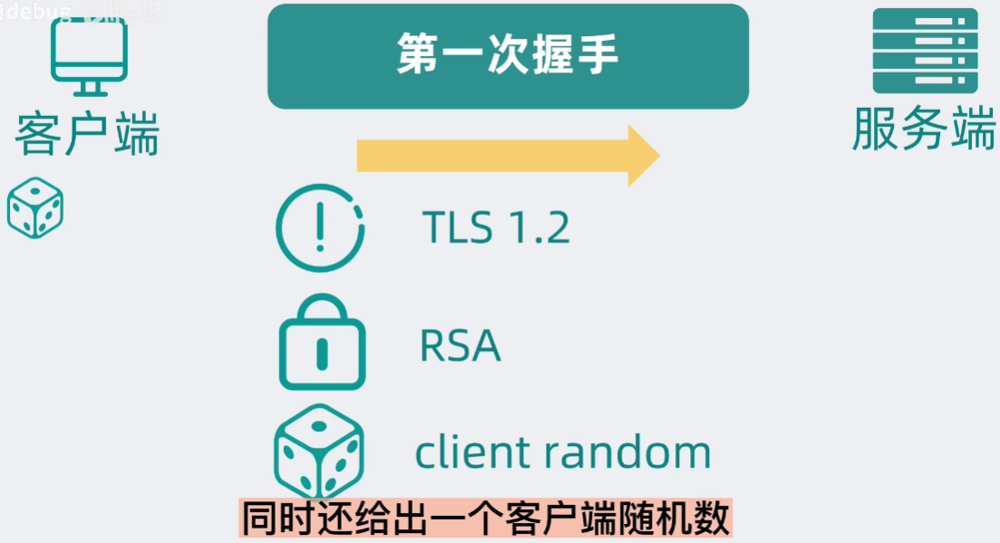
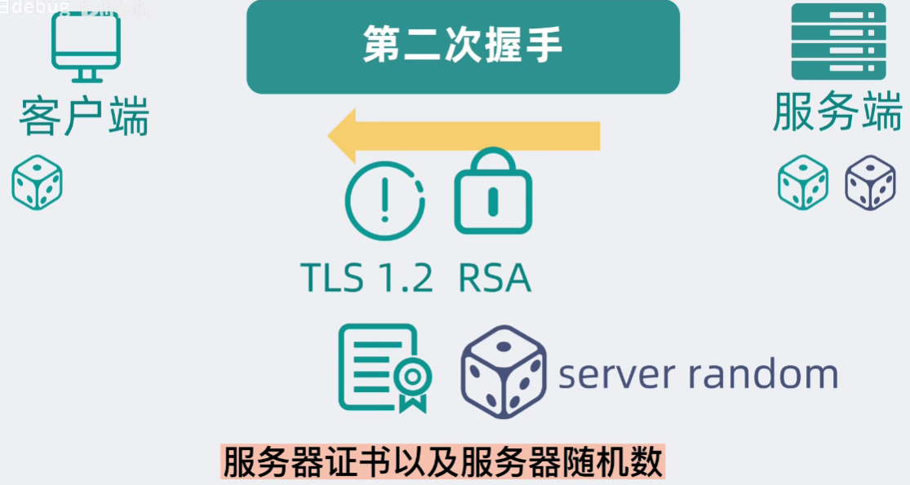
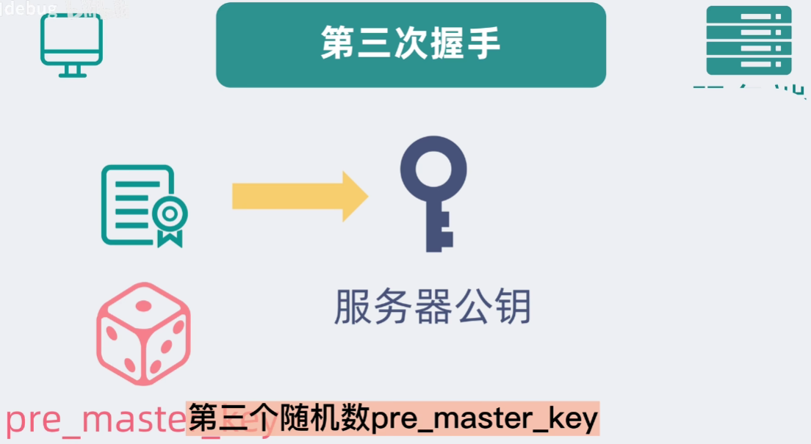
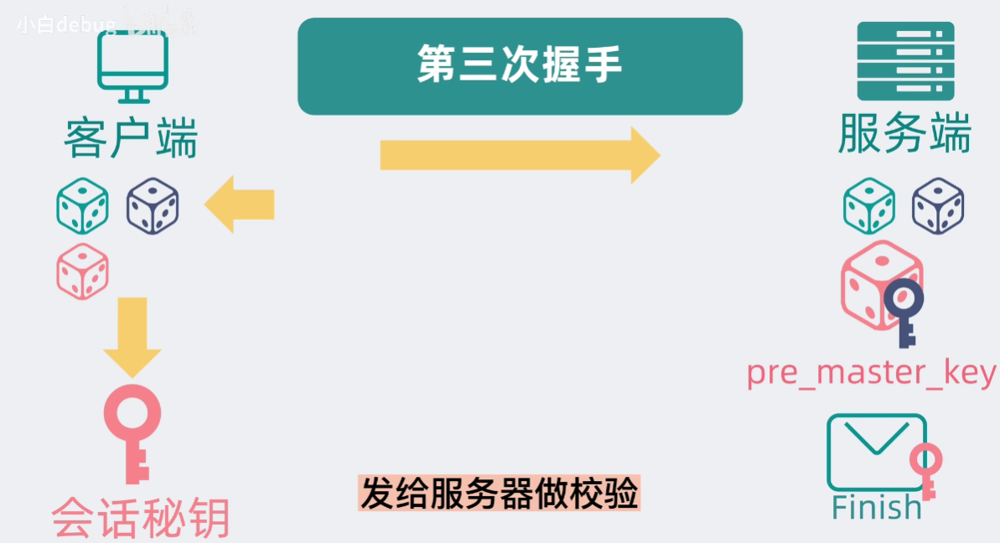
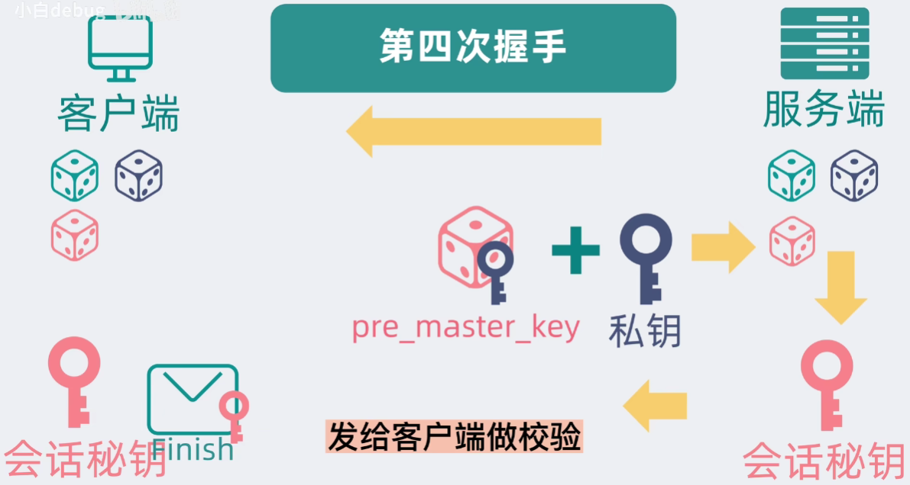
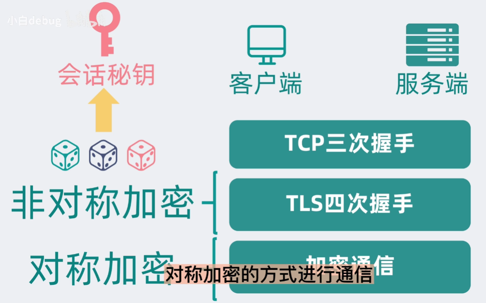
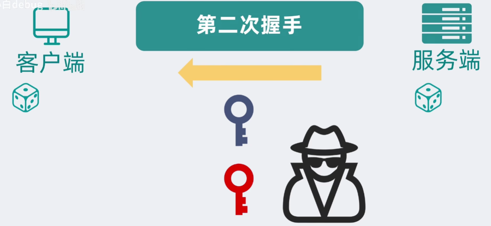
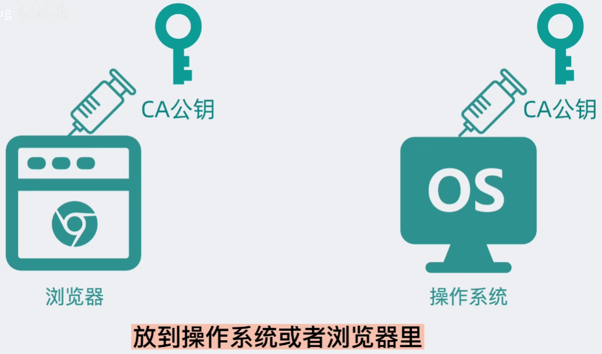

# HTTPS原理

> HTTPS（Hypertext Transfer Protocol Secure）是一种安全的网络传输协议，它在传统的HTTP协议上加入了**SSL/TLS加密层**，以确保数据在网络中的传输是加密和安全的

## 基本概念

### HTTPS工作流程

- **TCP连接**：客户端与服务器建立一个TCP连接，通常在443端口
- **TCP握手**：
  - **客户端问候**：客户端发送一个包含支持的TLS版本、加密算法、一个随机数（Client Random）以及可能的支持的密码套件列表的消息
  - **服务器问候**：服务器响应客户端问候，发送一个包含选择的TLS版本、加密算法、一个随机数（Server Random）以及服务器证书的消息
  - **证书验证**：客户端验证服务器证书的有效性，确认服务器的身份
  - **密钥交换**：客户端和服务器使用一种密钥交换算法（如RSA、ECDHE）协商出共享密钥（Premaster Secret）
  - **生成会话密钥**：客户端和服务器使用之前交换的随机数和Premaster Secret生成会话密钥，用于对称加密后续通信
- **安全通信**：握手完成后，客户端和服务器使用会话密钥加密通信，确保数据传输的安全

### HTTPS关键技术

- **对称加密**：如AES，用于加密通信数据
- **非对称加密**：如RSA，用于密钥交换和数字签名
- **数字证书**：由第三方CA（证书颁发机构）签发，用于验证服务器身份
- **哈希函数**：如SHA，用于确保数据的完整性

## 公钥和私钥

- **公钥**：是可以公开分发的密钥，它用于加密数据
  - **公开性**：公钥可以安全地公开，不需要保密
  - **加密用途**：公钥用于加密信息，这样只有对应的私钥才能解密
  - **数字签名验证**：公钥还可以用来验证数字签名，确保信息是由持有私钥的实体发送的，并且信息在传输过程中未被篡改
- **私钥**：私钥是保密的密钥，它用于解密由公钥加密的数据
  - **保密性**：私钥必须严格保密，不应泄露给任何人
  - **解密用途**：私钥用于解密由对应公钥加密的数据
  - **数字签名创建**：私钥用于创建数字签名，数字签名可以证明信息的完整性和发送者的身份

> 验证数字签名过程：
>
> - 签名创建：A使用私钥对消息进行签名，生成数字签名
> - 发送：A将消息和数字签名一起发送给B
> - 验证：B使用A的公钥验证数字签名，确保消息是由A发送且未被篡改

## 加密流程

**TCP第一次握手**

> 客户端告诉浏览器端，支持什么样的加密协议版本，使用什么样的加密套件，同时还给出客户端的一个随机数

**TCP第二次握手**

> 服务端告诉客户端确定的加密方式等信息，还有服务器证书及服务器的一个随机数

**TCP第三次握手**

> 从第二次握手的服务器证书中取出服务器公钥，再生成第三个随机数，用公钥加密第三个随机数发送给服务端

> 客户端这边已经有三个随机数，用这三个随机数进行计算，得到一个会话密钥，同时把迄今为止所有的通信数据内容生成一个摘要(Finish报文)，也发送给服务器做校验

**TCP第四次握手**

> 服务器使用服务端私钥解密，得到客户端的第三个随机数，然后一样的将这三个随机数通过一样的密钥算法获得一个会话密钥，同样将迄今为止所有的通信数据内容生成一个摘要(Finish报文)，发送给客户端做校验

两端后续就可以使用这个会话密钥进行**对称加密通信**了

## 服务器证书

> 服务器证书本质上是被CA(权威数字证书机构)的私钥加密过的服务器公钥

> 所以第二次握手的时候，客户端可以通过CA的公钥来解密服务器证书，从而拿到服务器公钥

> 不直接传递服务器公钥是因为公钥有可能在传输的过程中被替换，通过假的公钥来加密第三个随机数，由于第一个和第二个随机数是公开的，就可以计算出会话密钥
>
> 

## CA证书

> CA证书是由一个可信的第三方机构——证书颁发机构（CA）签发的数字证书。它用于在互联网上验证实体（如网站、个人、组织等）的身份。CA证书包含了实体的公钥以及一些其他信息，这些信息已经被CA用其私钥进行了数字签名

### 服务器SSL文件

**SSL证书文件（Certificate）**

- 文件扩展名：通常为`.crt`或`.pem`
- 描述：文件包含了服务器的公钥以及CA（证书颁发机构）对证书的签名。它是客户端（如浏览器）用来验证服务器身份的文件
- 来源：
  - 可以从商业CA购买证书
  - 可以使用Let’s Encrypt等免费服务获取证书
  - 可以自签名证书用于测试目的，但自签名证书不会得到浏览器或操作系统的信任

**私钥文件（Private Key）**

- 文件扩展名：通常为`.key`
- 描述：这个文件包含了服务器的私钥，它是服务器用来解密客户端发送的加密数据以及创建数字签名的。私钥必须保密，不应该对外公开
- 生成：私钥通常在申请SSL证书之前生成，并且在生成证书请求（CSR）时使用

## 安全性

两种可能的破解方式：

- **监听两端交流的所有数据**：就算可以获取到加密流程的所有数据，由于第三个随机数是客户端生成，用到了服务器的公钥，需要解密的话需要服务器的私钥，没有服务器私钥，则无法破解
- **替换第二次握手数字证书**：由于客户端默认搭载可靠信任的CA机构的公钥的缘故，就算可以替换数字证书中的服务器公钥为黑客自己生成的公钥，但客户端在不安装证书的前提下，无法通过系统自带的公钥解出黑客自己生成的公钥出来。如果黑客想要用户能够解出来，就一定需要CA机构的私钥才能正确的加密自己生成的公钥