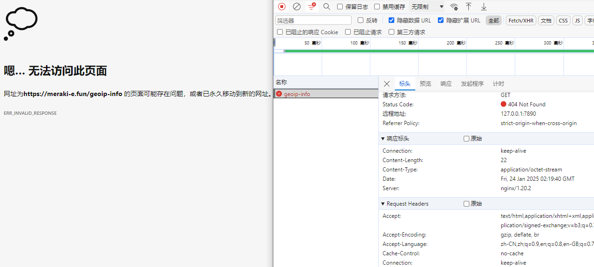
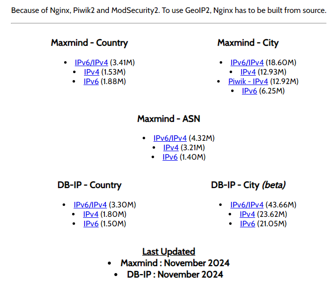

# Nginx地域管理

> 需要Nginx编译了`ngx_http_geoip_module`模块。如果没有，需要重新编译Nginx并添加这个模块，如果使用的是软件包管理器安装的Nginx，可能需要单独安装对应的GeoIP库和数据库

Nginx编译时具有两个模块：

- 新版为`ngx_http_geoip2_module `，支持`.dat`格式
- 旧版为`ngx_http_geoip_module`，支持`.mmdb`格式

## geoip2使用

### 环境准备

在基于 Debian 的系统上（例如 Ubuntu），可以使用如下命令：

```
sudo apt-get install libssl-dev libmaxminddb-dev
```

对于基于 Red Hat 的系统（如 CentOS），可以使用如下命令：

```
sudo yum install libmaxminddb libmaxminddb-devel
```

模块仓库：

```
git clone https://github.com/leev/ngx_http_geoip2_module.git
```

编译安装：

```
./configure \
  --add-dynamic-module=ngx_http_geoip2_module-master

make
```

模块放置：

```
mkdir -p /usr/local/nginx/modules

mv ./obj/
```

### mmdb下载

```
wget https://download.lin2ur.cn/GeoLite2/latest.tar.gz

tar -zxvf latest.tar.gz
```

测试信息：

```
mmdblookup -f GeoLite2-City.mmdb -i 121.32.182.94
```

获取信息：

```json
  {
    "city": 
      {
        "geoname_id": 
          1809858 <uint32>
        "names": 
          {
            "de": 
              "Guangzhou" <utf8_string>
            "en": 
              "Guangzhou" <utf8_string>
            "es": 
              "Cantón" <utf8_string>
            "fr": 
              "Canton" <utf8_string>
            "ja": 
              "広州" <utf8_string>
            "pt-BR": 
              "Cantão" <utf8_string>
            "ru": 
              "Гуанчжоу" <utf8_string>
            "zh-CN": 
              "广州市" <utf8_string>
          }
      }
    "continent": 
      {
        "code": 
          "AS" <utf8_string>
        "geoname_id": 
          6255147 <uint32>
        "names": 
          {
            "de": 
              "Asien" <utf8_string>
            "en": 
              "Asia" <utf8_string>
            "es": 
              "Asia" <utf8_string>
            "fr": 
              "Asie" <utf8_string>
            "ja": 
              "アジア" <utf8_string>
            "pt-BR": 
              "Ásia" <utf8_string>
            "ru": 
              "Азия" <utf8_string>
            "zh-CN": 
              "亚洲" <utf8_string>
          }
      }
    "country": 
      {
        "geoname_id": 
          1814991 <uint32>
        "iso_code": 
          "CN" <utf8_string>
        "names": 
          {
            "de": 
              "China" <utf8_string>
            "en": 
              "China" <utf8_string>
            "es": 
              "China" <utf8_string>
            "fr": 
              "Chine" <utf8_string>
            "ja": 
              "中国" <utf8_string>
            "pt-BR": 
              "China" <utf8_string>
            "ru": 
              "Китай" <utf8_string>
            "zh-CN": 
              "中国" <utf8_string>
          }
      }
    "location": 
      {
        "accuracy_radius": 
          200 <uint16>
        "latitude": 
          23.118100 <double>
        "longitude": 
          113.253900 <double>
        "time_zone": 
          "Asia/Shanghai" <utf8_string>
      }
    "registered_country": 
      {
        "geoname_id": 
          1814991 <uint32>
        "iso_code": 
          "CN" <utf8_string>
        "names": 
          {
            "de": 
              "China" <utf8_string>
            "en": 
              "China" <utf8_string>
            "es": 
              "China" <utf8_string>
            "fr": 
              "Chine" <utf8_string>
            "ja": 
              "中国" <utf8_string>
            "pt-BR": 
              "China" <utf8_string>
            "ru": 
              "Китай" <utf8_string>
            "zh-CN": 
              "中国" <utf8_string>
          }
      }
    "subdivisions": 
      [
        {
          "geoname_id": 
            1809935 <uint32>
          "iso_code": 
            "GD" <utf8_string>
          "names": 
            {
              "en": 
                "Guangdong" <utf8_string>
              "fr": 
                "Province de Guangdong" <utf8_string>
              "zh-CN": 
                "广东" <utf8_string>
            }
        }
      ]
  }
```

### 示例使用

nginx.conf

```nginx
# 最外层引入模块
load_module /usr/local/nginx/modules/ngx_http_geoip2_module.so;


    # 加载城市级别的GeoIP2数据库
    geoip2 /usr/local/nginx/GeoLite2-City_20240830/GeoLite2-City.mmdb {
        $geoip2_data_city_continent_code continent code;
        $geoip2_data_city_continent_name continent names zh-CN;
        $geoip2_data_city_country_code country iso_code;
        $geoip2_data_city_country_name country names zh-CN;
        $geoip2_data_city_region_code subdivisions 0 iso_code;
        $geoip2_data_city_region_name subdivisions 0 names zh-CN;
        $geoip2_data_city_location_latitude location latitude;
        $geoip2_data_city_location_longitude location longitude;
        $geoip2_data_city_postal postal code;
        $geoip2_data_city_city_name city names en;
    }

    server {


	    location /geoip-info {
	        set $geo_info '{';

	        # 添加各个变量到JSON字符串
	        set $geo_info '$geo_info "continent_code":"$geoip2_data_city_continent_code",';
	        set $geo_info '$geo_info "continent_name":"$geoip2_data_city_continent_name",';
	        set $geo_info '$geo_info "country_code":"$geoip2_data_city_country_code",';
	        set $geo_info '$geo_info "country_name":"$geoip2_data_city_country_name",';
	        if ($geoip2_data_city_region_code) {
	            set $geo_info '$geo_info "region_code":"$geoip2_data_city_region_code",';
	        }
	        if ($geoip2_data_city_region_name) {
	            set $geo_info '$geo_info "region_name":"$geoip2_data_city_region_name",';
	        }
	        set $geo_info '$geo_info "latitude":$geoip2_data_city_location_latitude,';
	        set $geo_info '$geo_info "longitude":$geoip2_data_city_location_longitude,';
	        if ($geoip2_data_city_postal) {
	            set $geo_info '$geo_info "postal_code":"$geoip2_data_city_postal",';
	        }
	        if ($geoip2_data_city_city_name) {
	            set $geo_info '$geo_info "city_name":"$geoip2_data_city_city_name"';
	        }
	
	        # 结束JSON对象
	        set $geo_info '$geo_info }';

	        add_header Content-Type application/json;
	        return 200 $geo_info;
	    }

    }
```

访问`/geoip-info`获取打印的数据：

```json
{
    "continent_code": "AS",
    "continent_name": "亚洲",
    "country_code": "CN",
    "country_name": "中国",
    "region_code": "GD",
    "region_name": "广东",
    "latitude": 23.1181,
    "longitude": 113.2539,
    "city_name": "Guangzhou"
}
```

禁止除了中国以外的地区访问：

```nginx
             if ($geoip2_data_city_country_code != "CN") {
                 return 404 '{"error": "Not Found"}';
             }
```

> 开启代理访问：
>
> 

### 常用变量

- `$geoip2_data_city_continent_code`: 大洲代码
- `$geoip2_data_city_continent_name`: 大洲名称（使用中文）
- `$geoip2_data_city_country_code`: 国家代码（ISO 代码）
- `$geoip2_data_city_country_name`: 国家名称（使用中文）
- `$geoip2_data_city_region_code`: 第一个子划分（通常是省份或州）的 ISO 代码
- `$geoip2_data_city_region_name`: 第一个子划分（通常是省份或州）的名称（使用中文）
- `$geoip2_data_city_location_latitude`: 纬度
- `$geoip2_data_city_location_longitude`: 经度
- `$geoip2_data_city_postal`: 邮政编码
- `$geoip2_data_city_city_name`: 城市名称（使用英文）

## geoip使用

### 环境准备

在基于Debian/Ubuntu的系统上，可以通过以下命令安装：

```
sudo apt-get install geoip-database libgeoip1
```

对于Red Hat/CentOS系统，可以使用如下命令：

```
sudo yum install GeoIP GeoIP-devel GeoIP-data
```

编译安装：

```
./configure \
  --with-http_geoip_module
```

数据镜像网站：[GeoIP Legacy Databases (miyuru.lk)](https://www.miyuru.lk/geoiplegacy)



### 示例使用

nginx.conf

```nginx
    geoip_country /usr/local/nginx/conf/vhost/maxmind_country.dat; # 国家级数据库
    geoip_city /usr/local/nginx/conf/vhost/maxmind_city.dat; # 城市级数据库

    server {


        location /geoip-info {
            set $geo_info '{';

            # 国家信息
            set $geo_info '$geo_info "country_code":"$geoip_country_code",';
            set $geo_info '$geo_info "country_name":"$geoip_country_name"';

            # 城市级别信息
            if ($geoip_city) {
                set $geo_info '$geo_info, "city":"$geoip_city"';
            }
            if ($geoip_region) {
                set $geo_info '$geo_info, "region":"$geoip_region"';
            }
            if ($geoip_postal_code) {
                set $geo_info '$geo_info, "postal_code":"$geoip_postal_code"';
            }
            if ($geoip_latitude) {
                set $geo_info '$geo_info, "latitude":$geoip_latitude';
            }
            if ($geoip_longitude) {
                set $geo_info '$geo_info, "longitude":$geoip_longitude';
            }

            # 结束JSON对象
            set $geo_info '$geo_info }';

            add_header Content-Type application/json;
            return 200 $geo_info;
        }

    }
```

访问`/geoip-info`获取打印的数据：

```json
{
    "country_code"："CN",
    "country_name"："China",
    "city"："Guangzhou",
    "region"："30",
    "latitude"：23.1181,
    "longitude"：113.2539
}
```

### 常用变量

- `$geoip_country_code`：两个字符的国家代码（例如：US, CN）
- `$geoip_country_code3`：三个字符的国家代码（例如：USA, CHN）
- `$geoip_country_name`：国家名称（例如：United States, China）
- `$geoip_region`：区域代码（例如：CA 表示California）
- `$geoip_city`：城市名称（使用城市级别的数据库时可用的相应变量）
- `$geoip_postal_code`：邮政编码
- `$geoip_area_code`：电话区号
- `$geoip_metro_code`：地铁代码
- `$geoip_latitude`：访问者位置的纬度坐标
- `$geoip_longitude`：访问者位置的经度坐标

