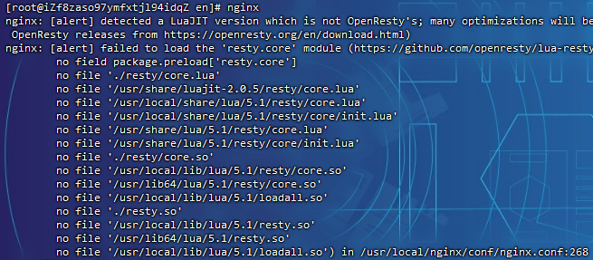
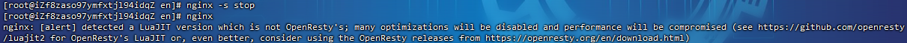
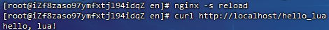
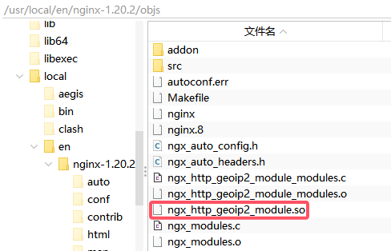
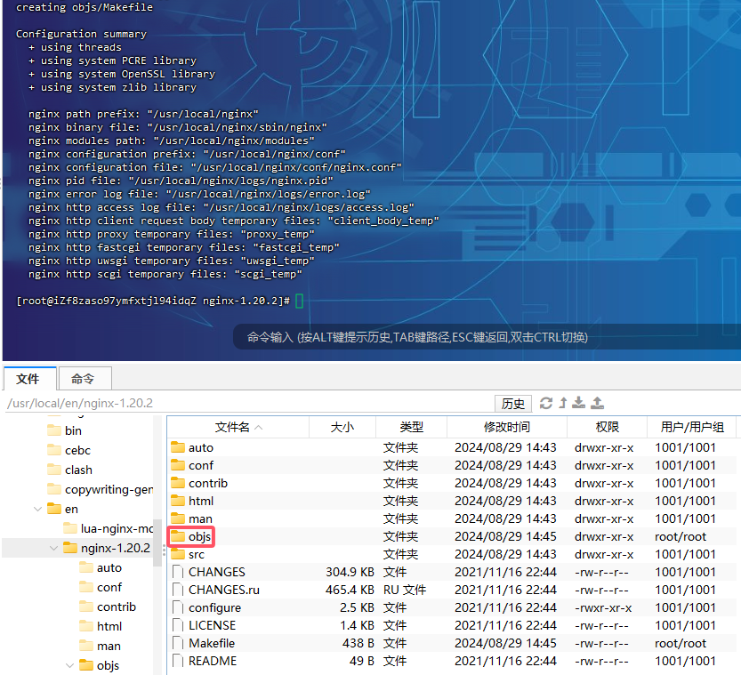
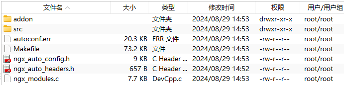
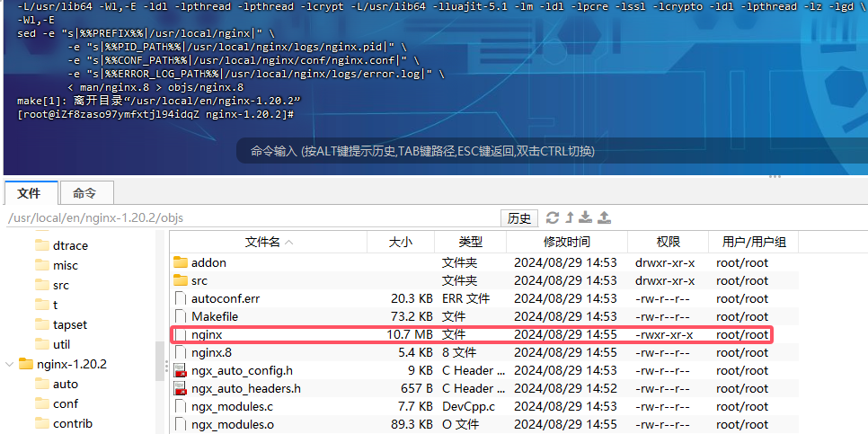
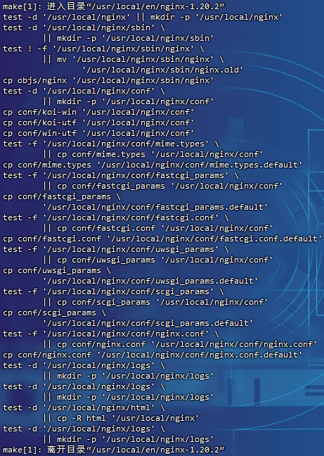

# Nginx常用模块

- **核心功能模块**
  - `ngx_http_core_module`：HTTP核心模块，提供HTTP的基本功能
  - `ngx_http_access_module`：访问控制模块，基于IP地址允许或拒绝请求
  - `ngx_http_auth_basic_module`：基本认证模块，用于HTTP基本认证
- **安全和加密模块**
  - `ngx_http_ssl_module`：SSL支持模块，用于HTTPS
  - `ngx_http_v2_module`：HTTP/2支持模块
- **日志和监控模块**
  - `ngx_http_stub_status_module`：状态信息模块，提供Nginx的基本状态信息
- **文件服务模块**
  - `ngx_http_static_module`：静态文件服务模块，用于提供静态文件服务
  - `ngx_http_autoindex_module`：自动索引模块，用于生成目录列表
- **内容缓存和加速模块**
  - `ngx_http_gzip_module`：Gzip压缩模块，用于压缩HTTP响应
- **流媒体和多路复用模块**
  - `ngx_http_flv_module`：FLV流媒体模块
  - `ngx_http_mp4_module`：MP4流媒体模块
  - `ngx_cache_purge`：缓存清除模块
  - `nginx-sticky-module`：粘性会话模块
  - `ngx_devel_kit`：开发工具模块
  - `lua_nginx_module`：Lua模块
  - `ngx_http_sub_module`：替换请求中的内容
- **其他常用模块**
  - `ngx_http_rewrite_module`：URL重写模块
  - `ngx_http_limit_req_module`：请求限制模块，用于限制请求速率
  - `ngx_http_limit_conn_module`：连接限制模块，用于限制并发连接数
  - `ngx_http_headers_module`：设置HTTP响应头模块
  - `ngx_http_browser_module`：浏览器识别模块，用于根据用户代理设置变量
  - `ngx_http_image_filter_module`：图像过滤模块
  - `ngx_http_gzip_static_module`：用于压缩静态文件
  - `ngx_http_gunzip_module`：用于解压缩静态文件
  - `ngx_http_substitutions_filter_module`：用于替换字符串
  - `ngx_http_dav_module`：WebDAV模块
  - `ngx_http_realip_module`：获取真实的客户端IP地址
  - `ngx_http_geoip_module`：地域管理，支持`.dat`格式
  - `ngx_http_geoip2_module`：新版地域管理，支持`.mmdb`格式

## Lua模块

Nginx的Lua模块（通常指的是`lua-nginx-module`）是一个用于Nginx的Lua脚本引擎。这个模块允许您在Nginx配置文件中嵌入Lua代码，从而提供了强大的动态内容生成和HTTP处理能力。Lua模块的使用为Nginx增添了以下功能：

- **动态内容生成**：您可以使用Lua来生成动态内容，如处理来自数据库的数据或执行复杂的逻辑
- **HTTP处理**：Lua脚本可以处理HTTP请求和响应，包括修改请求头、设置响应头、生成响应内容等
- **中间件功能**：Lua脚本可以作为Nginx的HTTP处理链中的一个中间件，对请求进行预处理或后处理
- **日志和监控**：Lua脚本可以用于日志记录和监控任务，例如记录请求数据或监控系统状态
- **与后端系统交互**：Lua脚本可以与后端系统（如数据库、消息队列等）进行交互，实现更复杂的业务逻辑

> 依赖于lua模块
>
> ```
> lua lua-devel luajit luajit-devel
> ```
>
> > 这里使用的是LuaJIT的官方版本而不是OpenResty优化过的版本
>
> 依赖的nginx模块
>
> ```
> lua-nginx-module-0.10.14.tar.gz
> ```
>
> > 对于最新的模块`0.10.19`版本编译后启动存在兼容性问题
> >
> > 

下载

```
# 下载lua_nginx_module模块
wget https://github.com/openresty/lua-nginx-module/archive/v0.10.19.tar.gz
```

设置环境变量

```
export LUAJIT_INC=/usr/include/luajit-2.0
export LUAJIT_LIB=/usr/lib64
```

> 必须先设置，否则会在`make`编译时出错

增加模块

```
  --add-module=../lua-nginx-module-0.10.14 \
```

启动警告



> 这个警告信息提示虽然Nginx可以运行，但是由于LuaJIT版本的问题，可能无法获得最佳的性能表现。如果希望获得更好的性能，建议使用OpenResty提供的LuaJIT版本

测试效果

```nginx
        location /hello_lua {
            content_by_lua 'ngx.say("hello, lua!")';
        }
```

```
curl http://localhost/hello_lua
```

> 

## 第三方模块

> - **静态编译**：使用`--with-<module>`或者直接包含模块源码路径会将模块编译进Nginx核心
> - **动态编译**：使用`--add-dynamic-module`指定模块路径，这会创建一个可动态加载的模块，引入模块示例代码`load_module modules/ngx_http_geoip2_module.so;`
>   - `make`编译后会在`objs`目录下，使用`make install`之后会执行命令`cp objs/ngx_http_geoip2_module.so '/usr/local/nginx/modules/ngx_http_geoip2_module.so'`，可以手动进行移动
>
> 

```
# 下载ngx_cache_purge模块
wget https://github.com/FRiCKLE/ngx_cache_purge/archive/refs/tags/2.3.tar.gz
tar zxvf 2.3.tar.gz

# 下载nginx-sticky-module模块
wget https://bitbucket.org/nginx-goodies/nginx-sticky-module-ng/get/master.tar.gz
tar zxvf master.tar.gz

# 下载ngx_devel_kit模块
wget https://github.com/simpl/ngx_devel_kit/archive/v0.3.1.tar.gz
tar zxvf v0.3.1.tar.gz
```

```
# 所有基本模块安装
./configure \
  --with-http_ssl_module \
  --with-http_v2_module \
  --with-http_stub_status_module \
  --with-http_flv_module \
  --with-http_mp4_module \
  --with-http_gzip_static_module \
  --with-http_sub_module \
  --with-http_dav_module \
  --with-http_realip_module \
  --with-http_image_filter_module \
  --with-http_gunzip_module \
  --with-threads \
  --with-file-aio \
  --add-module=../ngx_cache_purge-2.3 \
  --add-module=../nginx-goodies-nginx-sticky-module-ng-08a395c66e42 \
  --add-module=../ngx_devel_kit-0.3.1 \
  --add-module=../lua-nginx-module-0.10.14 \
  --prefix=/usr/local/nginx

make
```

> 清除编译缓存
>
> ```
> make clean
> ```
>
> `./configure`编译过程，检查环境和配置选项
>
> 
>
> 
>
> `make`根据Makefile文件编译源代码
>
> 
>
> `make install`将编译好的程序安装到系统中
>
> 
>
> 注：如果编译之后还需要增加模块，只需要`./configure`和`make`命令即可，让新生成的`nginx`二进制可执行文件(`objs`目录下)去替代原本目录下的`nginx`二进制文件即可实现`nginx`模块的更新