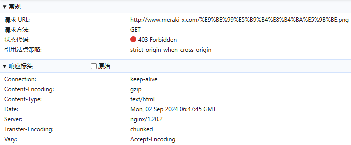

# Nginx常用配置

## gzip压缩

gzip压缩使用DEFLATE算法，通过消除文件中的冗余数据和重复内容来减小文件的大小。算法采用了LZ77算法和哈夫曼编码，通过构建字典和替换重复的字符、字符串来实现压缩。gzip压缩可以将文件大小减小到原始大小的20%至80%之间，具体压缩率取决于文件的内容和结构。通常，文本文件、HTML、CSS、JavaScript等可压缩的文本格式具有更高的压缩率，而图片、音频和视频等二进制文件的压缩率较低

> 在http段内添加以下配置来启用gzip压缩

```nginx
    gzip on;
    gzip_disable "MSIE [1-6]\.(?!.*SV1)"; #对IE6以下的版本都不进行压缩
    gzip_vary on;
    gzip_proxied any;
    gzip_comp_level 6;
    gzip_buffers 16 8k;
    gzip_http_version 1.1;
    gzip_min_length 256;
    gzip_types
      text/xml application/xml application/atom+xml application/rss+xml application/xhtml+xml image/svg+xml
      text/javascript application/javascript application/x-javascript
      text/x-json application/json application/x-web-app-manifest+json
      text/css text/plain text/x-component
      font/opentype application/x-font-ttf application/vnd.ms-fontobject
      image/x-icon;
```

- `gzip on`：启用gzip压缩
- `gzip_disable "MSIE [1-6]\.(?!.*SV1)";`：禁用了对旧版IE6（Internet Explorer 6）以下版本的Gzip压缩
- `gzip_vary on`：在响应头中添加`Vary: Accept-Encoding`，以便缓存服务器根据不同的压缩方式缓存不同的响应。如果不使用此配置，代理服务器可能会缓存不同的压缩和非压缩版本，这样会导致缓存效率低下，浪费存储空间，同时也增加了响应时的计算成本
- `gzip_proxied any`：指定压缩是否将后端服务器接收到的数据进行压缩
  - `off`：关闭所有的代理结果数据压缩
  - `expired`：如果header中包含`Expires`头信息，启用压缩
  - `no-cache`：如果header中包含`Cache-Control:no-cache`头信息，启用压缩
  - `no-store`：如果header中包含`Cache-Control:no-store`头信息，启用压缩
  - `private`：如果header中包含`Cache-Control:private`头信息，启用压缩
  - `no_last_modified`：启用压缩，如果header中包含`Last_Modified`头信息，启用压缩
  - `no_etag`：启用压缩，如果header中包含`ETag`头信息，启用压缩
  - `auth`：启用压缩，如果header中包含`Authorization`头信息，启用压缩
  - `any`：无条件压缩所有结果数据

- `gzip_comp_level 6`：指定压缩级别，范围是1-9，数字越大压缩越多，但也会增加CPU负载
- `gzip_buffers 16 8k;`：设置了用于存储压缩数据的缓冲区大小，`16`是指缓冲区的数量，而`8k`是指每个缓冲区的大小（8KB）
- `gzip_http_version 1.1;`：指定了Nginx在与客户端通信时使用的HTTP版本，HTTP/1.0协议不支持Gzip压缩，如果客户端请求的版本低于`1.1`，则Nginx不会发送Gzip压缩的响应，默认值是`1.1`
- `gzip_min_length 256`：指定文件大小超过多少字节才进行压缩
- `gzip_types`：指定要进行压缩的文件类型

> 未压缩前
>
> 
>
> `Ctrl + F5`无视缓存强制刷新，压缩后
>
> 
>
> 

### gzip_static

> 在提供静态文件服务时，如果存在与原始文件同名的`.gz`文件，则直接发送这个预先压缩好的文件，而不是动态压缩，这样可以解决`gzip on`和`sendfile on`时不经过用户进程将静态文件通过网络设备发送出去导致无法进行压缩的问题
>
> `gzip on;`和`gzip_static on;`可以同时启用，相互独立

开启命令

```nginx
gzip_static on;
```

手动压缩文件命令

```
gzip jquery.min.js
```

配置`vue.config.js`

```js
  configureWebpack: {
    name: name,
    resolve: {
      alias: {
        '@': resolve('src')
      }
    },
    plugins: [
      // http://doc.ruoyi.vip/ruoyi-vue/other/faq.html#使用gzip解压缩静态文件
      new CompressionPlugin({
        cache: false,                                  // 不启用文件缓存
        test: /\.(js|css|html|jpe?g|png|gif|svg)?$/i,  // 压缩文件格式
        filename: '[path][base].gz[query]',            // 压缩后的文件名
        algorithm: 'gzip',                             // 使用gzip压缩
        minRatio: 0.8,                                 // 压缩比例，小于 80% 的文件不会被压缩
        deleteOriginalAssets: false                    // 压缩后删除原文件
      })
    ],
  },
```

> 打包效果
>
> 

## 允许跨域

```nginx
		# 为特定的URL匹配请求设置根目录
		location / {
			# 允许跨域的配置
			add_header 'Access-Control-Allow-Origin' '*';
			add_header 'Access-Control-Allow-Methods' 'GET, POST, OPTIONS';
			add_header 'Access-Control-Allow-Headers' 'DNT,X-CustomHeader,Keep-Alive,User-Agent,X-Requested-With,If-Modified-Since,Cache-Control,Content-Type,Authorization';
			# 此判断只能用于location块，客户端在执行实际请求之前，会发送一个OPTIONS请求来询问服务器是否允许跨源请求，直接返回204可以减少服务器的负担
			if ($request_method = 'OPTIONS') {
				return 204;
			}
			index  index.html index.htm;
			try_files $uri $uri/ /index.html;
		}
```

## 强制https

### HSTS配置

> HSTS（HTTP Strict Transport Security）是一种安全功能，用于**强制浏览器只通过HTTPS访问网站**，以减少中间人攻击的风险。配置HSTS有以下好处：
>
> - **提高安全性**：确保用户始终通过加密的HTTPS连接访问网站，防止数据在传输过程中被窃听或篡改
> - **避免SSL剥离**：防止攻击者将HTTPS连接降级为不安全的HTTP连接
> - **性能提升**：浏览器在首次访问后可以直接使用HTTPS连接，无需先进行HTTP重定向到HTTPS

配置HSTS

```nginx
server {
    # 其他配置...

    # 启用HSTS
    add_header Strict-Transport-Security "max-age=31536000; includeSubDomains" always;

    # 其他配置...
}
```

> - `max-age=31536000`：告诉浏览器这个设置的有效期为31536000秒（即一年）。在此期间，浏览器只通过HTTPS访问网站
> - `includeSubDomains`：可选参数，指示HSTS策略也适用于所有子域名

注意事项

- 在决定启用HSTS之前，请确保网站已经完全支持HTTPS，并且所有资源都可以通过HTTPS加载
- 由于HSTS设置会被浏览器缓存，因此在部署前应充分测试，以避免出现配置错误导致网站无法访问的情况
- 如果您的网站将来可能需要回退到HTTP，或者有证书过期等问题，需要谨慎使用HSTS，或者设置较短的`max-age`
- 考虑到HSTS预加载列表，一旦您的域名被加入到浏览器内置的HSTS预加载列表中，那么在列表失效前，您的网站将始终通过HTTPS访问，即使服务器配置发生变化。因此，在提交到HSTS预加载列表之前，请确保网站已经稳定支持HTTPS

> 如果证书出现错误，通过代码的方式发送请求并取消证书验证还是可以访问的，浏览器是完全无法访问的
>
> 

### 重定向

> 发送http请求的时候进行重定向，将所有http请求定位到https去

```nginx
    server {
        listen 80;
        server_name example.com www.example.com; # 域名

        # 将所有 HTTP 请求重定向到 HTTPS
        return 301 https://$server_name$request_uri;
    }
```

> - 当请求到达80端口时，Nginx读取请求的`Host`头
> - Nginx在`server_name`指令中查找与`Host`头匹配的域名
> - 如果`Host`头匹配`server_name`列表中的第一个域名（在本例中是`example.com`），那么Nginx将使用这个域名来构造重定向URL
> - 如果`Host`头与`www.example.com`匹配，则使用`www.example.com`
>
> 如果请求没有指定`Host`头，或者`Host`头与`server_name`列表中的任何一个都不匹配，Nginx将使用列表中的第一个域名（`example.com`）作为默认值
>
> 测试命令
>
> ```
> curl -I http://www.meraki-x.com
> ```
>
> 结果
>
> ```
> HTTP/1.1 301 Moved Permanently
> Server: nginx/1.20.2
> Date: Thu, 08 Aug 2024 04:19:56 GMT
> Content-Type: text/html
> Content-Length: 169
> Connection: keep-alive
> Location: https://www.meraki-x.com/
> ```
>
> 注意：
>
> - 默认情况下，`curl` 不会跟随重定向，除非指定了`-L`这个参数(自动进行重定向到新的位置)，`-I`只获取HTTP头部信息
> - 很多第三方库发送请求会自动遵循重定向，就像浏览器一样，所以在请求后会发送一个新的请求到重定向的URL

## 防盗链

```nginx
        location ~ .*\.(wma|wmv|asf|mp3|mmf|zip|rar|jpg|gif|png|swf|flv|mp4)$ {
            valid_referers none blocked example.com *.example.com;
            # 如果referer不在白名单中，则返回一个错误图片
            if ($invalid_referer) {
                return 403; # 或者 return 301 https://yourdomain.com/forbidden.jpg;
            }
        }
```

> - `valid_referers`指令用于设置合法的referer白名单
> - `none`允许没有referer头的请求
> - `blocked` 允许referer头存在但被阻止或修改的请求，代表referer信息存在，但是由于某些原因（如用户代理设置或隐私设置）被阻止或修改了。例如，当用户的浏览器设置为不发送referer信息，或者referer信息被代理服务器修改为一个空字符串时，这种情况就会被归类为`blocked`
> - `example.com`允许来自`example.com`域的请求
> - `$invalid_referer`是一个内置变量，当`valid_referers`指令检查发现referer不合法时，它的值为真
> - `return 301 https://yourdomain.com/forbidden.jpg;`是另一种处理方式，即如果referer不合法，则将请求重定向到一个错误图片
>
> 防盗链效果
>
> 
>
> 实际返回信息
>
> ```html
> <html>
> <head><title>403 Forbidden</title></head>
> <body>
> <center><h1>403 Forbidden</h1></center>
> <hr><center>nginx/1.20.2</center>
> </body>
> </html>
> ```
>
> 重定向图片效果
>
> 

## IPV6支持

```nginx
    server {
        listen 80;                          # 监听IPv4的80端口
        listen [::]:80;                     # 监听IPv6的80端口

        # 其他服务器配置...
    }
```

> 测试
>
> ```
> curl -6 http://localhost
> ```
>
> 

## 代理websocket

当客户端发起一个WebSocket握手请求时，它会在HTTP请求中包含一个`Upgrade`头，例如：

```
GET /socket.io/websocket/ HTTP/1.1
Host: example.com
Upgrade: websocket
Connection: Upgrade
Sec-WebSocket-Key: dGhlIHNhbXBsZSBub25jZQ==
Sec-WebSocket-Protocol: chat
Sec-WebSocket-Version: 13
```

服务器需要正确地响应这个请求，以完成WebSocket握手，服务器响应应该包含以下头信息：

```
HTTP/1.1 101 Switching Protocols
Upgrade: websocket
Connection: Upgrade
```

确保服务器能够正确地处理WebSocket握手：

```nginx
		location / {
			proxy_pass http://localhost:8000;
			proxy_http_version 1.1;
			proxy_set_header Upgrade $http_upgrade;
			proxy_set_header Connection "upgrade";
			# 处理基于域名的请求
			proxy_set_header Host $host;
			proxy_set_header X-Real-IP $remote_addr;
			proxy_set_header REMOTE-HOST $remote_addr;
			proxy_set_header X-Forwarded-For $proxy_add_x_forwarded_for;
			client_max_body_size 5000M;
		}
```

> Nginx会设置`Connection`头为`upgrade`，并且设置`Upgrade`头为`$http_upgrade`(原始的`Upgrade`头值)，在Nginx转发请求和响应时，确保服务器能够正确地处理WebSocket握手
>
> 

## 递归代理

> 如果将请求代理转发给自己，会出现递归的情况，无法结束递归，导致超过最大连接数
>
> ```nginx
> events {
>     worker_connections  1024;
> }
> ```

```nginx
	server {
		# 服务器端口使用443，开启ssl, 这里ssl就是上面安装的ssl模块
		listen       443 ssl;
		# 域名，多个以空格分开
		server_name  test.meraki-x.com;

		# ssl证书地址
		ssl_certificate     /usr/local/nginx/cert/test.meraki-x.com.pem;  # pem文件的路径
		ssl_certificate_key  /usr/local/nginx/cert/test.meraki-x.com.key; # key文件的路径

		# ssl验证相关配置
		ssl_session_timeout  5m;    #缓存有效期
		ssl_ciphers ECDHE-RSA-AES128-GCM-SHA256:ECDHE:ECDH:AES:HIGH:!NULL:!aNULL:!MD5:!ADH:!RC4;    #加密算法
		ssl_protocols TLSv1 TLSv1.1 TLSv1.2;    #安全链接可选的加密协议
		ssl_prefer_server_ciphers on;    #使用服务器端的首选算法

		location / {
			# proxy_ssl_certificate /path/to/your/proxy_certificate.pem; # 如果后端服务器需要客户端证书，则配置此项
			# proxy_ssl_certificate_key /path/to/your/proxy_privatekey.pem; # 如果后端服务器需要客户端证书，则配置此项
			# proxy_ssl_trusted_certificate /path/to/your/ca_certificate.pem; # CA证书路径，用于验证后端服务器的证书

			# 代理相关配置
			proxy_set_header Host $host; # 设置Host头，以传递原始请求的主机名
			proxy_set_header X-Real-IP $remote_addr; # 设置真实客户端IP
			proxy_set_header X-Forwarded-For $proxy_add_x_forwarded_for; # 设置X-Forwarded-For头
			proxy_set_header X-Forwarded-Proto $scheme; # 设置X-Forwarded-Proto头，表示原始请求的协议
			proxy_pass https://test.meraki-x.com; # 将请求代理到后端服务器的HTTPS地址
		}
	}
```

> 查看`/usr/local/nginx/logs`目录下的日志
>
> access.log
>
> 
>
> error.log
>
> 
>
> ```
> *1023 1024 worker_connections are not enough while connecting to upstream, client: 47.113.186.151, server: test.meraki-x.com, request: "GET / HTTP/1.0", upstream: "https://47.113.186.151:443/", host: "test.meraki-x.com"
> ```
>
> 
>
> 注意：值得注意的是，虽然可以通过浏览器的请求域名区分到不同的server块，但是在Nginx的代理配置中，如果同一个ip和端口，会优先当前的server块，导致递归代理，除非端口不同